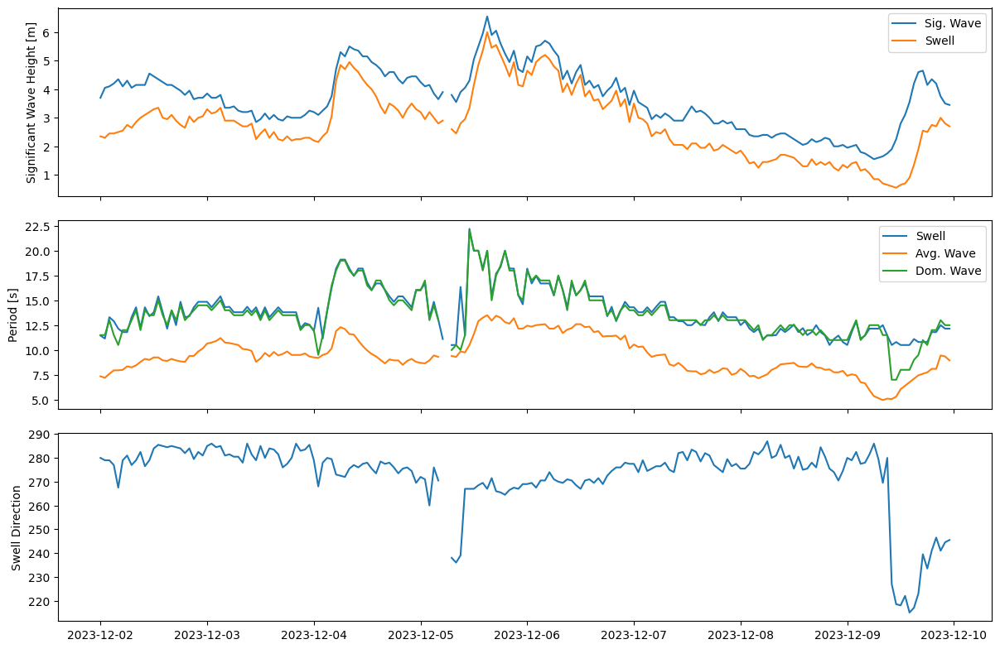

# RC-UW_ResearchLog
Log of weekly research accomplishments

## December 03 - December 09
- Collected results of week's atmospheric river event

Figure 1: 12/02-12/10 Storm Event (Precip, APress, WSpd, Water Level)

Figure 2: 12/02-12/10 Storm Event (H_s, T_s, SDir)

## November 26 - December 02
- Ran DFM model: 15466558:
  - Changed FlowFM.mdu to 14 day run
- Email with Julie Heilman (WSDOT) about potentially getting water mark surveys in Grays Harbor County and Pacific County
- Added more to DFM analysis code
  - Wave height, period, water level, wind speed, water velocity, air pressure
  - Plotted river outflow transect data for Willapa River and it seems to match average flow data from USGS gage
  - Need to monitor and document flooding events during this week's atmospheric storm event (12/04-07/2023) 

## November 19 - November 25
- Ran DFM model (2x): [15448379, 15461143]
  - 15448379:
    - Changed FlowFM.mdu time to 5hr
    - Changed test.slurm model runtime to 10hr
    - Added email alert for model start/stop
    - 20m run time for model (5hr)
  - 15461143:
    - Changed FlowFM.mdu time to 48hr
    - Changed test.slurm model runtime to 24hr
    - 2hr 54m run time for model (48hr)
- Generated water level comparison plots for both models at Tokepoint mooring
  - Water levels ~1.1m difference

## November 12 - November 18
- Ran DFM model (Job ID: 15392871) on 11/17.
  - Changed time in "dimr_config_parallel.xml" from "<time>0 3600 2592000</time>" to "<time>0 3600 86400</time>" (should be 24 hours).
  - Changed time in "dimr_config_parallel_lib.xml" from "<time>0 3600 2592000</time>" to "<time>0 3600 86400</time>" (should be 24 hours).
  - Job timed out, time domain for model still too long/unchanged.
  - Need to change FlowFM.mdu file and FlowFM_month.mdu file (maybe?).
- Ran DFM model (Job ID: 15387075) on 11/16.
  - Altered model runtime on test.slurm script to 10 minutes (works, but doesn't exit out cleanly, dates for model run still not changed).
- Met with Christie to talk about research questions for DFM model (11/17/23).
  - Look at WB or GB and start with comparison for water levels first.
  - Can later on look at influence of atmospheric forcing (resolution very large), and riverine influence.

## November 05 - November 11
Research Ideas:
- Lateral circulation at mouth of Willapa River and Chehalis River (affects H101 and H105)
  - Motivation: Observe/model momentum budget at bends at mouth to look at bank erosion or salt transport
    - Compare between WB and GH
  - Would require instruments put out and bathymetry survey
    - NCEI has 1/3 arc second (10m) resolution DEM for Willapa Bay (stops just west of Raymond)
    - GH: https://catalog.data.gov/dataset/grays-harbor-p280-bathymetric-digital-elevation-model-noaa-nos-estuarine-bathymetry
	- Updated 11/12/2020 (1/3 arc second)
  - How does ebb/flood tides for stratified/unstratified flows affect the energy at the bends?
    - Is it asymmetrical or symmetrical? (Primary, secondary flows that can affect erosion)
    - https://journals.ametsoc.org/view/journals/phoc/49/6/jpo-d-18-0175.1.xml
    - https://journals.ametsoc.org/view/journals/phoc/52/7/JPO-D-21-0298.1.xml
      - Modeled
    - https://www.sciencedirect.com/science/article/abs/pii/S027843431300126X
    - https://people.duke.edu/~jlh82/pubs/Nidzieko_et_al_2009_JPO.pdf
    - https://scholarcommons.sc.edu/cgi/viewcontent.cgi?article=1046&context=geol_facpub
- Model vertical structure at mouth of rivers during storm events (compared to normal ebb/flood tides)
- Look at time lag between Tokepoint station and Willapa River gauge (east of Raymond)

## October 29 - November 04
- Loaded new Delft3D-FM license onto laptop.
- Updated Laptop (took ~2 days).
- Completed first three tutorials (creating a curvilinear grid and creating a triangular grid and Coupling multiple separate grids).
- Researched Delft FM studies on land boundaries (in Notion "Delft FM Studies" doc).
- Found historic highs for stream gauges in Grays Harbor and Willapa Bay.
- Found FEMA flood zone maps for Grays Harbor county (updated 2020).

## October 22 - October 28
- Created temporary directory on hyak (/mmfs1/gscratch/derakhti/rchiu18).
- Worked with Christie on HYAK basics (main files for Delft3D model run, submitting job, cancelling job, checking storage allocation, etc).
- Tested rsync from HYAK server to local machine.
- Requested new license key to renew DelftFM license on Alex's laptop.

## October 15 - October 21
- Created Git repository on HYAK account for DelftFM files.
- Read through Hydrodynamic section in Delft-FM manual.
- Tried to understand SLURM scripts.
- Attempted to understand 'D3DSUPDUSA-252 - Decreased Flow performance during parallelization with waves' gmail thread.

To Do:
- Attempt to create a test container and test SLURM job
    - https://hyak.uw.edu/docs/hyak101/python/syllabus
- Work on examples in Delft3D program

## October 08 - October 14
- Meet with Christie to discuss Deflt3D basics - (10/09)
- Create shared spreadsheet for monitoring stations in Willapa Bay, Grays Harbor, and surrounding area.
  - https://docs.google.com/spreadsheets/d/1Mqzt7Lxn9V12FRSPelFWJJG9nrxQnFr4MR76eoNUSmU/edit#gid=0
- Research more into Delft-FM architecture and tools.
  - Begin reading Delft-FM manual (https://content.oss.deltares.nl/delft3d/D-Flow_FM_User_Manual.pdf)

- General research ideas for dissertation:
  - ADCP/water level gauges at mouth of Willapa River.
    - Measure propagation of waves after shoal at bay mouth.
      - Time lag for wave propagation.
    - Investigate hydrodynamics that dampen/amplify inflow/outflow at mouth.
      - Flow gauge is located east of Raymond.
    - Look at velocity profiles during peak and after during relaxation to observe any density driven flows/circulation from interaction between ocean inflow and freshwater outflow.
  - Water level gauges at Nahcotta Port (potential outwash/overtopping investigation).
  - Lidar survey of waves and beach evolution, wave behavior over the shoal? during storm events.
    - Wave run up, set up, to infer ebb shoal migration placement and migration.
