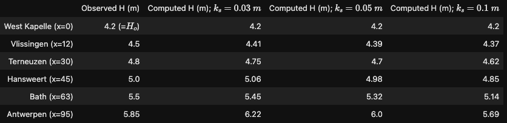
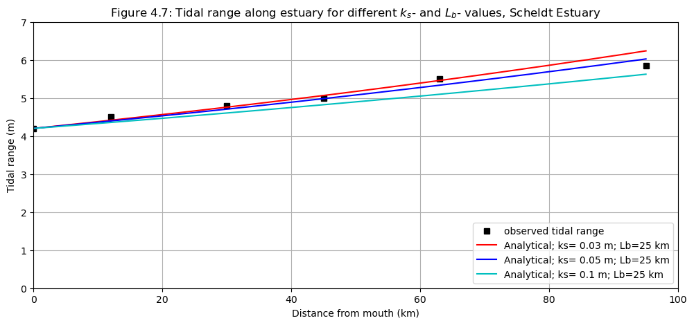

# January 12 - 18, 2025

## Summary
- Reproduced van Rijn's spreadsheet

## Results
1) Reproduced van Rijn's spreadsheet
- Velocity is determined by comparing the initial max peak tidal velocity and the calculated peak tidal velocity at x=0, t=0
	- Verified using van Rijn's Scheldt River dataset finding values closest to those calculated in the paper
- Reproduced water level and velocity at x (Fig. 1)

 
 
Figure 1: Water level and velocity at x on primary axis. dEta/dx on secondary axis.

2) Reproduced van Rijn's (2010) figures
- Used iteration to find velocities for van Rijn's calculations for the Scheldt River in the 2010 paper and found ~0.8 used
	- This could change depending on water depth, bottom friction, etc
		- e.g. u_peak = 0.801 (ks=0.03); u_peak = 0.790 (ks=0.05); u_peak = 0.774 (ks=0.1)
	- Iteration is built into function so it will automatically find an optimized velocity that comes within 0.01 of the computed peak tidal velocity
- New values calculating computed tidal ranges (ks=0.03, 0.05, 0.1) were closer to those found in Table 4.4 with new script (Table 1)
- New water level and velocity plot (x=0,50m) for ks=0.03 (Fig. 2)
- New along channel water level amplitude and velocity amplitude, Scheldt Estuary (Fig. 3)
- New along channel tidal range for different ks values (Fig. 4)

 
 
Table 1: Measured and computed tidal data (spring tide) of Scheldt Estuary based on analytical linearized method for a converging channel.

 
 
Figure 2: Water level and velocity at x=50 km and x=0 m for k_s=0.03 m, Scheldt Estuary.

 
 
Figure 3: Water level amplitude and velocity amplitude along estuary, Scheldt Estuary.

 
 
Figure 4: Water level amplitude and velocity amplitude along estuary for different ks values, Scheldt Estuary.

## Next steps
- Next week working on finishing workflow for CoPes pilot project
	- Create scripts to query satellite images within certain time period and domain (and maybe calculate statistics)
- Integrate tidal flats (compound channel) into Scheldt estuary model
