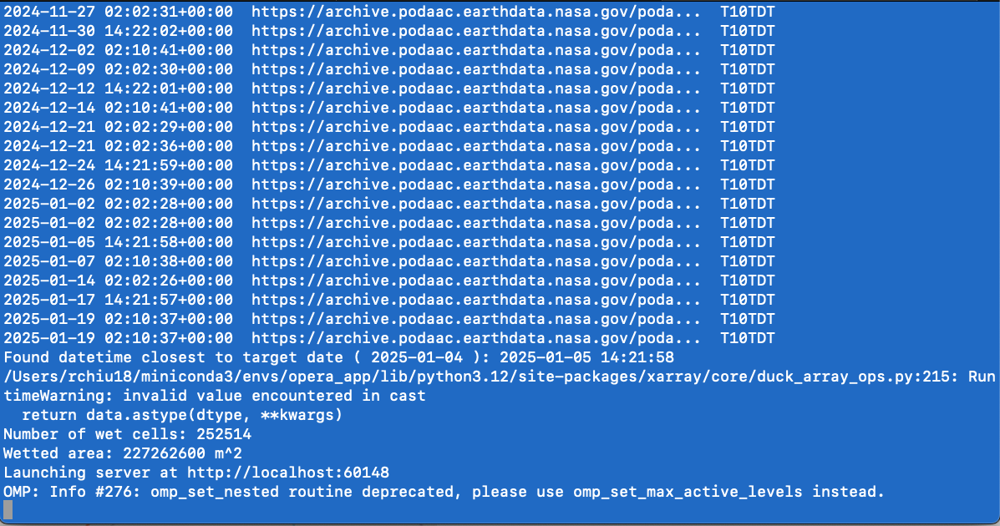
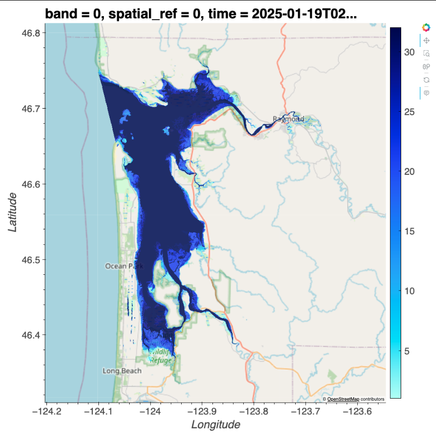

# January 19 - 25, 2025

## Summary
- OPERA DSWx satellite image workflow

## Results
### 1) Developed workflow DSWx product
- Wrote code for obtaining radar images and creating visualizations
- Code:
	- Creates and checks necessary key to talk to S3 server
	- User specifies time range and target date for image(s)
	- User specifies bounds
	- Queries S3 bucket using pystac for radar images within time range
	- Prints all timestamps for all available images (Fig. 1)
	- Picks out image closest to target date
	- Loads in shape file to constrain water cells within polygon
	- Opens interactive plot and plots image (Fig. 2)
	- Calculates number of wet cells and surface area (20m x 20m grid cell) (Fig. 3) 
- Created map of inundation frequencies for Willapa Bay and Grays Harbor (Fig. 4,5)

 
Figure 1: 

 
Figure 2: 

 
Figure 3: 

 
Figure 4:

 
Figure 5:

## Next steps
- Integrating tides into the figure

 