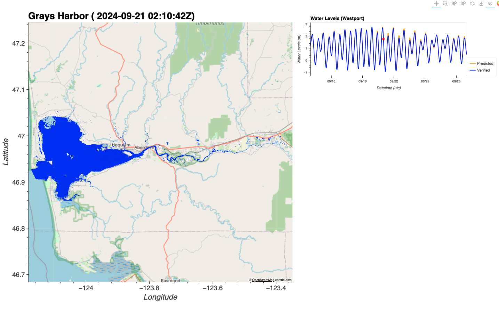
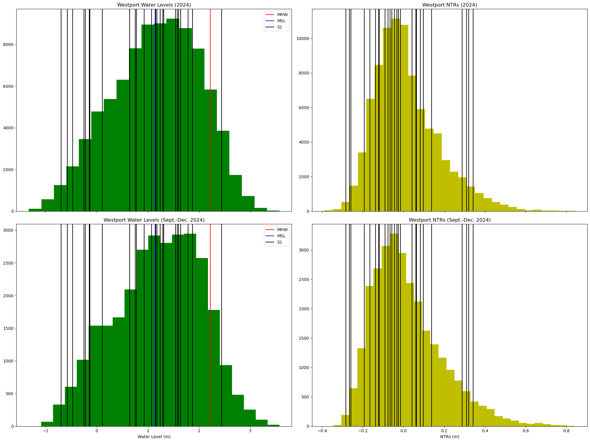
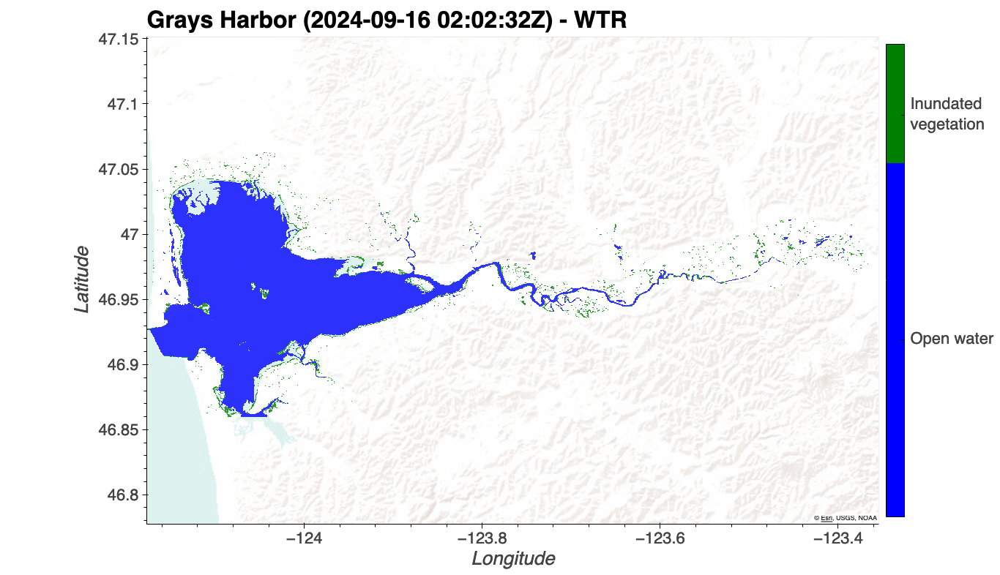
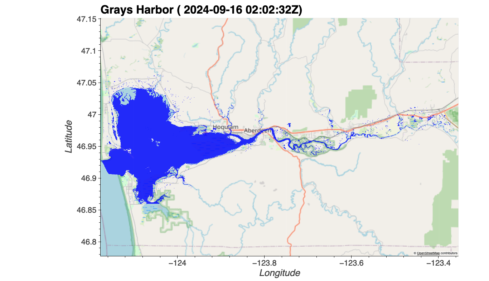
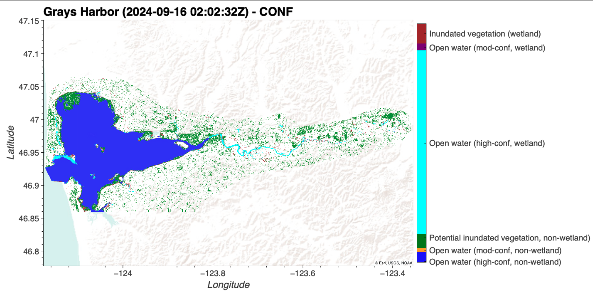

# January 26 - February 01, 2025

## Summary
- Remote sensing project

## Results
### 1) Added water level plot
- Added Westport/Tokepoint tide gauge info to output (Fig. 1)

 
Figure 1: Inundation map with Westport water levels.

2) Distribution of tides
- Plotted distribution of water levels and NTR for 2024 and for Sept.-Dec. 2024 (Fig. 2)
	- Jan. 2025 water levels not verified yet

 
Figure 2: Distribution of water levels in 2024 (a), Sept.-Dec. 2024 (c), and distribution of non-tidal residuals in 2024 (b) and Sept.-Dec. 2024 (d). 

3) Plot image layers side by side
- OPERA's DSWx product generates 4 layers (WTR, BWTR, CONF, DIAG) and a PNG file for each radar image captured
	- Each layer has its own classifications and definitions of cells
	- WTR layer:
		- 0: not water
		- 1: open water
		- 3: inundated vegetation
	- BWTR layer:
		- 0: not water
		- 1: water (classified as 'open water' or 'inundated vegetation')
	- CONF layer:
		- 0: not water (non-potential wetland)
		- 1: open water high-confidence (non-potential wetland)
		- 2: open water moderate-confidence (non-potential wetland)
		- 5: Potential inundated vegetation (non-potential wetland)
		- 30: not water (potential wetland)
		- 31: open water high-confidence (potential wetland)
		- 32: open water moderate-confidence (potential wetland)
		- 35: inundated vegetation (potential wetland)
- BWTR layer should show binary map of all cells that are characterized as wet (Fig. 3)
- WTR layer should show map of open water and inundated vegetation cells (Fig. 4)
- CONF layer should show map of open water (high, moderate-confidence) and inundated vegetation cells for both non-potential and potential wetlands (Fig. 5)

 
Figure 3: WTR layer.

 
Figure 4: WTR layer.

 
Figure 5: CONF layer.

4) Testing different basemaps
- Will compare images on local computer

## Next steps
- Need to do same distribution for Willapa Bay/Tokepoint
- Plot water levels relative to MHW
- Also include record obtained from Karthik (Jan. 2022, Dec. 2023)

