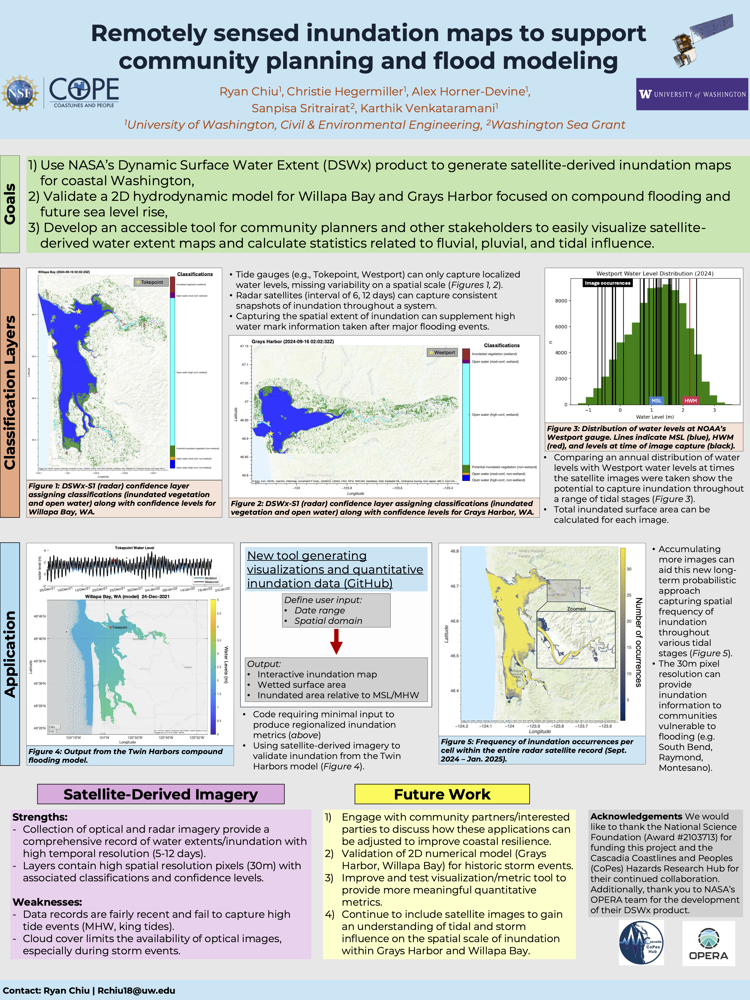
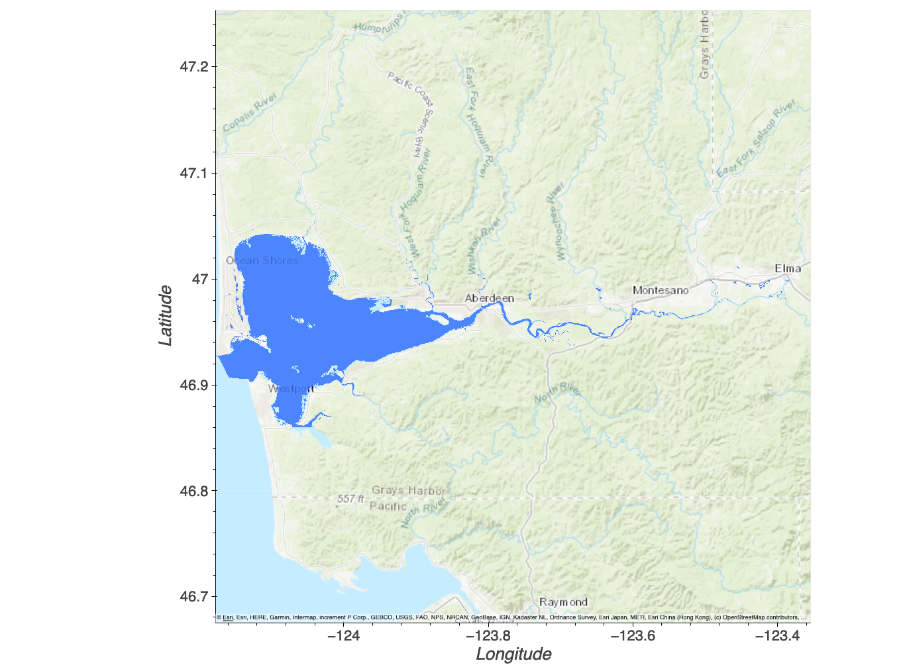
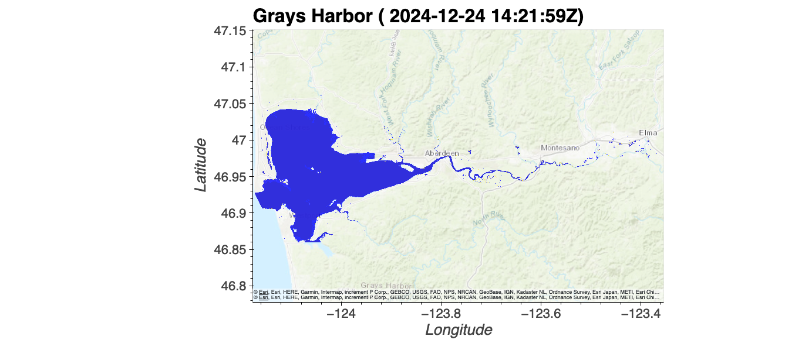

# February 02 - 08, 2025

## Summary
1) Navigating Coastal Hazards workshop poster 
2) Remote sensing project 

## Results
### 1) Navigating Coastal Hazards workshop poster 

 
Figure 1: Navigating Coastal Hazards workshop poster.

### 2) Identify images closest to MSL
- Identified 5 images that were taken when water levels at Westport were closest to MSL (1.141m)
	- All images had water levels with <1m difference from Westport's MSL
	- 2/5 were partial coverage so those were removed
	- 2 had high NTRs (-0.266, 0.320) so those were removed
	- Left with one image closest to MSL (2024-10-22 02:00:00+00:00)
- Created netcdf file for plotting as base (Fig. 2)

 
Figure 2: Water layer for "MSL".

- To compare, I chose two extremes events (1 extremely low tide and 1 extremely high tide)
	- Low tide occurred on 2024-12-02 02:12:00+00:00 where water level is -0.697m and NTR is -0.258m (Fig. 3)
	- High tide (>MHW) occurred on 2024-12-24 14:24:00+00:00 where water level is 2.435m and NTR is 0.288m (Fig. 4)

 
Figure 3: Inundation at low tide plotted with base MSL layer.

 
Figure 4: Inundation at high tide plotted with base MSL layer.

## Next steps
- Explore differences in inundation between similar water layers with different NTRs
