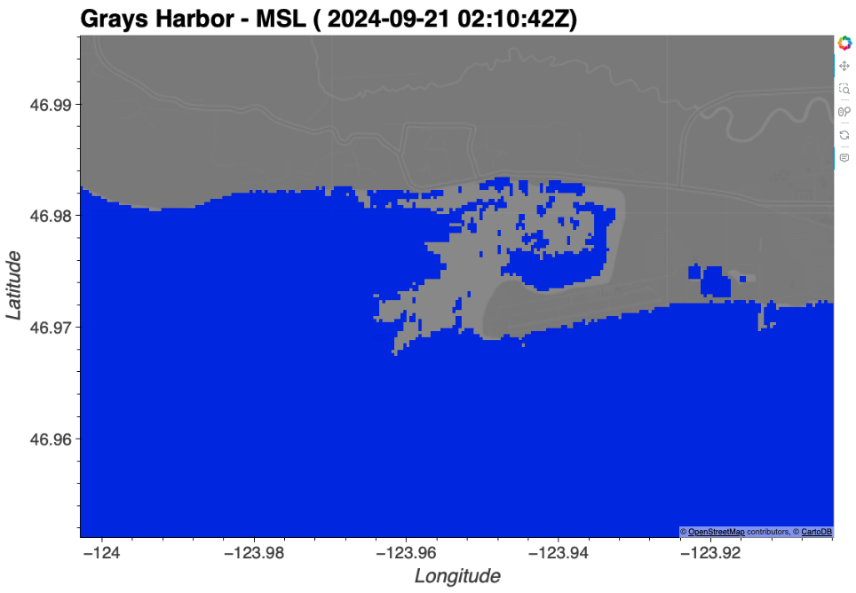
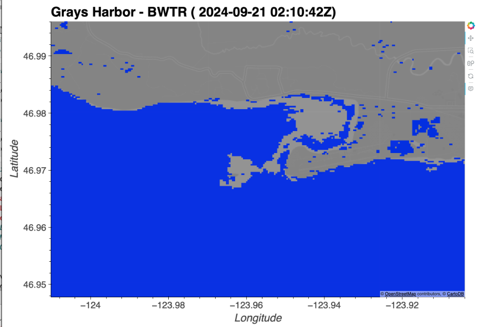
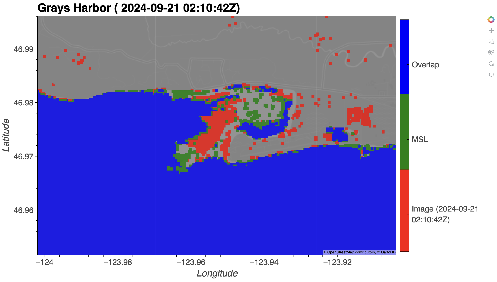
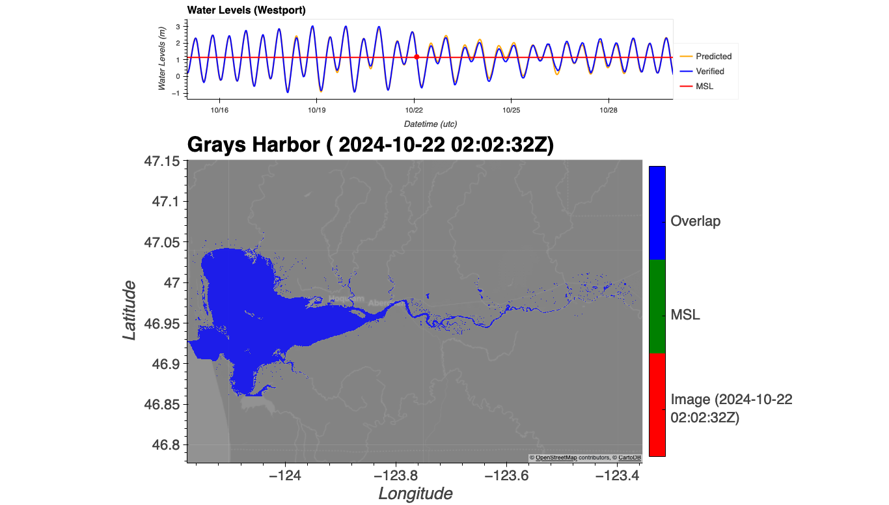
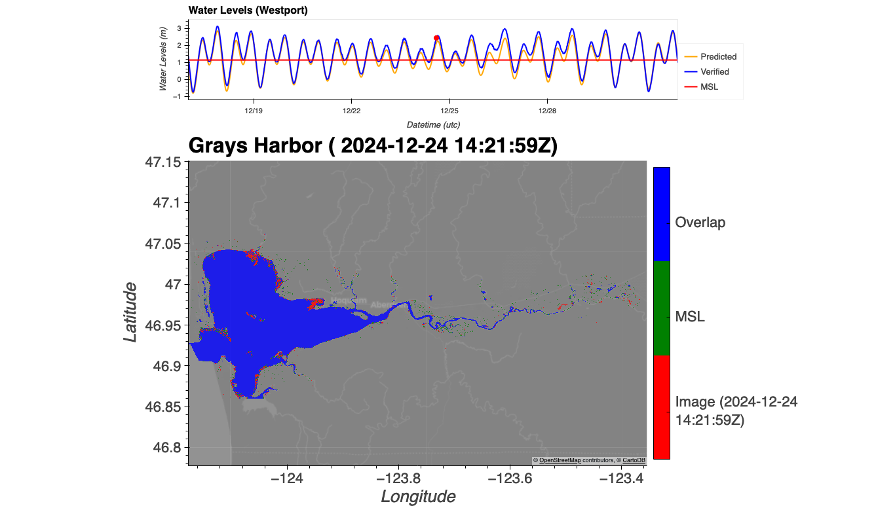
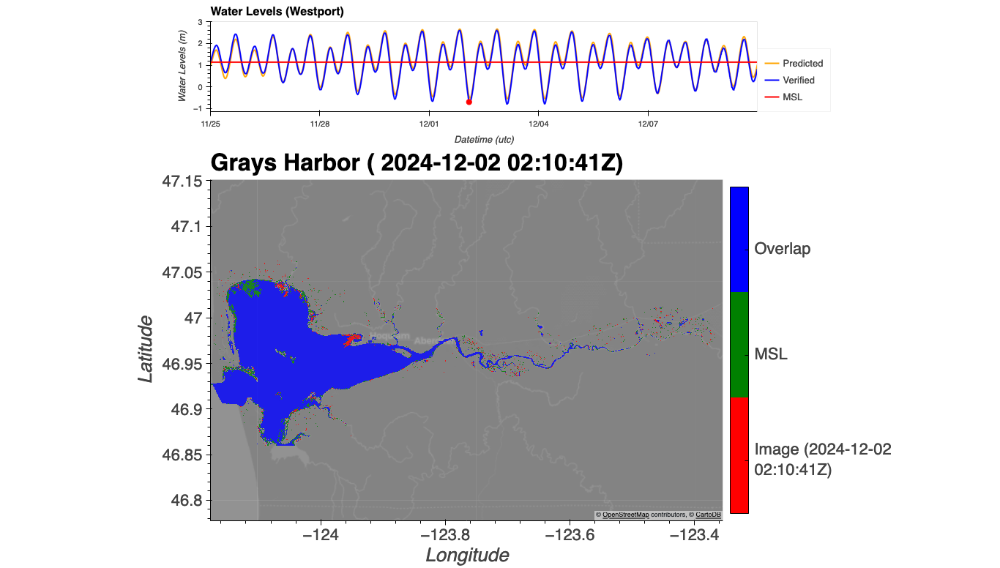
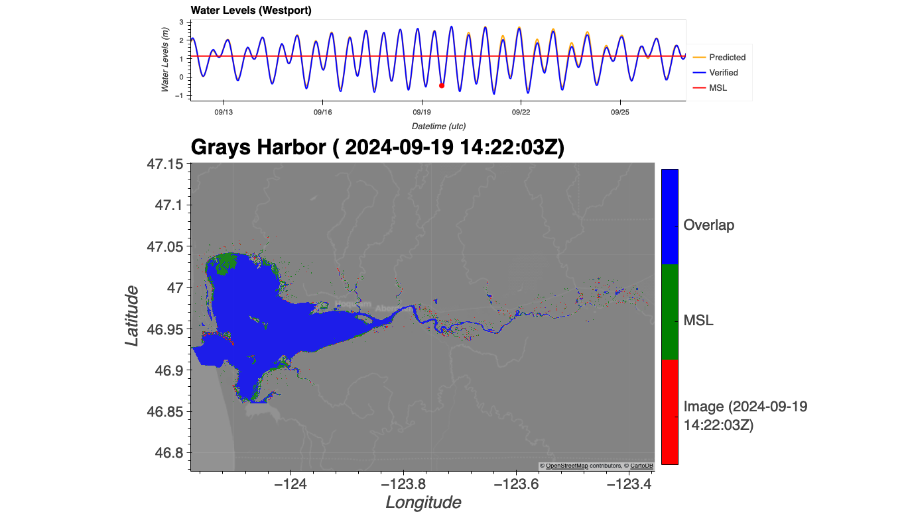

# February 09 - 22, 2025

## Summary
1) Attended Navigating Coastal Hazards workshop
2) New plot for remote sensing inundation map
3) Lower Willapa River resilience (meeting)

## Results
### 2) New plot for remote sensing
- New script plotting individual layers (MSL, image layer) cells and overlapping cells
- Zoomed in for validation (Fig. 1,2,3)
- Verify MSL layer is accurately showing 10-22-2024 (Fig. 4)
- Overlapping plot for high(est) tide (Fig. 5)
- Overlapping plot for low(est) tide (Fig. 6)
- Another low tide that shows much less inundation even though higher water level at Westport (Fig. 7)
	- 12/02/24 had 239,915,700 m2 wetted surface area (lowest tide)
	- 09/19/24 had 237,856,500 m2 wetted surface area

 
Figure 1: Zoomed in plot of MSL layer.

 
Figure 2: Zoomed in plot of image layer.

 
Figure 3: Zoomed in plot of overlapping plot.

 
Figure 4: Verification that MSL layer is the same as 10/22/2024 image.

 
Figure 5: Overlapping plot for high(est) tide.

 
Figure 6: Overlapping plot for low(est) tide.

 
Figure 7: Overlapping plot for low(ish) tide.

### 3) Lower Willapa River resilience meeting
- Ideas for workshop deliverables:
	- Non-technical visualizations explaining riverine/coastal transition zone
	- Map of transition zone/flood zones along Willapa River
- Questions our modeling/research could help address:
	- How can we include this transition zone to characterize flood risk for communities?
	- What effects does the surge plain have on mitigating tidal flooding/riverine flooding for communities upstream and downstream? (surge plain located north of South Bend)
	- How does channel depth (e.g. dredging) affect flooding?
	- Amount of water floodplain/surge plain store?
	- Basically, what function does surge plain serve to surrounding environment?

## Next steps
- Working on adding interactive plot toggling between layers
- Compare DFM model results with remote sensing inundation