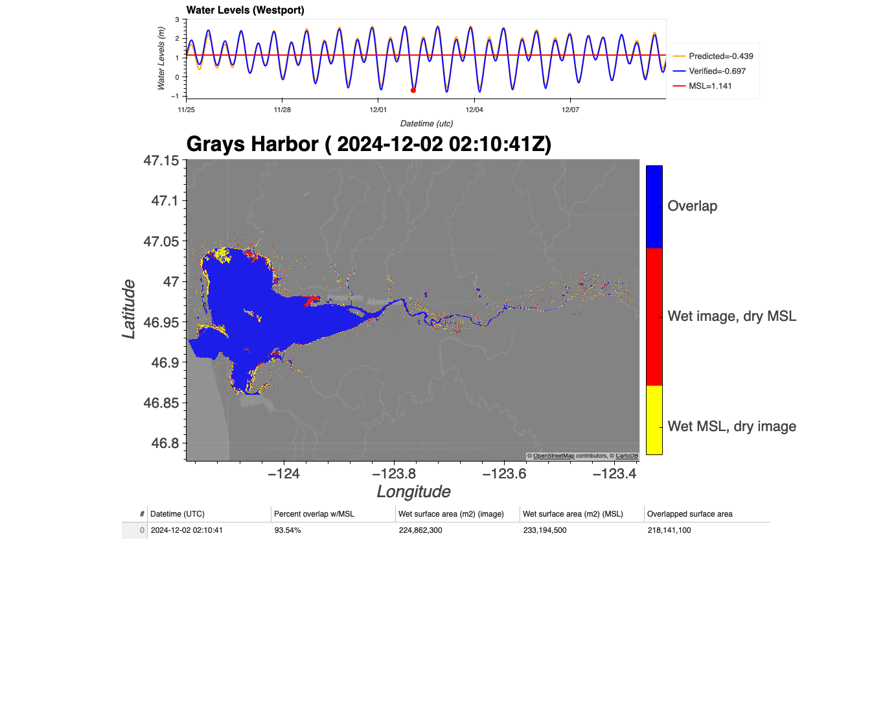
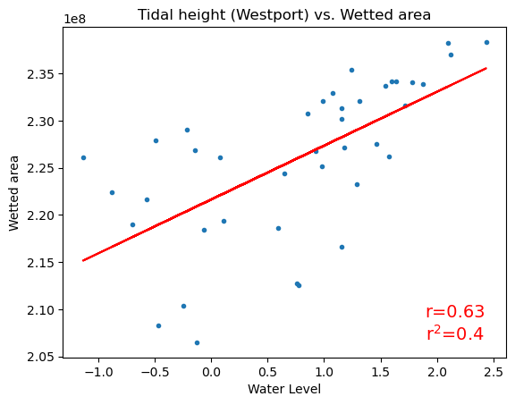
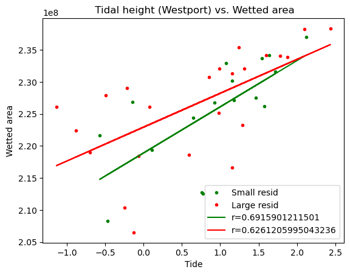
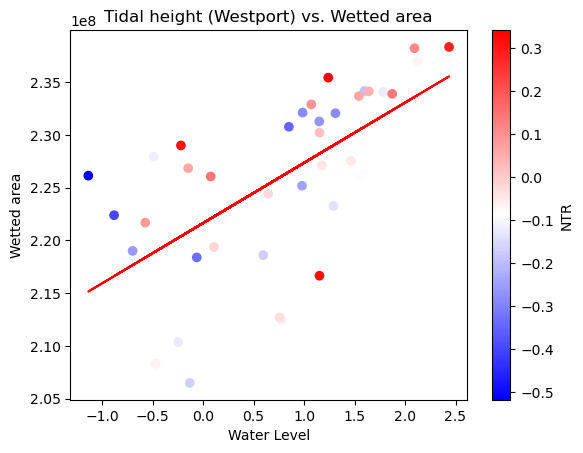
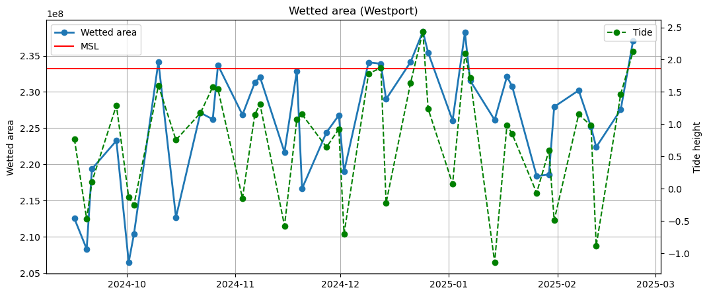
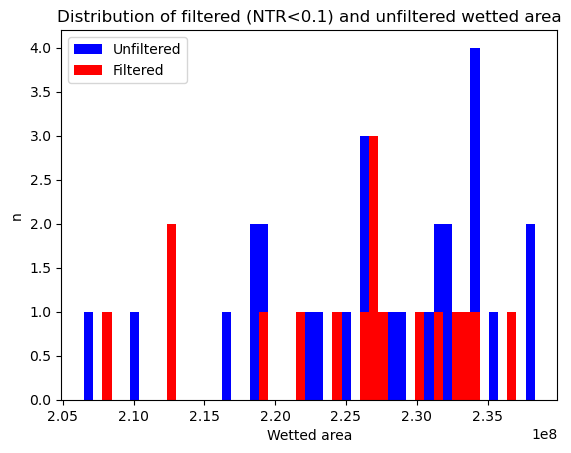
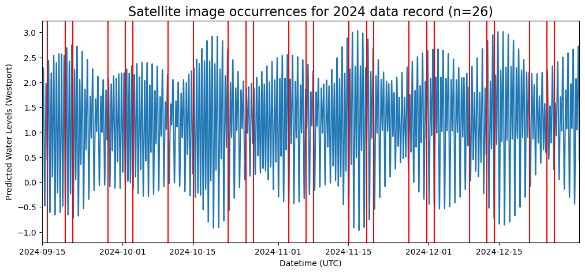
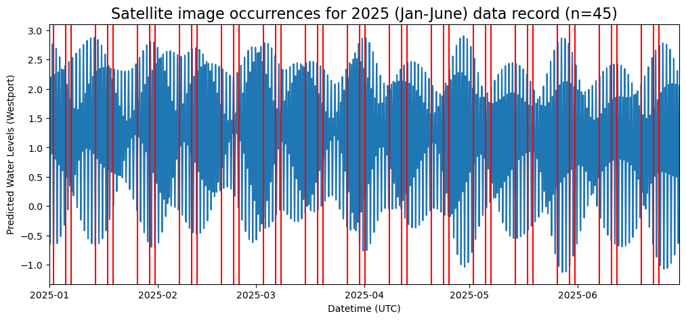
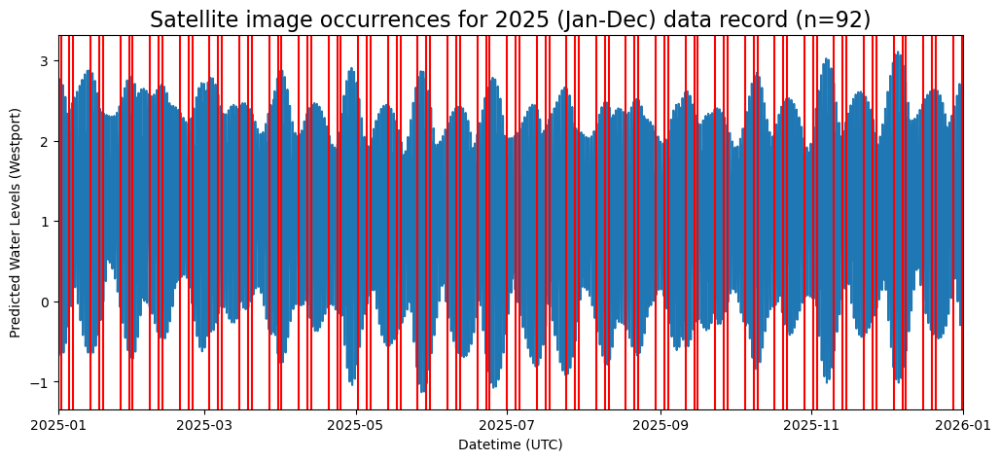

# February 23 - March 01, 2025

## Summary
1) Wrapping up remote sensing work

## Results
### a) Redid map showing overlapping and individual wet cells
- Inundation map shows:
	- Overlapping wet cells
	- Wet image cells (dry MSL cells)
	- Wet MSL cells (dry image cells)
- Showing spatial variability:
	- Lowest tide for record (12/02/2024) (Fig. 1)
		- Covers 93% of the MSL cells
	- Highest tide for record (12/24/2024) Fig. 2)
		- Covers 98% of the MSL cells
	- Time near MSL (~-0.012m) but with high NTR (0.32m)
		- Overlaps same % as low tide image
		- Inundation higher in lower half of Grays Harbor

 
Figure 1: Low tide.

 
Figure 2: High tide.

 
Figure 3: Near MSL but high NTR.

### b) Relationship between wetted surface area and Westport water levels
- Medium correlation between water levels at Westport and image wetted surface area (Fig. 4)
- "Stronger" correlation between water levels at Westport and images with small residuals (NTR<0.1m) (Fig. 5, 6)
- Instances where wetted area exceeded MSL wetted area only occur when Westport water levels exceed MSL (Fig. 7)

 
Figure 4: Tidal height at Westport vs. inundated area.

 
Figure 5: Tidal height at Westport vs. inundated area (separated by large and small NTRs).

 
Figure 6: Tidal height at Westport vs. inundated area (colorer indicating NTRs).

 
Figure 7: Time series of wetted surface area (image, MSL) and Westport water levels.

### c) Distribution of wetted area
- Distribution of all wetted surface area images is left skewed while filtered wetted surface area images (NTR<0.1m) is left skewed but more Gaussian (Fig. 8)
	- Images with larger NTR add more surface area to system, explaining the stronger left skew

 
Figure 8: Histogram of filtered (NTR<0.1m) and unfiltered wetted area.

### d) Planning for future remote sensing image availability
- Frequency for radar images are every 1d 11:48hr, 6d 23:41hr, and 3d 12:19hr
- 2024 data record (Fig. 9):
	- 13/26 (50%) images occur when Westport water levels are below MSL (1.141m)
	- 25/26 (96%) images occur when Westport water levels are below MHW (2.218m)
	- 7/26 (27%) images occur when Westport water levels are below MLW (0.083m)
- 2025 (Jan-June) data record (Fig. 10):
	- 26/45 ((57%) images occur when Westport water levels are below MSL (1.141m)
	- 44/45 (97%) images occur when Westport water levels are below MHW (2.218m)
	- 10/45 (22%) images occur when Westport water levels are below MLW (0.083m)
- 2025 (Jan-Dec) data record (Fig. 11):
	- 52/92 (56%) images occur when Westport water levels are below MSL (1.141m)
	- 89/92 (96%) images occur when Westport water levels are below MHW (2.218m)
	- 19/92 (20%) images occur when Westport water levels are below MLW (0.083m)
- Future questions with more images:
	- Distribution of spatial inundation frequency
	- Stronger relationship between Westport water level and total wetted surface area
	- Confirmation that total wetted surface area exceeds MSL wetted surface area every time MSL is exceeded at Westport
	- Smaller NTR during non-stormy periods to get more MSL images
		- How wetted surface area may change without influence of high river discharge
	- 

 
Figure 9: Time series of Westport water levels with satellite image occurrences for 2024.

 
Figure 10: Time series of Westport water levels with satellite image occurrences for first half of 2025 (Jan-June).

 
Figure 11: Time series of Westport water levels with satellite image occurrences for 2025.

## Next steps
- Finish GitHub repo and upload
- Plan for upcoming month's research
	- Writing up methods for how to address research questions
	- Lit review for studies integrating analytical model and remote sensing for compound flooding work
- Prepare extended forcing files (waves, discharge) for extended DFM runs to include remote sensing images
	- 2021:
		- December 10, 12, 19, 22 (Grays Harbor, Willapa Bay)
	- 2023:
		- December 18 (Grays Harbor, Willapa Bay)