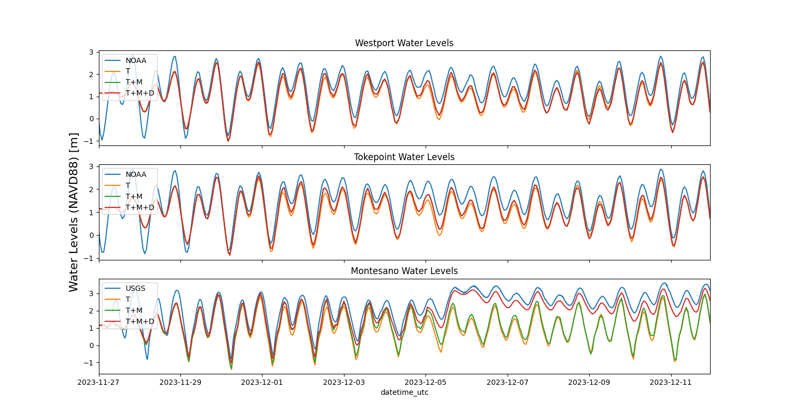
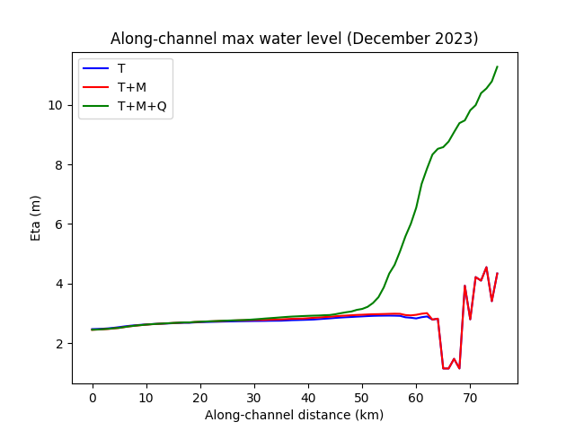
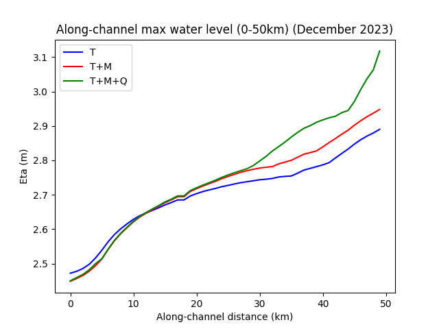
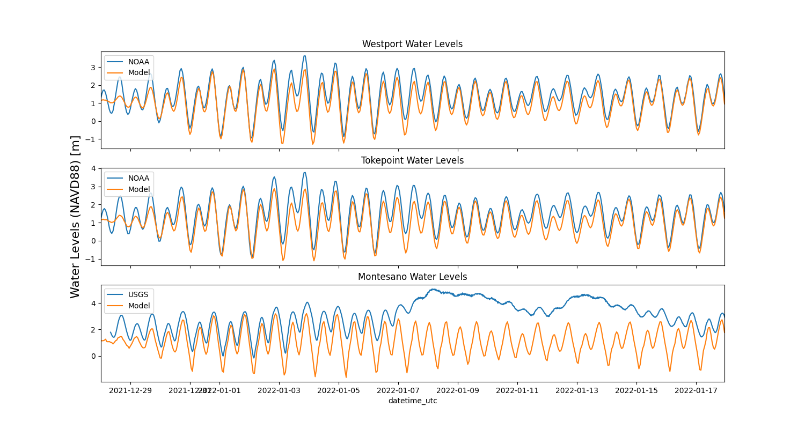
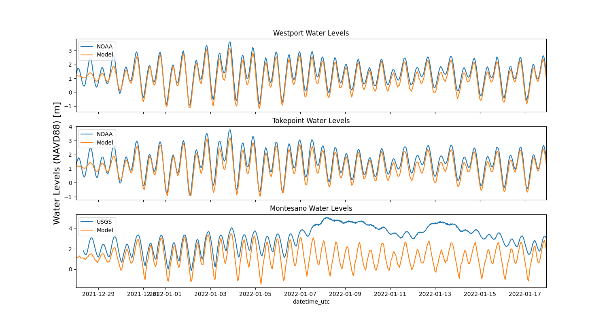

# March 02 - March 22, 2025

## Summary
1) Ran DFM model for Jan 2022 and Dec 2023 storms

## Results
### a) Dec 2023 DFM runs
- Tides, Tides+MET, Tides+MET+Discharge (completed)
- Tides+MET+Discharge+Waves (in progress)
- Elevated water levels only appear when including discharge
- Each added forcing improves water levels at Westport, Tokepoint, and Montesano (Fig. 1)
- Along channel max water levels
	- Model run with discharge begins diverging from T+M model run at ~28 km upstream (mouth of Chehalis River) (Fig. 3)

 
Figure 1: Comparing water levels from December 2023 model runs (tides, tides+MET, tides+MET+discharge).

 
Figure 2: Along channel max water levels from Grays Harbor mouth to Porter.

 
Figure 3: Along channel max water levels from Grays Harbor mouth to 50km upstream.

### b) Jan 2022 DFM runs
- Tides, Tides+MET (completed)
- Tides+MET+Discharge (in progress)
- Tides+MET+Discharge+Waves (need to do)

 
Figure 4: Station water levels for January 2022 model run (tides only).

 
Figure 5: Station water levels for January 2022 model run (tides+MET).

## Issues:
- Few of the upstream points have constant water levels during tide runs
- Need to change a few of the upstream observation points

## Next steps:
- Plot water level maps for tide runs to see placement of upstream observation points
- Re-run ALL models with new upstream observation points
- Validate TM runs with pressure/wind speed at local weather stations