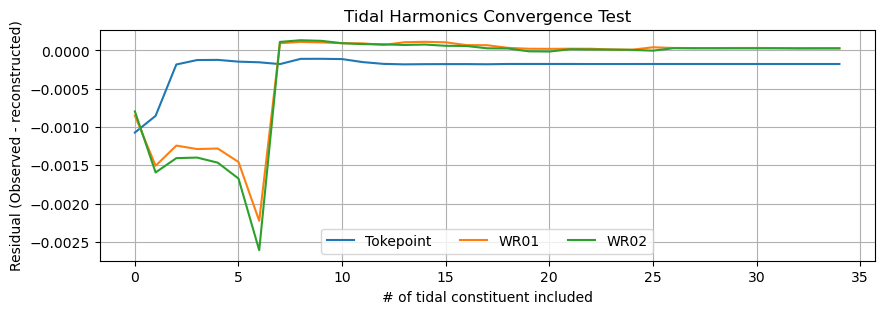

# March 15 - 28, 2026

## Summary+takeaways:
1) Harmonic analysis
* Converges as you include more tidal constituents for Tokepoint, Bendiksen's, and Raymond locations
2) Reran model runs and analysis for December 2023
* Started documenting methods, analysis, and figures

## Results:
#### 1) Compare harmonics between Tokepoint, Bendiksen, and Raymond
* Analysis from 11/09/2025 to 02/28/2026 provides 34 constituents
* Finding the minimum amount of time to perform tidal reconstruction
* All 3 stations converge as you include more harmonics (Fig. 1)
* Need to optimize which ones cause it to converge the fastest

TidalHarmonicConvergenceTest
 
Figure 1: Convergence test for Tokepoint, WR01, and WR03 tidal constituents.

#### 2) December 2023 compound flooding analysis
* Analysis document:
	* https://docs.google.com/document/d/1qJ-AD4PZNuqJLrgbc75YmX5wcYAvHjA1AhB6RHt6cMU/edit?usp=sharing
* Found ~27 day long run prior to model start made water levels smoother
* Tide+Discharge (TD) run had dry points near the mouth (need to investigate)
* Large TSRI at the beginning of model run (result of sudden discharge)
	* Solve by running restartfile with base discharge?

## Next steps:
* Test restartfile run with base discharge
* Investigate nan values in channel for model TD run
* Working to transfer files over to s3 servers