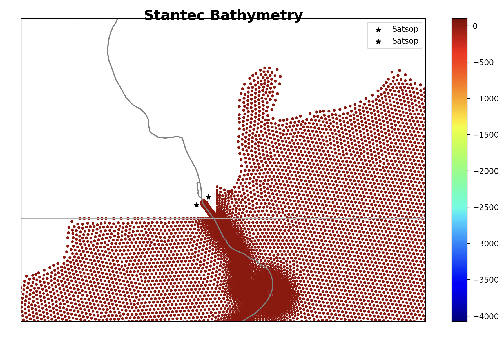

# March 23 - March 29, 2025

## Summary:
1) Reran Wuming's V9.9 version 
2) Create restart files for Dec2023 and Jan2022 storm runs 
3) Debugging DFM runs 
4) Run Jan2022 and Dec2023 periods using restart file 

## Results:
### 1) Reran Wuming's V9.9 version to verify same configurations
- Recreated results

 
Figure 1: Comparing Jan2022 results with Wuming's V9.9 version.

### 2) Creating restart files
- Ran models 2 weeks prior with only tides and created restartfiles for date we want to start the model runs (Dec. 29, 2022 and Nov. 27, 2023) (Fig. 1,2)

 
Figure 1: Jan2022 restartfile with 2 weeks of ramped up tides.

 
Figure 2: Dec2023 restartfile with 2 weeks of ramped up tides.

### 3) Debugging DFM runs
- When using restartfiles, given error saying nlinks from restartfile
	- Did not match model's so could not use restartfile
	- Found that it was due to *.pli points (discharge coordinates) for Chehalis, Satsop, Wynoochee, and Willapa being outside the grid, which somehow was generating new links
- Shifted coordinates to inside the grid, which let the model run
	- HOWEVER, it seems to have deactivated the discharge for those locations
- Solution: ran restartfile (tides only) with discharge files (Q=0) to retain same number of nlinks
	- Worked!

 
Figure 3: Satsop discharge points residing outside model domain.

### 4) Running models for Dec2023 and Jan2022
#### December 2023 storm
- December 2023 run using 2 week tides restartfile was marginally better than without 2 week run with tides (Fig. 4)
	- Water levels at Montesano recreate elevated signal, but Tokepoint and Westport show large differences between observed and modeled
- Along channel profiles at different times show elevated and shifting water levels (Fig. 5,6)
	- Time 1: Peak spring tide prior to storm
	- Time 2: Peak wind/gust at Westport station
	- Time 3: Peak water levels reached at the USGS Montesano station at the arrival of the storm (2nd peak of elevated signal)
	- Time 4: Max discharge recorded at USGS Porter station
- Upstream along channel profiles are the same when peak wind is reached on December 2nd
- Upstream along channel profile increases drastically when max water levels at Montesano (spike) is reached, suggesting that water levels upstream of Gray Harbor's mouth is elevated significantly
	- When max discharge is reached at Porter after ~1.5 days, the along channel profile is lower upstream, most likely due to tidal flushing and decrease in precipitation
	- Water levels upstream of Satsop is more elevated however, most likely due to peak discharge from the Porter gauge
- Comparisons between T, TM, and TMD along channel profiles (Fig. 7,8)

 
Figure 4: Comparing water levels from December 2023 model runs (tides, tides+MET, tides+MET+discharge).

 
Figure 5: Along channel water level profile at max spring tide (prior to storm), max storm winds, max Montesano water levels, and max discharge at Porter station.

 
Figure 6: Same as Figure 5 but with bed

 
Figure 7: Along channel water level profiles comparisons between T, TM, and TMD runs.

 
Figure 8: Along channel water level profiles comparisons between T, TM, and TMD runs separated by each major event (spring, wind, water level, discharge).

#### Jan 2022 storm
- Ran Jan2022 storm using restart file (Fig. 9)

 
Figure 9: DFM run for Jan2022 storm with TMD forcing.

## Next steps:
- Run Jan2022 storm for T and TM
- Work on presentation for CoPes Team 2 meeting
- Run models for:
	- December 2015 storm event
	- December 2007 great gale event (sufficient data)
	- January 2021 storm event?
		- No Montesano data

