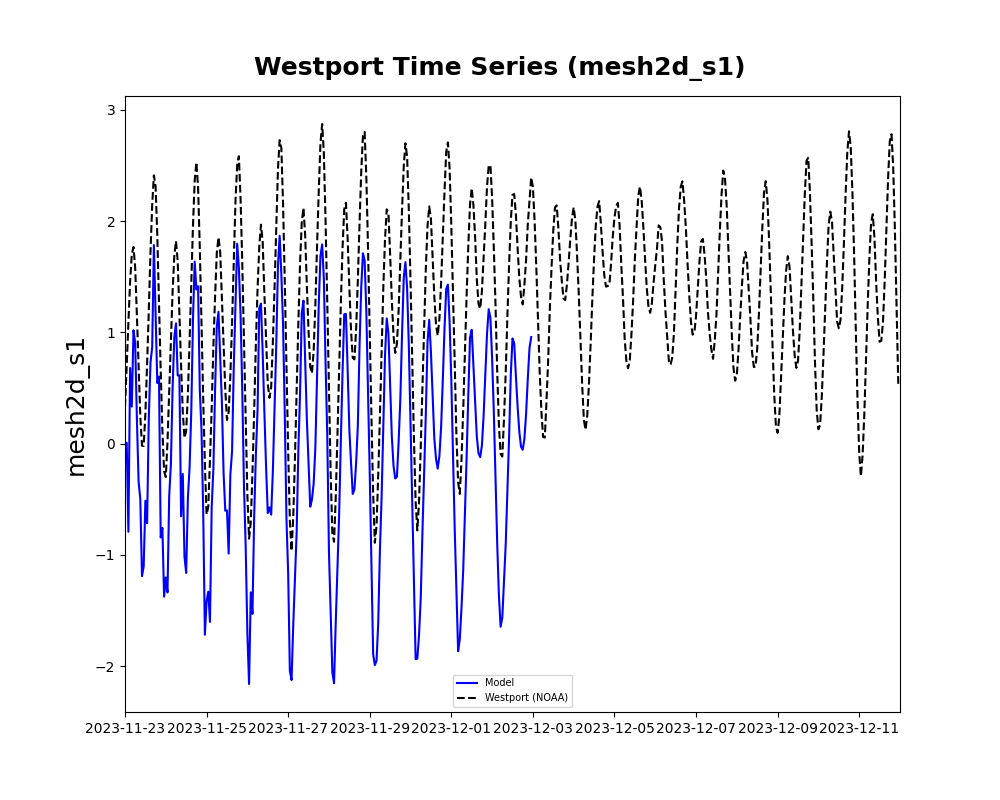

## March 24 - March 30
### Summary:
1) Stantec's report shows tidal datums are referenced to MLLW (corrections referenced below is to convert MLLW to NAVD88)
2) 1999 Stantec model shows water depth output aligning best with observations (NAVD88) at Tokepoint (no corrections)
3) 2023 DFM model run (tides, discharge (merged), and waves):
	- Tokepoint water depth output aligns best with observations at Tokepoint (no corrections)
	- Westport corrected SSH (+0.34) is closer to observations at NOAA gauge, but still underestimated
4) 2023 DFM model run (tides + waves):
	- Tokepoint water depth output aligns best with observations at Tokepoint (no corrections)
	- Westport corrected SSH (+0.34) is closer to observations at NOAA gauge, but still underestimated
5) Only differences found between Stantec's model and new DFM model is time intervals, atmospheric forcing, discharge forcing, and wave forcing
	- Next steps:
		- Change location for water level comparison? (Westport within Marina)
		- Run tidal for random time without storm to see if both models can simulate tides at Tokepoint and Westport
		- Compare 1999 wave data with model output for validation

### Tasks
1) Look at Stantec model datum and compare with new model
2) Ran DFM model (TwinHarbors_test11) with no forcing
3) Ran original model from Stantec to look at results at each observation station
4) Ran TwinHarbors_test10 with tides, merged discharge (Satsop+Porter), waves (no MET)
5) Ran TwinHarbors_test12 with tides, waves (no MET)

'''
'''

1) Comparison of Stantec model and DFM model (2023):
- Stantec report shows Toke point and Westport stations are referenced to MLLW
	- Stantec report (1999):
		- Westport NAVD88 is +1.77 ft (above MLLW)
		- Tokepoint NAVD88 is +0.82 ft (above MLLW)
		- Aberdeen NAVD88 is +1.64 ft (above MLLW)
	- According to NOAA (2023):
		- Westport NAVD88 is +1.12 ft (above MLLW)
			- Mean ∆SSH in full DFM model (T+M+D+W) is ~1.32m
    			- https://tidesandcurrents.noaa.gov/datums.html?id=9441102
		- Toke point is +0.82 ft (above MLLW)
   			- Mean ∆SSH in full DFM model is ~1.38 m

2) Ran DFM model (2023) with no forcing (TwinHarbors_test11):
	- Westport: SSH=0, waterdepth = 6.12327292m
	- Toke point: SSH=0, waterdepth = 1.42673181m
	- Montesano: SSH=0, waterdepth = 5m

3) 1999 Stantec model run:
	- Could only compare Tokepoint station (no GH or Westport stations in 1999 in Stantec folder)
	- Water depth output exceeded NOAA observations (NAVD88)
	- SSH output underestimated NOAA observations (NAVD88)
	- SSH (+0.24m) output brings us closer to NOAA observations but still underestimated
		- Added 0.24m assuming that model output is in MLLW (Stantec Report), so +0.24m is correction to NAVD88 based on Tokepoint NOAA station
	 	- https://tidesandcurrents.noaa.gov/datums.html?id=9440910

*Plotted Westport water level and SSH to compare magnitude with model runs in 2023 and the magnitude is similar

4) Ran DFM (2023) model (T+D*+W) (TwinHarbors_test10)
	- Tides, discharge (merged), and waves
	- Tokepoint:
		- Water depth output aligned with observations (NAVD88)
		- SSH output underestimated NOAA observations (NAVD88)
		- SSH (+0.24m) output brings us closer, but still underestimated

	- Westport:
		- Water depth output way overestimated observations

5) Ran DFM (2023) model (T+W) (TwinHarbors_test12)
	- Tides and waves only
	- Tokepoint:
		- Water depth output aligned with obserations (NAVD88)
		- SSH output underestimated NOAA observations (NAVD88)
		- SSH (+0.24m) output brings us closer, but still underestimated

	- Westport:
		- Water depth output overestimated observations (NAVD88) by a lot (>4m)
		- SSH output underestimated NOAA observations (NAVD88)
		- SSH (+0.34m) output brings us closer, but still underestimated

- Depth at points nearest to observation points based on bathymetry file (*tw_v60m*)
	- Westport: -5.8507181825396275m
	- Montesano: -5.0m
	- Toke point: -1.4809497578709583

### Issues:
- Disk quota exceeded for model runs due to >200GB
	- Tried to fix by:
		- Deleting older files and running one model at a time
		- Created extract_netcdf.sh script to create new files with specific variables, decreasing the size of each output file by >50%
	- Issue NOT resolved
- Cannot use nctoolkit in environment because it requires python version 3.8+ (environment uses v=3.6)
- Still cannot figure out datum issue:
	- Tokepoint seems to do just fine matching water depth output with NAVD88 observations for all runs
 	- Westport is off by ~1m when using NAVD88 corrected model output (+0.34m)
