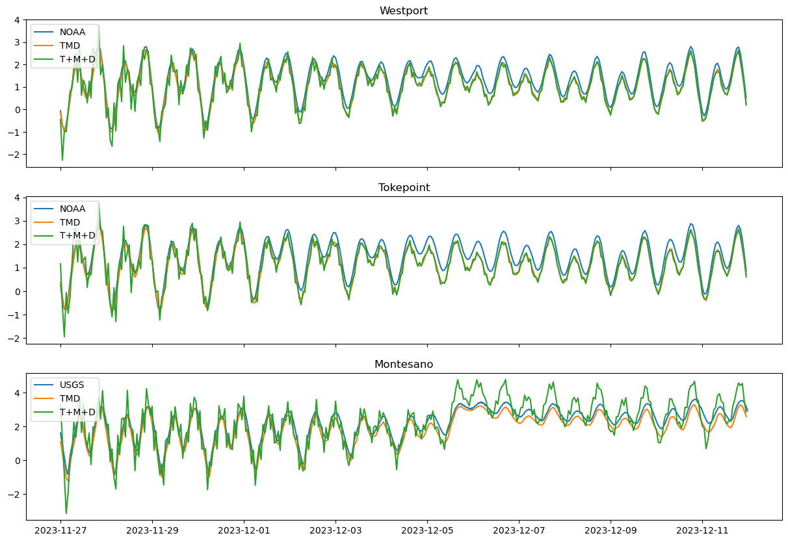

# March 30, 2025 - April 05, 2025

## Summary:
1) Ran individual model runs for December 2023 (M, D, TD, TMD)  
2) Along-channel water level profile comparisons  

## Results:
### 1) Individual model runs 
- At Westport, water levels from TMD and TM are basically the same, with largest difference being 1.5 cm when plotting the difference (Fig. 1)
	- Run TD underestimates the water levels here and are more of less the same as T run
	- This tells us that tides and MET are the dominant contributors at Westport!
- At Toke point, same is true where TMD and TM are the same
	- TD and T water levels are the same
	- Tides and MET are the dominant contributors at Toke point as well!
- At Montesano, the full TMD run is closest to simulating the USGS water levels
	- Each additional forcing gets us closer to the observed water levels

 
Figure 1: Model run comparisons(TMD, TD, TM, and T).

- Adding up individual runs (T+M+D) do a decent job at simulating water levels at Westport and Toke point (Fig. 2a,b)
- Adding up individual runs (T+M+D) overestimate observed water levels at Montesano (Fig. 2c)

 
Figure 2: Model run comparisons(TMD and T+M+D).

### 2) Along-channel water level profile comparisons
- Separated along channel profiles into 4 times:
	- Max tide (prior to storm arrival)
	- Max wind (max winds recorded at Westport station)
	- Max water levels (max water levels recorded at the Montesano USGS gauge)
	- Max discharge (max discharge recorded at the Porter USGS gauge
- The addition of T+Q outputs always overestimate water levels upstream, and vary downstream
- Delineated the Coastal, Transition, and River Zones
- Coastal zone is defined as the region where water level difference between T and TQ are <1 cm
- River zone is defined as the region where water levels difference between Q and TQ are <1 cm
- Transition zone is defined as the region in between
- Strongly enough, we see the largest extension of the river zone during max wind
	- Although river zones are decreased in max water level and max discharge, water levels are much higher upstream >8m

 
Figure 3: Model comparisons between T, Q, T+Q, and TQ for max tide, max wind, max water level, and max discharge times. Vertical lines are delineations between the Coastal Zone, Transition Zone, and River Zone.

- Plotted along channel profiles with maximum water level at each station (dotted) (Fig. 4)
	- The max water levels from the mouth to ~50km upstream are reached within the first 4-5 days of the model (prior to max winds or storm arrival)
	- From 52-66km upstream (Montesano/Wynoochee to ~2km upstream of Satsop), max water levels are reached around 8-9 days (Dec 5-6) which correspond to the elevated water level signal recorded at Montesano
	- From >67km to Porter, max water levels are reached near the end of the model run (~Dec  10-11)

 
Figure 4: (a) Montesano water levels, (b) discharge from Porter, Wynoochee, and Satsop gauges, and (c) along channel water level profiles at max periods.

- Discharge and along channel profiles over time (Fig. 5)
	- When peak discharge is reached at Satsop and Wynoochee just before Dec 6, we see river discharge influence start to migrate downstream
	- Times where water levels are highest (light blue) all along channel is when tides are typically high, preventing tidal flushing and raising upstream water levels

 
Figure 5: (a) Discharge from Porter, Wynoochee, and Satsop gauges, (b) tides at Westport, and (c) along channel water level profiles over time.

## Issues:
- December 2023 model run looks different than Wuming's
	- 

## Next steps:
