# March 24 - March 30
## Summary:
1) Changing coordinates to match Stantec's in their report yields much better agreement between the model output and NOAA tide gauges (Tokepoint and Westport) referenced to MSL.
  - Coordinate for Statenc's Tokepoint coordinate is ~400m SE of NOAA gauge.
  - Coordinate for Stantec's Westport coordinate is ~1,350m SE of NOAA gauge.
  - Westport SSH is still truncated at LLW.
2) Compared 1999 survey data with DFM model (1999)
  - Most x velocity matches (GH1, GH3, GH4, GH6)
  - GH2 matches phase but differs in magnitude
  - GH5 phases seem to be shifted
    - Lag correlation of -2 hours

## Tasks:
1) Match location with NOAA_WL_OBS.xyn file for Tokepoint and Westport stations
2) Compare survey data with 1999 DFM model output for validation

## Results
### 1) Compare DFM model output's water levels at Stantec's station coordinates
  - Used Tokepoint and Westport coordinates found in Stantec's report, and plotted 1999 and 2023 water levels at cell closest and had much better results
  - Plotted SSH with newly downloaded NOAA water level (MSL)

<strong><em>Figure 1: Tokepoint SSH (1999)</strong></em>

<strong><em>Figure 2: Tokepoint SSH (2023)</strong></em>

<strong><em>Figure 3: Tokepoint coordinates</strong></em>

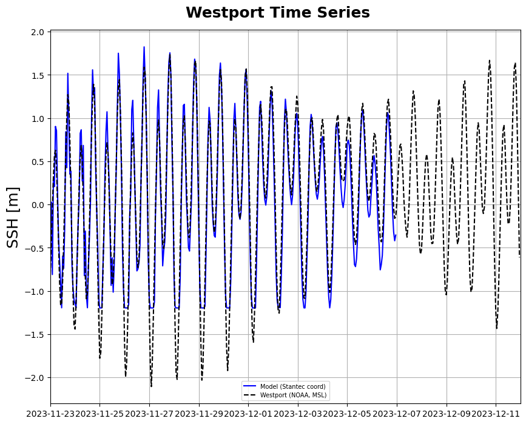
<strong><em>Figure 4: Westport SSH (2023)</strong></em>

<strong><em>Figure 5: Westport coordinates</strong></em>

### 2) Compare survey data with 1999 DFM model output for validation
#### GH Survey Map

<strong><em>Figure 6: GH survey map (1999)</strong></em>

#### Time Series

<strong><em>Figure 7: GH1 Current Data (1999)</strong></em>

<strong><em>Figure 8: GH2 Current Data (1999)</strong></em>

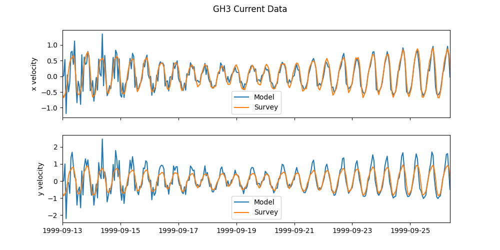
<strong><em>Figure 9: GH3 Current Data (1999)</strong></em>

<strong><em>Figure 10: GH4 Current Data (1999)</strong></em>

<strong><em>Figure 11: GH5 Current Data (1999)</strong></em>

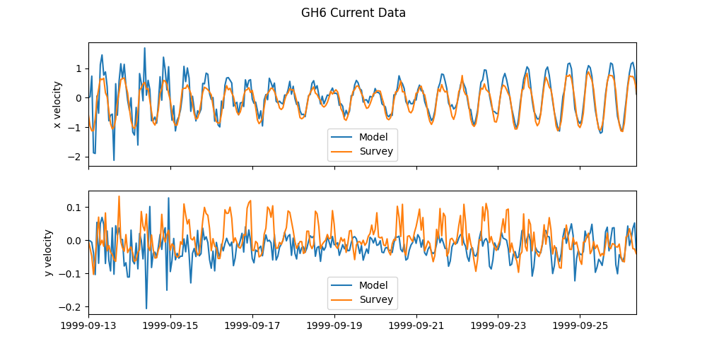
<strong><em>Figure 12: GH6 Current Data (1999)</strong></em>

#### Property Plots

<strong><em>Figure 13: GH1 property plot (1999)</strong></em>

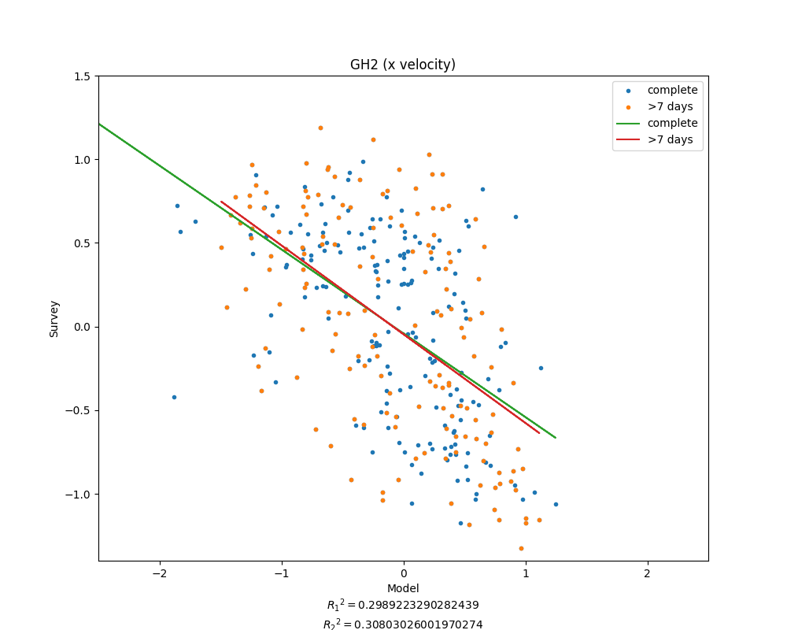
<strong><em>Figure 14: GH2 property plot (1999)</strong></em>

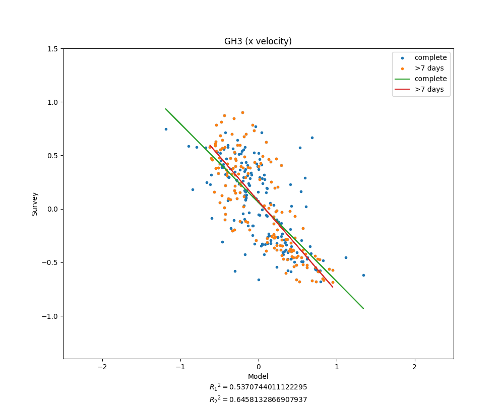
<strong><em>Figure 15: GH3 property plot (1999)</strong></em>

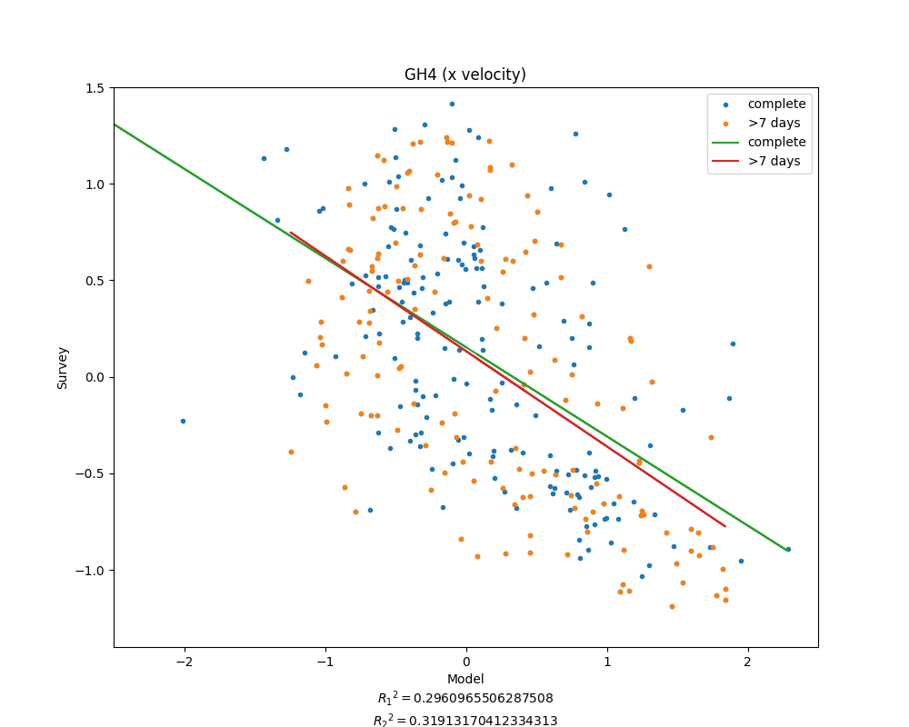
<strong><em>Figure 16: GH4 property plot (1999)</strong></em>

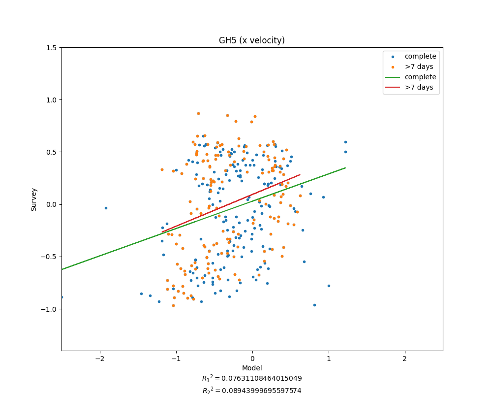
<strong><em>Figure 17: GH5 property plot (1999)</strong></em>

<strong><em>Figure 18: GH6 property plot (1999)</strong></em>

#### Lag Correlations
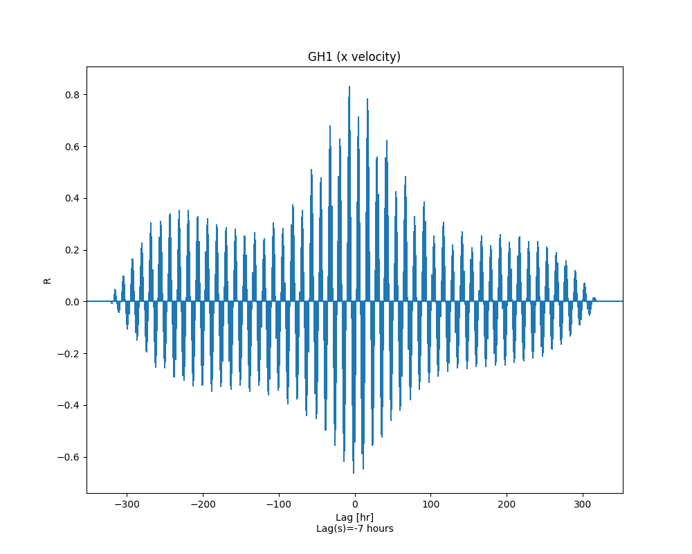
<strong><em>Figure 19: GH1 lag correlation (1999)</strong></em>

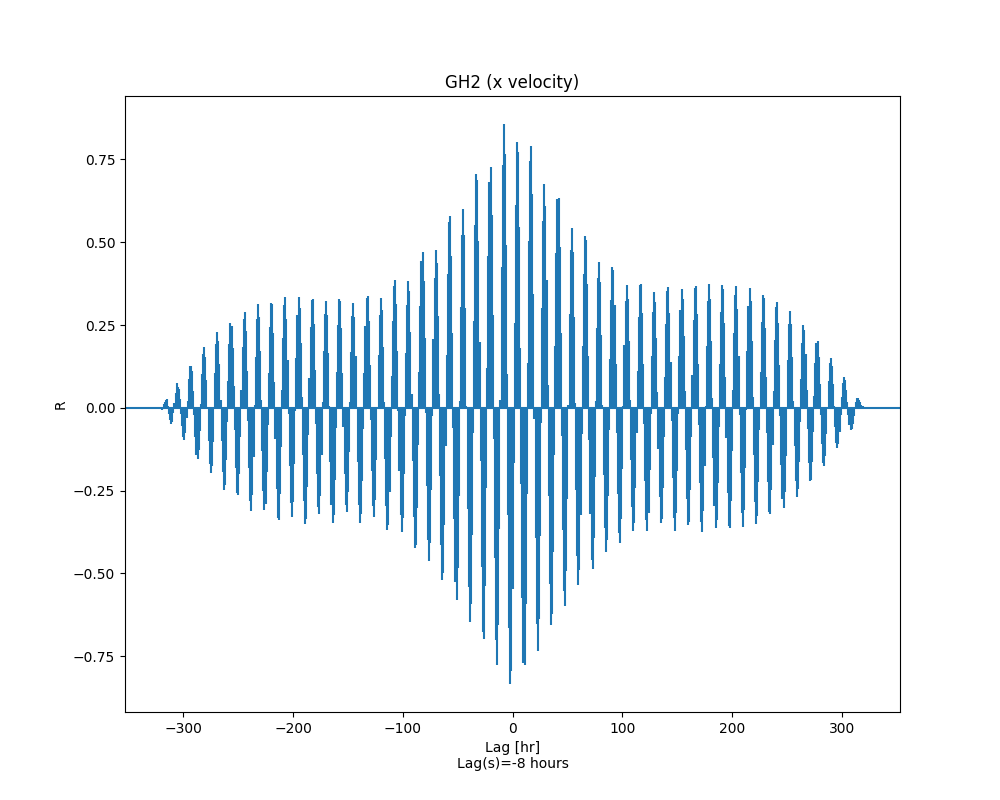
<strong><em>Figure 20: GH2 lag correlation (1999)</strong></em>

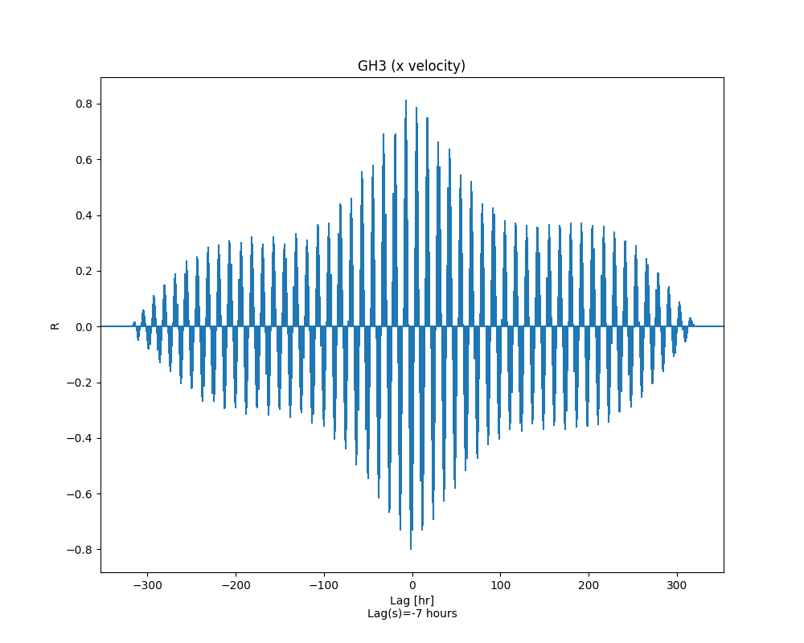
<strong><em>Figure 21: GH3 lag correlation (1999)</strong></em>

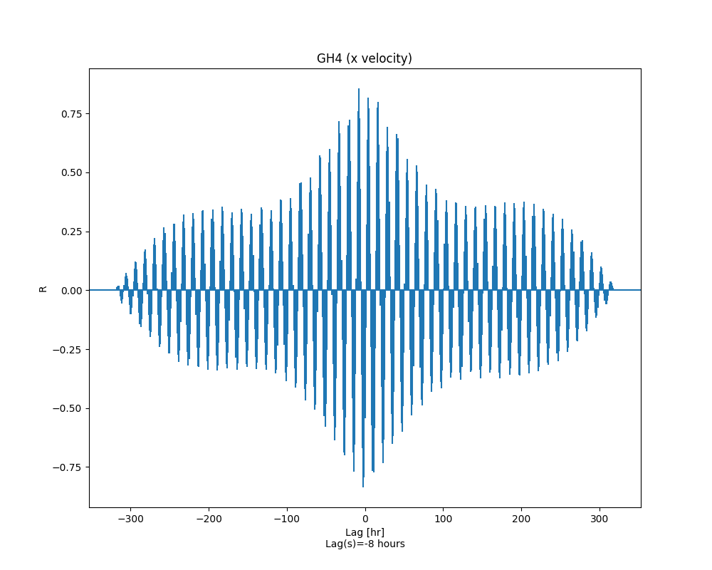
<strong><em>Figure 22: GH4 lag correlation (1999)</strong></em>

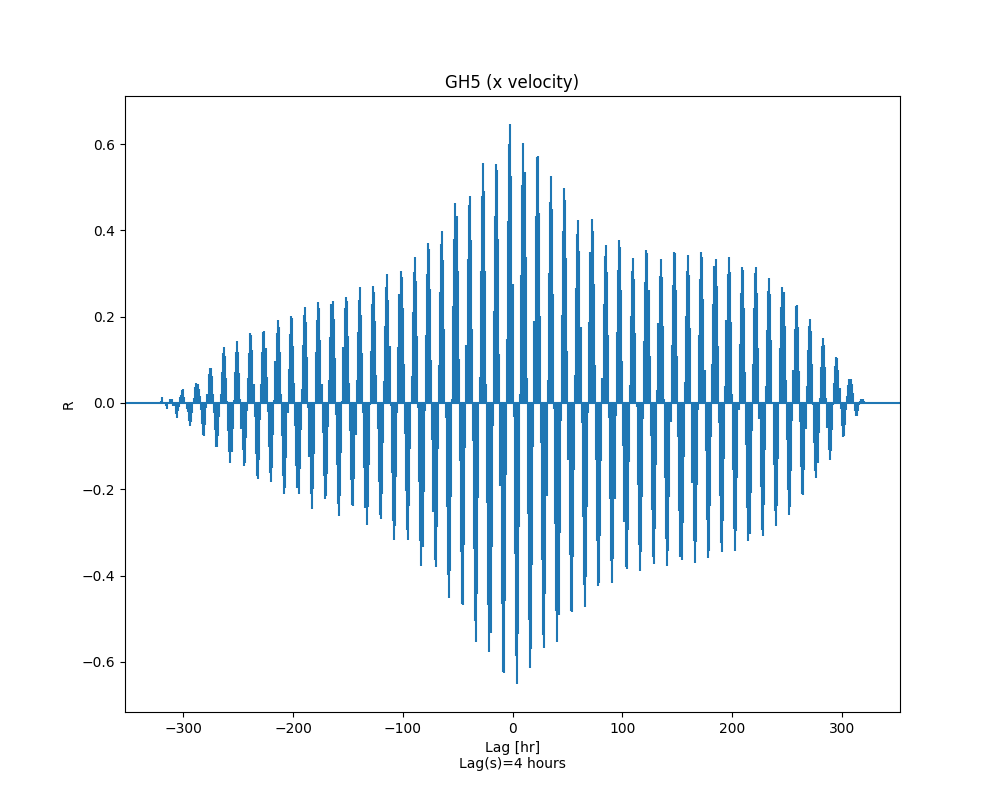
<strong><em>Figure 23: GH5 lag correlation (1999)</strong></em>

\
<strong><em>Figure 24: GH6 lag correlation (1999)</strong></em>

## Issues:

