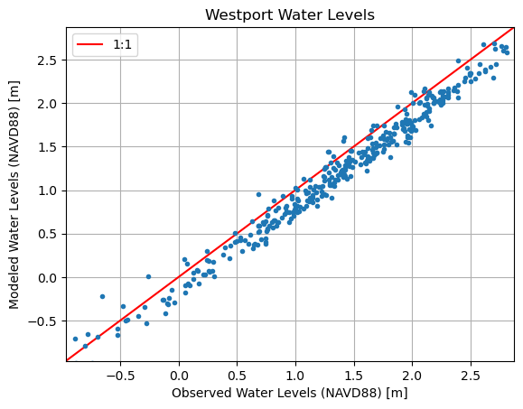

# April 06 - 12, 2025

## Summary:
1) Calculate the model skill/metrics for Model TMD 
2) Compound flooding analysis using Xiao et al., 2021 

## Results:
### 1) Model skill/metrics for DFM run (TMD)
- Plot observed vs modeled water levels for Westport, Toke Point, and Montesano for TMD run (Fig. 1,2,3)
- Calculated RMSE, scatter index, bias, and R (correlation) (Table 1)
	
 
Figure 1: Observed water levels vs modeled water levels (Westport).

 
Figure 2: Observed water levels vs modeled water levels (Toke Point).

 
Figure 3: Observed water levels vs modeled water levels (Montesano).

 
Table 1: Model metrics (RMSE, scatter index, bias, and R).

## 1) Characterizing TWLs into non-linear interactions 
- Followed Xiao et al. (2021)'s method of decomposing total water levels (TWL) to isolate nonlinear interactions (Fig. 4)
	- TWL = Tides + LFS + TSRI (non-linear interactions)
	- TSL = LFS + TSRI
	- LFS (low-frequency surge): represents the water level setup induced by non-tidal forcing, such as river flow, surface wind, and atmospheric pressure
	- Tides derived from tides-only run
- Near mouth and up to Aberdeen/Wishkah River, TWL and UTWL (tides+LFS) are similar indicating that TSRI is small (Fig. 5a,b)
- Larger LFS influence moving upstream (due to wind field and pressure)
- At Montesano/Wynoochee, TSRI becomes larger (up to 1 m) and is 90º out of phase with tides (Fig. 5c)
	- Phase lag suppresses tidal amplitude and decreases TWL (compared to UTWL)
	- Phase lag most likely due to lower water levels, especially during low tides which increase bottom friction
- At the tidal extent, TWL and UTWL are similar, with TSRI suppressing spikes seen in UTWL (Fig. 5d)
	- TSRI is also out of phase with tides, suppressing tidal oscillations 

 
Figure 4: Flowchart of decomposing TWL into tides, low-frequency surge, and nonlinear interactions (Xiao et al., 2021).

 
Figure 5: Time series at Grays Harbor mouth, Aberdeen/Wishkah River, Montesano/Wynoochee River, and the tidal extent showing tides (blue), UTWL (tides+LFS, yellow), TWL (red), LFS (green), and TSRI (black). 

## Next steps:
- CoPes Annual Gathering poster
- Follow complex demodulation analysis from Xiao et al. (2021) to relate tidal frequencies to non-linear interactions