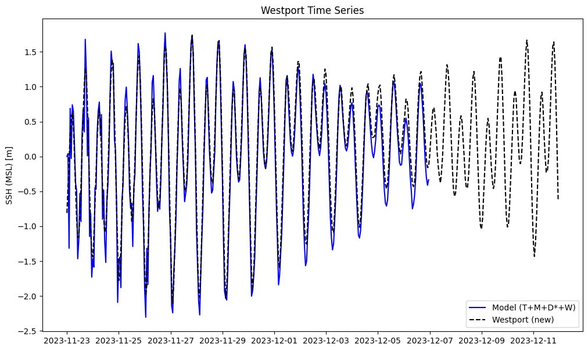
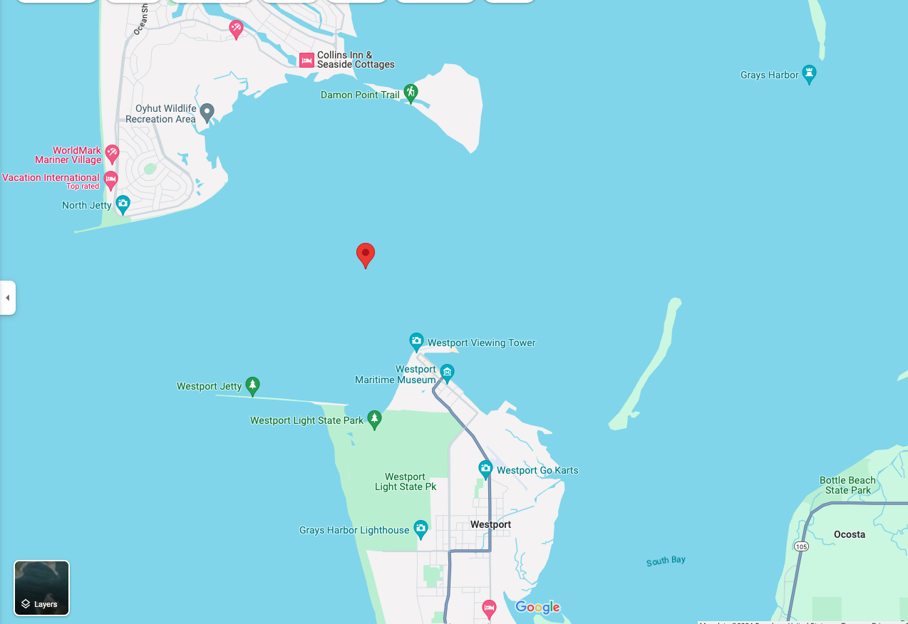
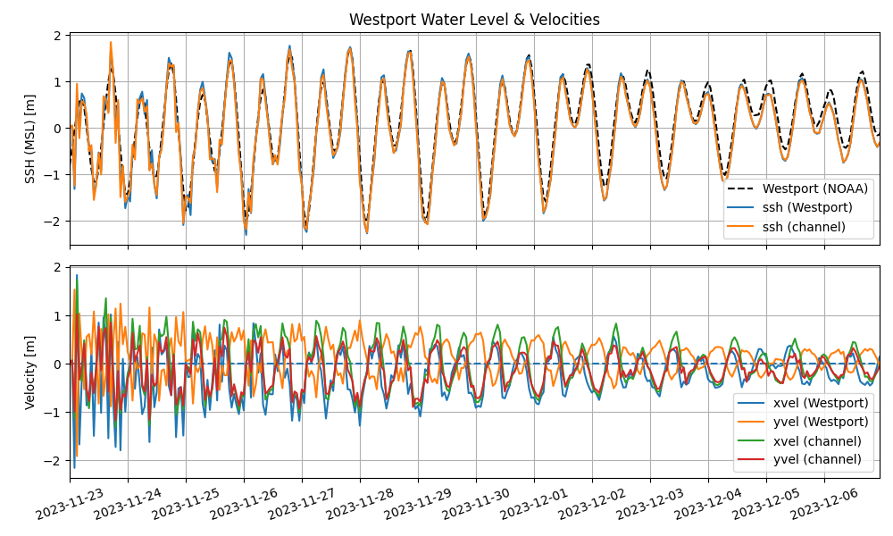
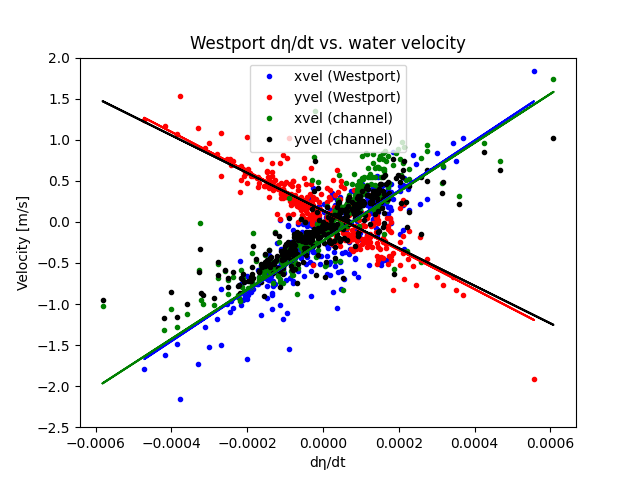

# April 07 - April 13, 2024
## Summary:
1) New Westport coordinate further offshore yields better water level predictions than coordinates provided by Stantec and NOAA gauge station. 
2) Flood tides: Westport has strong eastward and southward velocities; GH channel has strong eastward and northward velocities. 
3) Ebb tides, Westport has strong westward and northward velocities; GH channel has strong westward and southward velocities. 
4) Stronger velocities at outer channel during transition between ebb/flood tides, then center of channel becomes stronger (velocities on south channel is stronger). 
   
## Tasks:
1) Compare Westport water levels (further in channel) with Westport NOAA gauge location to see if better fit. 
2) Velocity and water level relationship at new Westport location and channel. 
3) Velocity field in GH channel. 
4) Run DFM model starting November 15, 2023.

## Results:
### 1) Compare Westport water levels
Plotted water levels from 2023 DFM model run using Stantec's Westport coordinate and a new coordinate @ 46.908078, -124.099941 (~0.5km NE of NOAA's tide gauge, ~1.25km NW of Stantec's coordinate).

<strong><em>Figure 1: Westport water levels (Stantec's coordinate vs. new @ 46.908078, -124.099941).</em>

### 2) Looked at x,y velocity and water level relationship at 2 different points
Plotted velocity and water levels at new Westport location and a point in the GH channel (46.922102, -124.126883) to look at relationships between dη/dt and SSH (MSL).

\
<strong><em>Figure 2: Location of coordinate in GH channel.</em>

\
<strong><em>Figure 3: Water levels and x,y velocities.</em>

\
<strong><em>Figure 4: Relationships between dη/dt and water velocities at Westport and GH channel.</em>

Takeaways:
- During flood tides, Westport has strong eastward and southward velocities, while GH channel has strong eastward and northward velocities.
- During ebb tides, Westport has strong westward and northward velocities, while GH has strong westward and southward velocities.

### 3) Velocity field of GH channel during duration of 2023 model run (November 23 - December 12, 2023)
Velocities in channel show mean landward flow during flood tides and mean seaward flow during ebb tides. During the transition between ebb and flood tides, velocities at the edges of the channel are stronger, then become weaker while velocities in the center channel become stronger throughout the tidal phase. Southern half of the channel exhibits stronger velocities roughly halfway through a tidal phase.

<video width="320" height="240" controls>
  <source src="[video.mov](https://github.com/rychiu18/RC-UW_ResearchLog/blob/master/Figures/041624meeting/Westport_vel_clip.mp4)" type="video/mp4">
</video>
<strong><em>Figure 5: Water levels at Westport location and velocity vectors in GH channel.</em>

## Issues:
1) Running DFM model for November 15, 2023: water levels explode after ~1-2 days (tested with different combinations of forcings: tides; tides + MET; tides + Q; tides + MET + Q + waves). 
2) Fix overlaps between spatial maps: overlapping nodes with velocity and water level maps when plotting quivers or meshgrid.

## Next steps:
- Work on CoPes poster
- Investigate why DFM model works for Nov. 23 - Dec. 12 runs but NOT for Nov. 15 - Dec. 12 runs (Issue #2)
  - Related to restart file? Or map_interval or his_interval files?
- Filter out overlapping nodes in different '*_map.nc' files for plotting spatial output variables from DFM model. 
