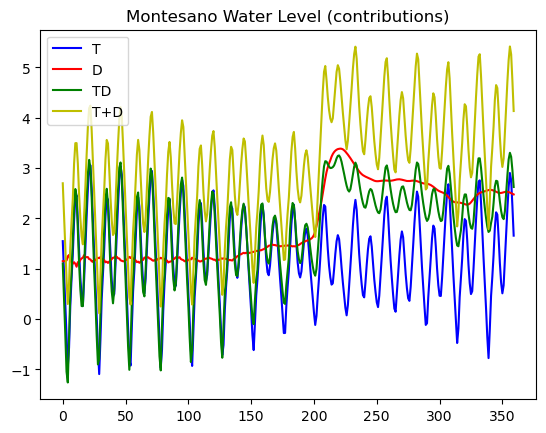
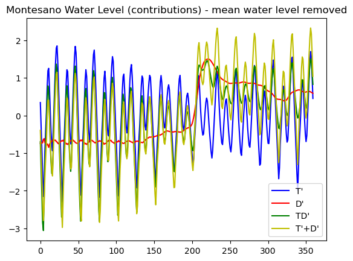
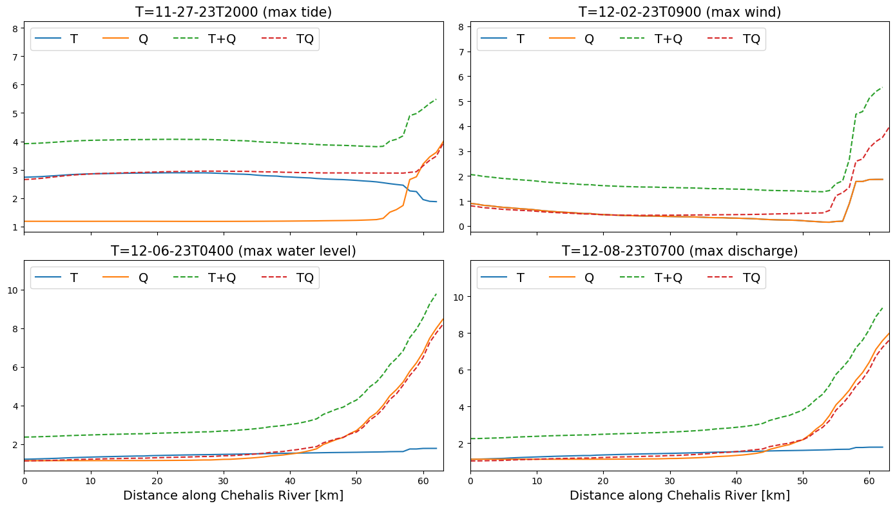
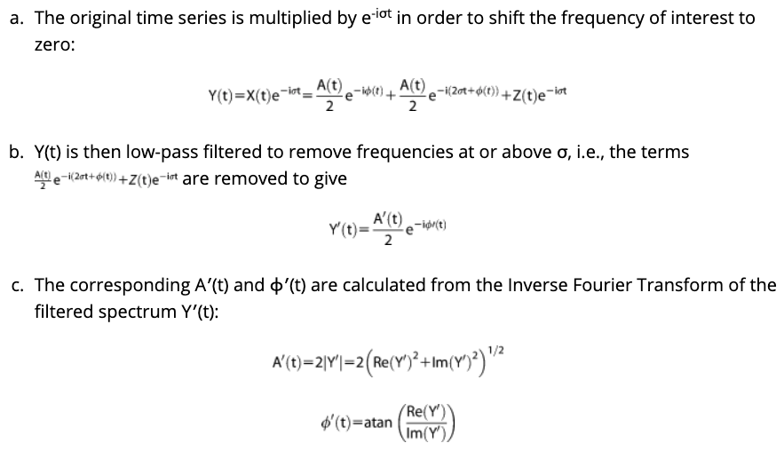
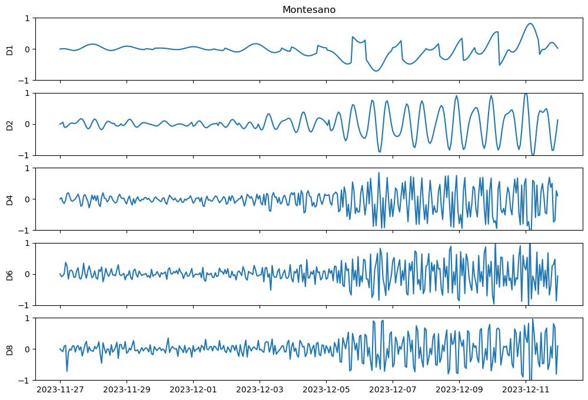

# April 13 - 19, 2025

## Summary:
1) Fixed oscillations in Dec2023_D run 
2) Complex demodulation analysis (Xiao et al., 2021) 

## Results:
### 1) Dec2023_D run
- Added A0 offset to discharge run and water level is >0 now
	- Still struggling on how to visualize without using NAVD88 as datum (Fig. 1,2)
- HOWEVER, transition zone logic changes, with a much narrower transition zone during max water level and max discharge (Fig. 2)

 
Figure 1: Montesano water level contributions for tides only run (blue), discharge only run (red), tides+discharge (yellow), and tides/discharge run (green).

 
Figure 2: Montesano water level contributions for tides only run, discharge only run, tides+discharge, and tides/discharge run with mean water level removed. 

 
Figure 3: Along channel profiles for: (a) max tide, (b) max wind), (c) max water level at Montesano, and (d) max discharge at Porter. 

### 2) Complex demodulation analysis
- Method for complex demodulation (Fig. 4)
	- 1) Multiply TSRI by e^-iøt
	- 2) Low-pass filter using respective frequencies (D1, D2, D4, D6, D8)
	- 3) Calculate amplitude and phase from Inverse Fourier Transform of the filtered spectrum
- Trying to demodulate non-linear interaction signal (TSRI), but struggling to find any relationship with frequencies (Fig. 5)

 
Figure 4: Complex demodulation method (Jalon-Rojas et al., 2018). 

 
Figure 5: Demodulated water levels at Montesano.

## Next steps:
- CoPes Annual Gathering poster
