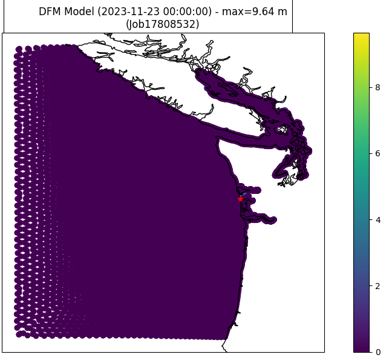
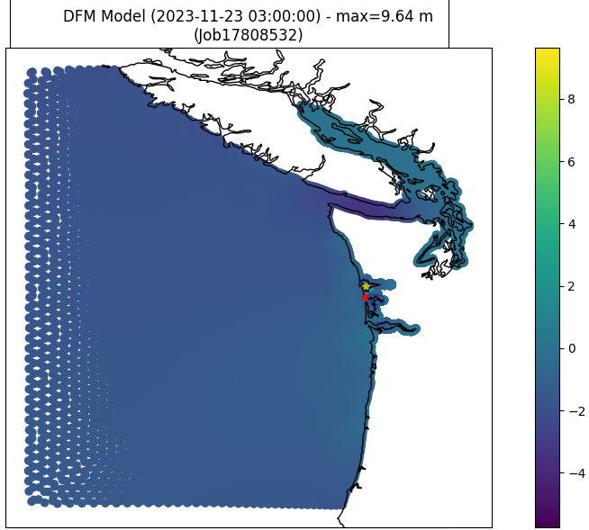
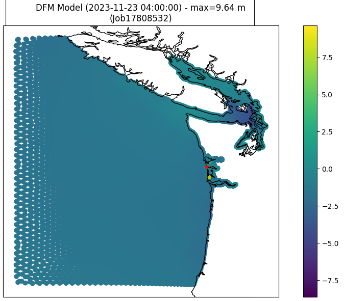
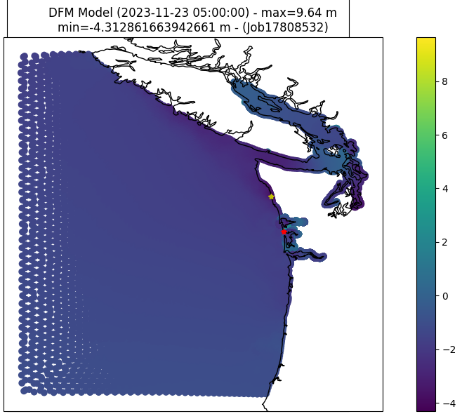
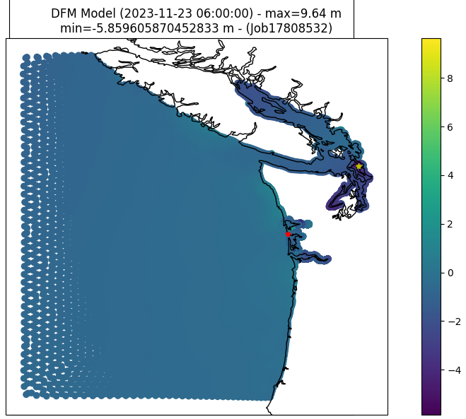
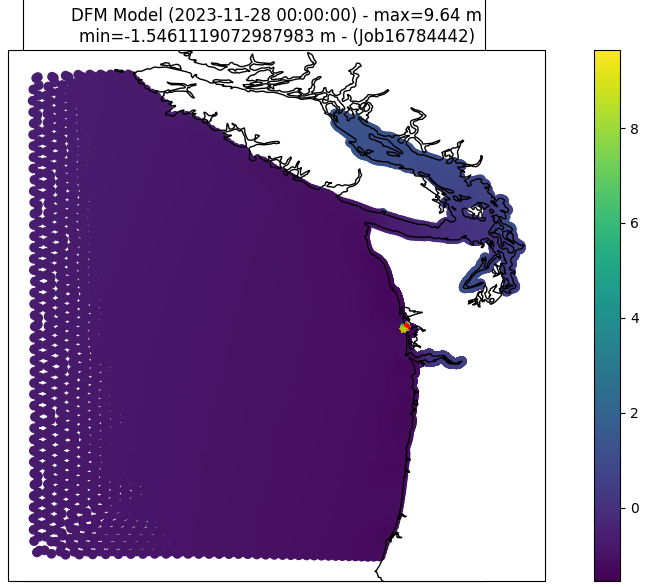

# April 14 - April 20, 2024
## Summary:
- Water levels still explode in both old DFM setup (n=8 files) and new DFM setup (n=15 files) when starting from Nov. 15 or before.
- Instabilities arise for DFM model runs (starting on or before Nov. 15, 2023) right away at multiple locations (straight, north coast, northern boundary).
  - For DFM model runs on or before Nov. 15, 2023, SSH at Tokepoint & Westport blow up at hour=39.
- Overlapping points between different map files share same water levels but have different velocities at map edges.

## Tasks:
1) Investigate overlapping points between different "*_map.nc" files.  
2) Investigate where instability for water level (SSH) occurs during runs starting from Nov. 15, 2023.

## Results:
### 1) Overlapping points in "*_map.nc" files

*older setup = original setup with model domain partitioned into 8 files (nodes=4; ntasks-per-node=2; cpus-per-task=8; nNodes=4; nProc=2)  
*newer setup = newer setup with model domain paritioned into 15 files (nodes=1; ntasks-per-node=40; nNodes=1; nProc=16)

The different "*_map.nc" files have overlapping points. Investigating FlowFM_0013_map.nc and FlowFM_0015_map.nc files (GH) shows 2198 points overlapping. Water levels at these points are consistent with each other (Figure 3). However, velocities differ (primarily at the edges of each file boundary) (Figures 4,5,6,7). Overlapping points may be necessary for feeding boundary conditions for forcing the other map file.

<strong><em>Figure 1: Overlapping points within Gray's Harbor with new(er) DFM model setup.</em> 

<strong><em>Figure 2: Overlapping points within Gray's Harbor with older DFM model setup.</em> 

<strong><em>Figure 3: Water level differences for overlapping points in FlowFM_0013 and FlowFM_0015.</em> 

<strong><em>Figure 4: Velocity (magnitude) at overlapping points between map partitions (newer setup).</em> 

<strong><em>Figure 5: Velocity (magnitude) at overlapping points between map partitions (older setup).</em> 

<strong><em>Figure 6: Velocity differences of overlapping points in FlowFM_0013 and FlowFM_0015 at H=00.</em> 

<strong><em>Figure 7: Velocity differences of overlapping points in FlowFM_0013 and FlowFM_0015 at from H=0:49.</em> 

## 2) Instabilities
- Water levels for original model (tides only) has instability around north channel of WB (+9.64m) that persists around this area for the entirety of the run (north channel and south GH).
- DFM run starting from November 15 has instabilities at H=5 along the north coast (Figure 11), then instabilities start to rise inside the Straight of Juan De Fuca/Bellingham (Figures 12,13). By H=30, water level instabilities still exist in the straight and instability starts to grow at northern boundary (Figure 13). At H=38, instabilities at northern boundary grow very large (-58m) (Figure 14).

<strong><em>Figure 8: Water levels for DFM model (Nov. 15 start) at H=00.</em> 

<strong><em>Figure 9: Water levels for DFM model (Nov. 15 start) at H=03.</em> 

<strong><em>Figure 10: Water levels for DFM model (Nov. 15 start) at H=04.</em> 

<strong><em>Figure 11: Water levels for DFM model (Nov. 15 start) at H=05.</em> 

<strong><em>Figure 12: Water levels for DFM model (Nov. 15 start) at H=06.</em> 

<strong><em>Figure 13: Water levels for DFM model (Nov. 15 start) at H=30.</em> 

<strong><em>Figure 14: Water levels for DFM model (Nov. 15 start) at H=38.</em> 

DFM run starting from November 23 has instabilities around north channel of WB and south GH which is consistent. Otherwise, water levels at other times seem to be normal (H=39, 120).

<strong><em>Figure 15: Water levels for DFM model (Nov. 23 start) at H=00.</em> 

<strong><em>Figure 16: Water levels for DFM model (Nov. 23 start) at H=39.</em> 

<strong><em>Figure 17: Water levels for DFM model (Nov. 23 start) at H=120.</em> 

## Issues:
- Many instabilities, think about how to fix

## Next Steps:
- CoPes poster
