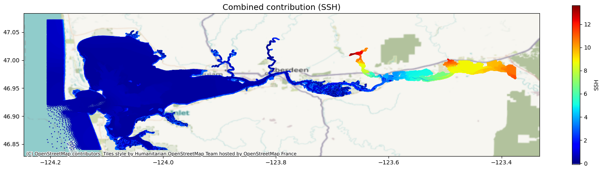
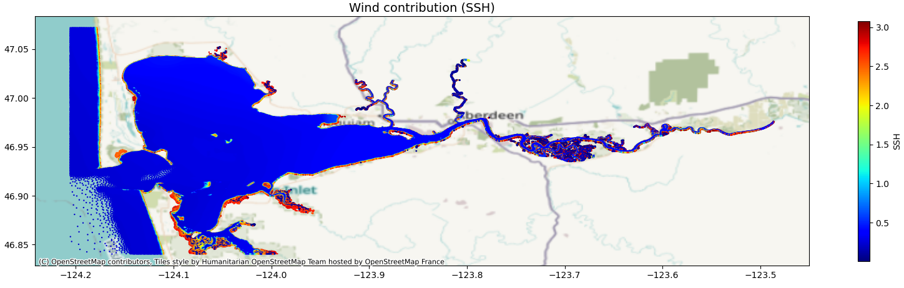
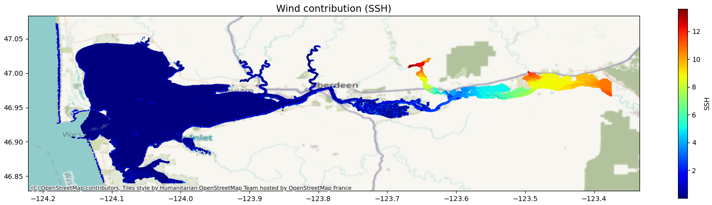
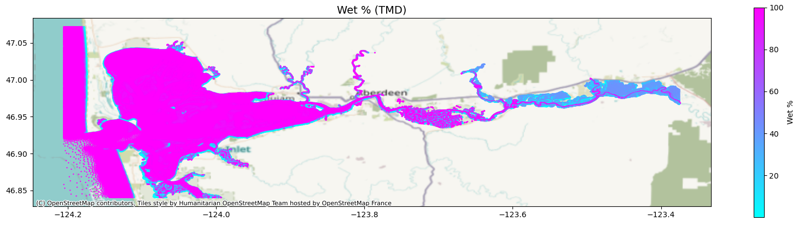
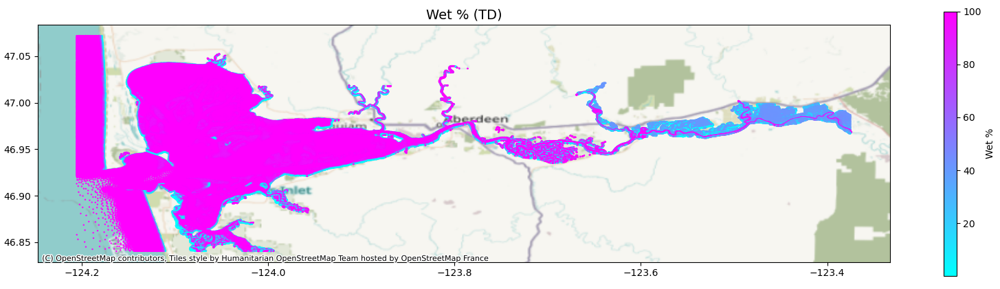
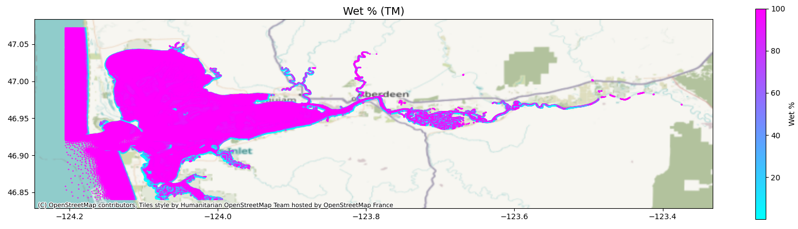
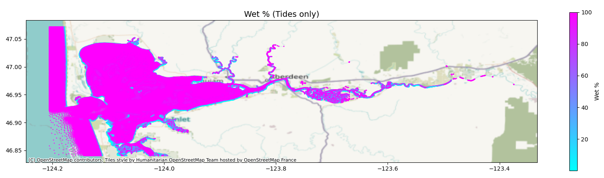

# April 20 - May 03, 2025

## Summary:
1) Plot compound flooding contributions
2) Plot percent wet maps

## Results:
### 1) Compound flooding contributions
- Combined contribution of compound flooding during peak (Fig. 1)
	- Followed Bao et al. (2024)'s method
	- MET and discharge contributes up to 12m upstream near Porter, Satsop, and Wynoochee
	- MET and discharge contributes up to 0.5m within the bay
- Wind contribution during peak (Fig. 2)
	- MET contributes up to ~3m over the tidal flats in the surge plain and curvature bends upstream
	- MET contributes up to 0.4m within the bay
	- Max contributions within Grays Harbor was ~3m, but mostly in southern bay/sloughs
	- Tides only make it up to Satsop
- Discharge contribution during peak (Fig. 3)
	- Discharge contributes up to 13.6m at discharge points upstream as expected
	- Discharge contributes up to 10cm within the bay

 
Figure 1: MET and discharge contributions to water levels in Grays Harbor.

 
Figure 2: MET contributions to water levels in Grays Harbor.

 
Figure 3: Discharge contributions to water levels in Grays Harbor.

### 2) Plot percent wet maps
- Calculate percent wet for each cell and plot map for TMD, TD, TM, and T runs (Fig. 4,5,6,7)

 
Figure 4: Percent wet map for December 2023 storm (tides+MET+discharge run).

 
Figure 5: Percent wet map for December 2023 storm (tides+discharge run).

 
Figure 6: Percent wet map for December 2023 storm (tides+MET run).

 
Figure 7: Percent wet map for December 2023 storm (tides run).

## To do:
- Run model for Jan2022 storm to compare analysis
- Plot map with locations of peak values with corresponding time to see when each cell reaches max water level
- Plot contribution ratio for each cell at peak