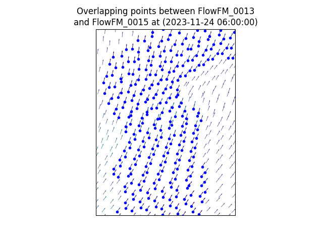
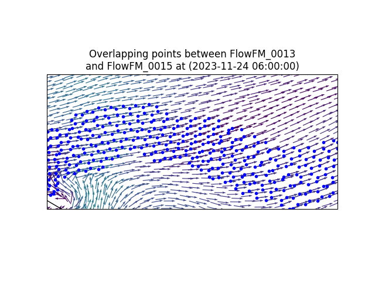
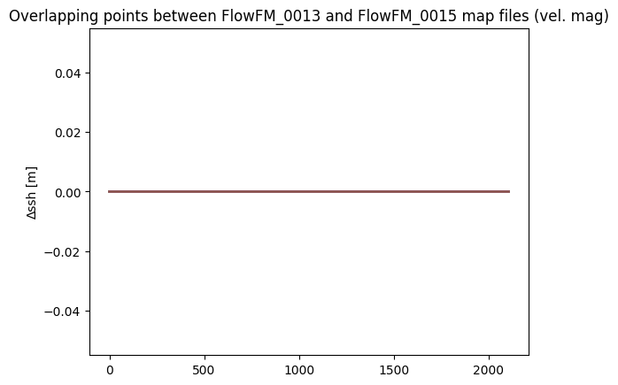

# April 21 - April 27, 2024

## Summary:
1) Ghost cells can be removed by taking the cells with the largest velocities.
2) CoPes All Hands poster.
3) DFM model did not run completely.

## Tasks:
1) Fix ghost cells in overlapping map files
2) Run DFM model for Nov. 23 - Dec. 12, 2023
3) Make CoPes All Hands poster

## Results:
### 1) Ghost cells in overlapping map files

Overlapping edge cells (ghost cells) exist in each map file due to parallelization. Had difficulty using OpenEarth's 'dflowfm_readDataPartitioned.m' tool working, so created one in Python for cross referencing two map files. The logic behind OpenEarth's tool is to take the largest velocity between the two cells. This was implemented using the new Python script and works well. Will eventually need to expand to cross reference all map files (do not need to work on at the moment as water levels at ghost cells agree).

Figures 1/2: Velocity vectors for overlapping points within Gray's Harbor between FlowFM_0013 and FlowFM_0015 map files.

Figure 3: Differences between velocity in two map files.

### 2) DFM model run
Model takes typically ~3-4 days to run with tides, met, discharge, and waves. Allocated 5 days of run time for Nov. 23 - Dec. 12, 2023 run but timed out reaching December 8. At model run day 2, model output reached early December, but slowed down afterwards. On model run day 4, DFM resolved only ~1-2 days of output.

## Issues:
- DFM model did NOT complete
  - Ran only until Dec. 9, 2023.
  - Model ran for 5 days (expected to finish in ~3-4 days based on previous runs)
  - Increase MEM for run?

## Next Steps:
- Finish CoPes poster.
- Write script for merging all map files and replacing values of ghost cells.
- Remove elevated (+9m) points within the map.
