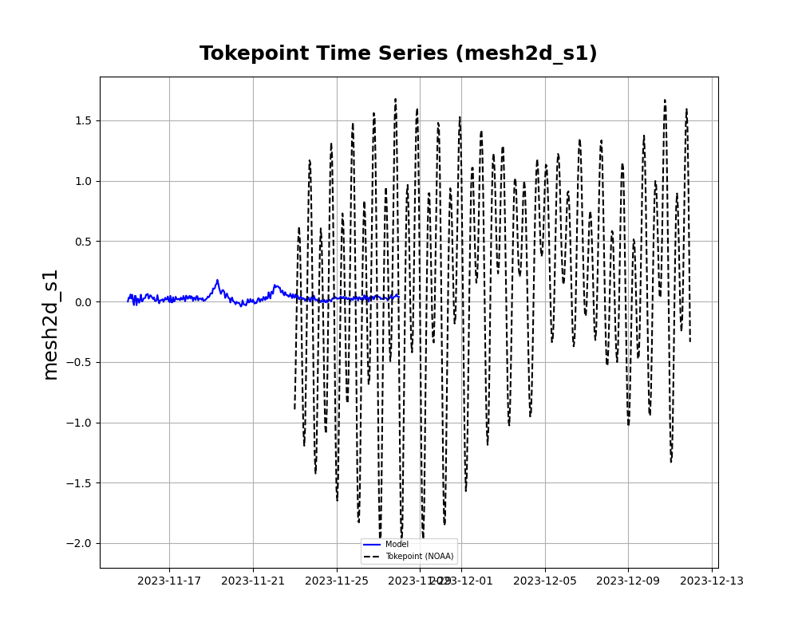
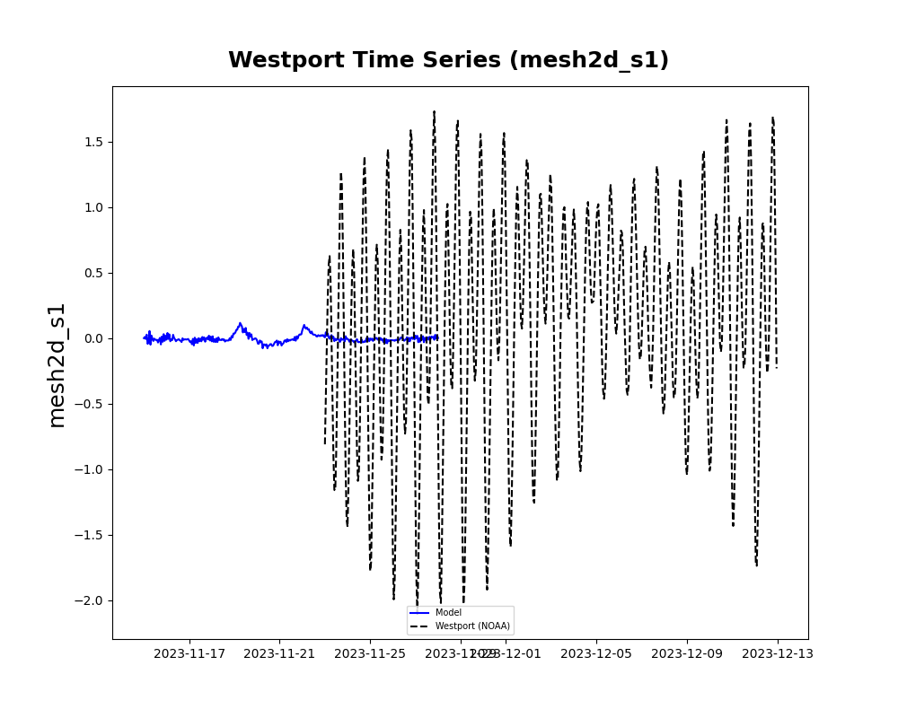

# April 28 - May 04, 2024

## Summary:

## Tasks:
1) CoPes poster and prep
2) Work on getting OpenEarthTool's dflowfm_readDataPartitioned.m working.
3) Run DFM model from Nov. 15 - Dec. 12 with just MET forcing.

## Results:
### 1) CoPes poster

### 2) OpenEarthTool
Previous issue was with nc_varget.m file throwing error: "data cannot be concatenated. Probably caused by different nc_varget function. This function is based on the nc_varget from OEtools." Found another nc_varget.m file that seems to run but giving all 0's as output when running script comparing any variable (time, ssh, velocity, etc)

### 3) DFM model (Nov. 15 - Dec. 12) with MET
SSH seemed reasonable when running DFM model with ONLY MET forcing (removed tides). Instability may be due to tides?

## Issues:

## Next Steps:
- Figure out how to use OEtools dflowfm_readDataPartitioned.m (compare and export netcdf to be read in python? or reluctantly work in MATLAB for plotting?)
- Continue investigating instabilities when beginning on Nov. 15 or prior 
