# May 04 - 10, 2025

## Summary:
1) Spatial maps of max water level and occurrence  
2) Spatial maps of max nonlinear effect
3) Spatial maps of velocity/bed stress

## Results:
### 1) Plotted spatial maps of max water levels and occurrence
- Max water depth for wind contribution (TM - T) (Fig. 1)
- Max water depth occurrence for wind contribution (Fig. 2)
- Wind speed and direction time series for Westport (Fig. 3)
	- Wind contributes up to 30 cm offshore and the main part of the bay (up to 40 cm in the very north end)
	- Max water depth occurrence shows the entrance channel and most of the northern bay reaching peak on Dec 05 T03:00Z
		- Wind is sustained for 18 hours from ~188 degrees (176-197) at ~9-10 m/s from Dec 04 T16:00Z to Dec 05 T09:00Z, which explains why entrance of bay is pushed to the north.
	- Eastern and lower part of the bay reaches max water levels on Dec 02 T12:00Z (132 hours). This occurs as the direction changes from 200 to 290 degrees within 4 hours prior and wind remains above 11 m/s.
	- The very northern parts of the bay reaches max water levels roughly on Dec 02 T10:00Z (130 hours). 

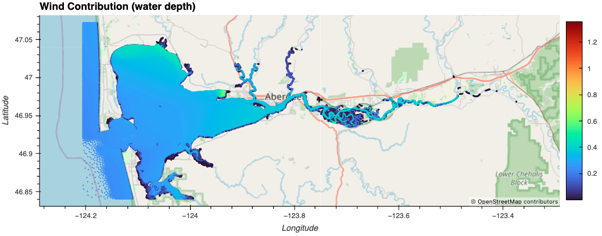 
Figure 1: Max water depth from wind contribution.

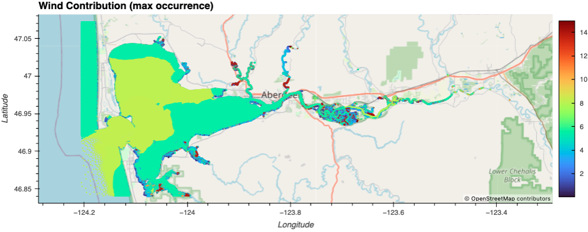 
Figure 2: Max water depth occurrence from wind contribution.

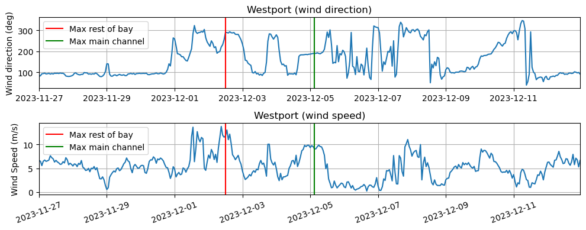 
Figure 3: Time series of wind speed and direction at Westport MET station.

- Max water depths for discharge contribution (TD - T) (Fig. 4)
- Max water depth occurrence for wind contribution (Fig. 5)
- Discharge and water level time series (Fig. 6)
	- Contribution from discharge is at maximum upstream (due to no tides), and decreases down to ~10 cm at the entrance of Chehalis River
	- The eastern half of the surge plain reaches max water depths during Dec. 06 T22:00Z, on the falling tide and when Porter discharge is halfway towards its peak
	- Between Satsop and Elma reaches peak on Dec. 06 T01:00, during the rising tide of the second peak after water levels were elevated at Montesano
	- Max water depths at Montesano were reached on Dec. 06 T10:00, near the end of the falling tide
	- East of South Elma reaches peak on Dec. 08 T12:00Z, roughly after peak flow is reached at Porter

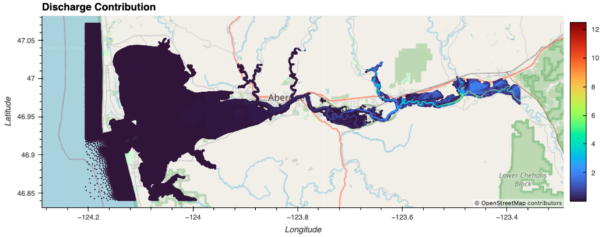 
Figure 4: Max water depth from discharge contribution.

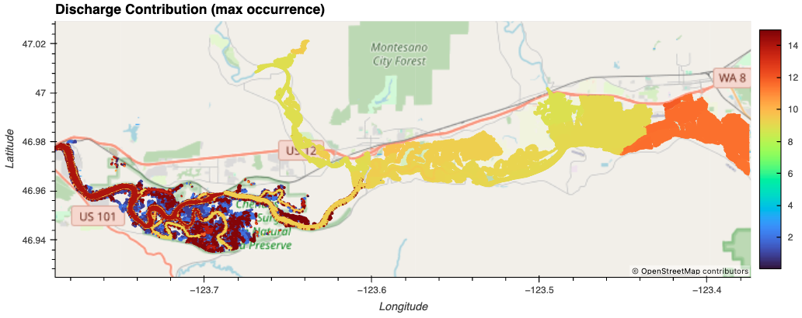 
Figure 5: Max water depth occurrence from discharge contribution.

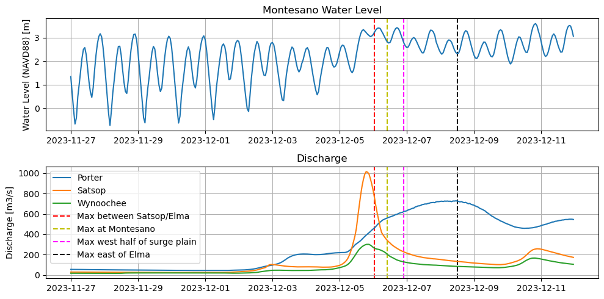 
Figure 6: Time series of discharge at Porter, Wynoochee, and Satsop.

- Max water depths for combined contribution (TMD - T) (Fig. 7)
- Max water depth occurrence for combined contribution (Fig. 8)
	- Max water depths are reached mostly in the upstream channels, contributing up to 3.5 m at Montesano
	- Max water depth occurrence shows splotchy results and occurrences upstream are similar timing to discharge contribution plot

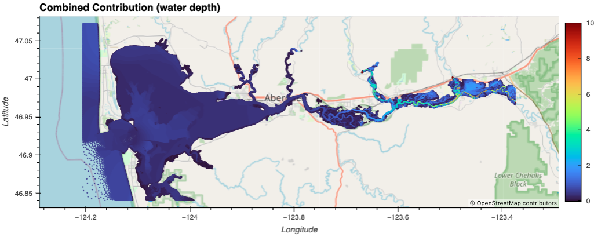 
Figure 7: Max water depth from combined contribution.

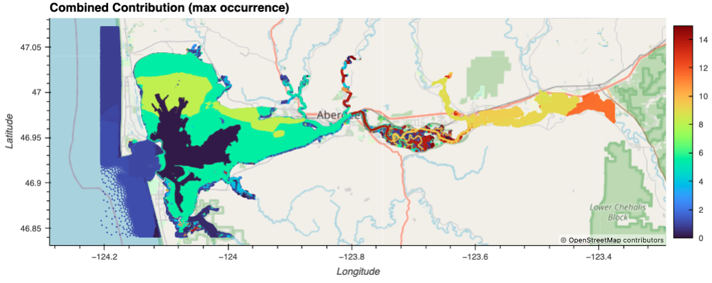 
Figure 8: Max water depth occurrence from combined contribution.

### 2) Spatial maps of nonlinear effect
- Nonlinear effects = TMD - TD - TM + T (Bao et al., 2022)
- Spatial plot of nonlinear effects (Fig. 9)
	- Main channels at the mouth and center of the bay reach peak nonlinear effects (up to 60 cm) within the first few days of the model
	- Nonlinear effects are mostly low around and upstream of Satsop River
	- Montesano reaches up to 0.5 m of nonlinear effect
	- The main channel of Chehalis River reaches peak nonlinear effect within the first few days
	- HOWEVER, many patches within the surge plain reaches max near the end of the time series

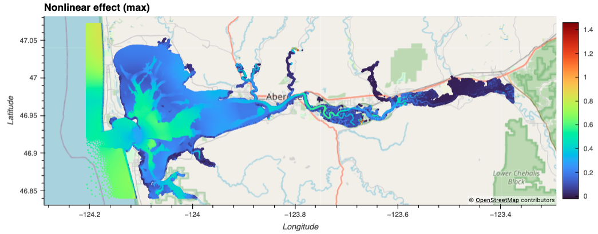 
Figure 9: Max nonlinear effect.

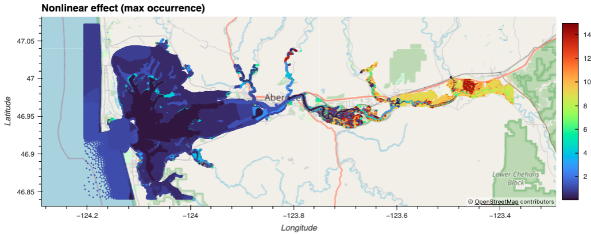 
Figure 10: Max nonlinear effect occurrence.

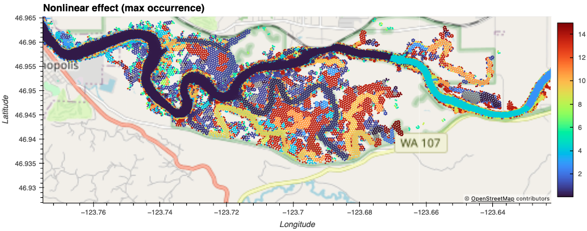 
Figure 11: Max nonlinear effect occurrence (zoomed on surge plain).

## Next steps:
- Look at velocity field/bed stress
- Compare results from nonlinear decomposition approach (Xiao et al., 2021) with nonlinear results from Bao et al. (2022)'s method
