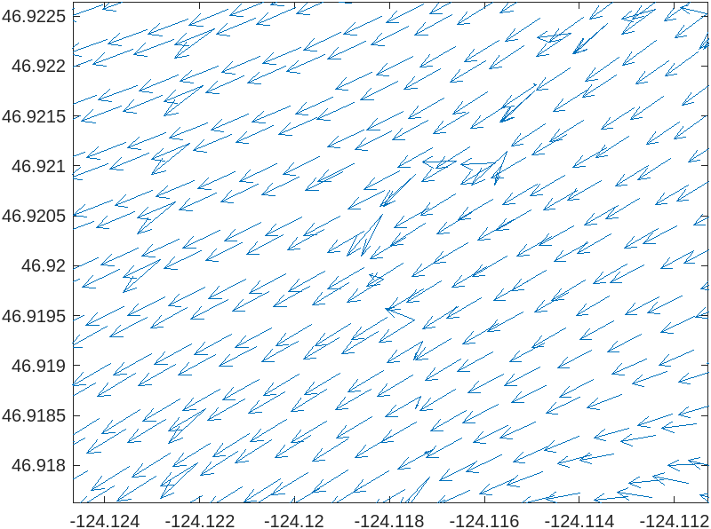

# May 05 - May 11, 2024

## Summary:
1) Attended CoPes All Hands Meeting. 
2) Got DFM file from Shelby. 
3) OEtool script (dflowfm_readDataPartitioned.m) works to eliminate ghost cells.  

## Tasks:
1) Test .py file form Shelby to concatenate DFM files.
2) Test dflowfm_readDataPartitioned.m file

## Results:
### 1) New DFM files
The read_d3dfm_results.py file from Shelby uses the Python pickle module to restructure the objects within the original DFM file and concantenates all map netcdf files. Unfortunately, the Twin Harbor map files contain different number of cells and is giving me this error: 
"ValueError: all the input array dimensions except for the concatenation axis must match exactly, but along dimension 1, the array at index 0 has size 32533 and the array at index 1 has size 33516".  Will need to redo looping in script to hopefully merge data correctly.

### 2) dflowfm_readDataPartitioned.m file
Able to get it running and reduce the number of values, but is still showing overlapping coordinates with different velocities (ghost cells are not removed).

## Issues:
- dflowfm_readDataPartitioned.m file is not eliminating ghost cells. Shelby has notebok that she will send over that removes ghost cells.

## Next Steps:
- Look at sages of storm and detide water levels at Westport, Tokepoint, and Montesano.
- Check bathymetry at North Cove to see if needs to be smoothed out.

