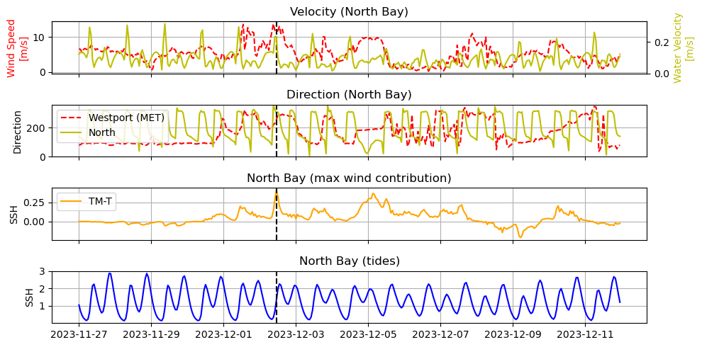
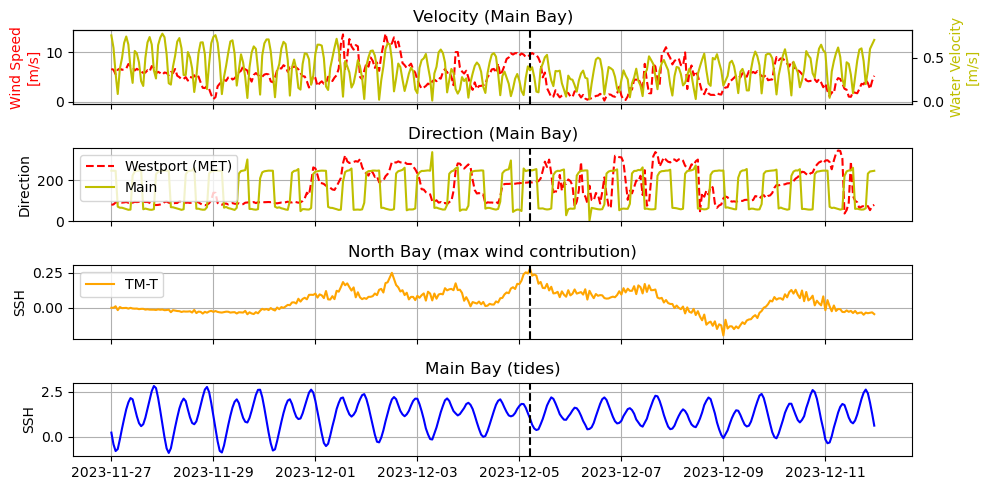
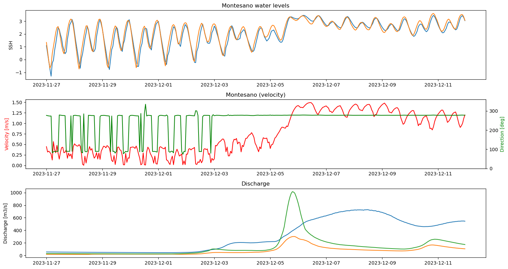

# May 11 - 17, 2025

## Summary:
1) Wind contribution time series 
2) Discharge contribution time series 

## Results:
### 1a) North bay time series
Max wind contribution (~41cm) was reached in the North Bay on Dec. 02, 2023 T11:00Z. Wind direction at Westport was blowing from the west (~255 degrees), whereas water current was flowing towards 300 degrees (northwest). Wind speeds were sustained over 10 m/s for at least 6 hours prior to max wind contribution. Tides were also rising which contributed to rising water levels. Opposing wind and water flow may be the reason for max contribution in the northern part of the bay.

 
Figure 1: North Bay time series.

### 1b) Main bay time series
Max wind contribution within the main bay is reached on December 05, 2023 T05:00Z. Winds were sustained for half a day prior at just below 10m/s coming from the south (192 degrees). Water velocity is 40 cm/s flowing west-southwest (~250 degrees). Although tides were dropping, the opposing winds and water flow elevate water levels within the main part of the bay.

 
Figure 2: Main Bay time series.

### 2) Montesano time series
Direction of water flow alternates between eastward and westward until precipitation and discharge increases, generating strong downstream flow for the remainder of the time series.

 
Figure 3: Montesano time series.

## Next steps:
- Look at volume flux upstream of Montesano, entrances of surge plain, and mouth of Chehalis River
- Compare results for January 2022 storm
