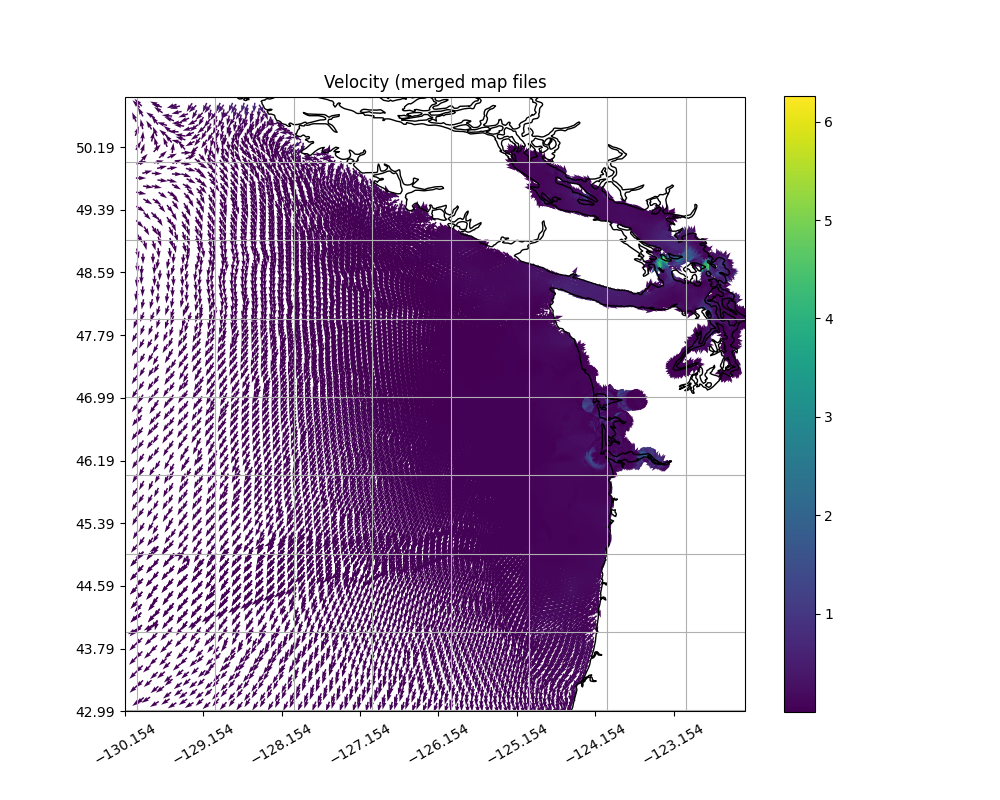
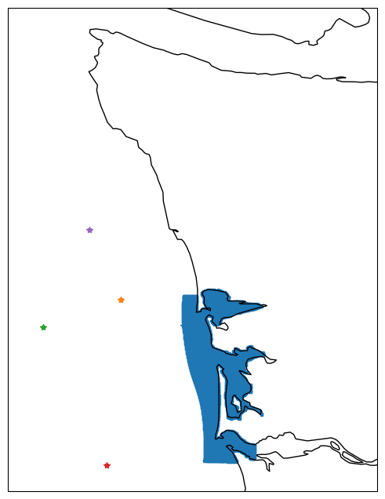
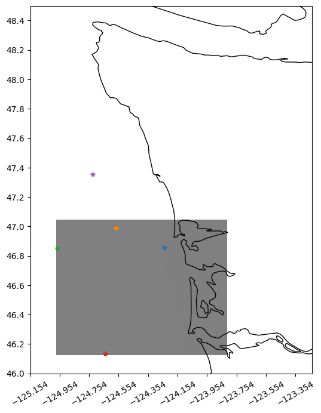

# May 12 - May 18, 2024

## Summary:
1) Got Shelby's merge map file working  
2) Create new grid for SWAN model forcing (ongoing)  
3) Spreadsheet w/ongoing issues with DFM model  

## Tasks:
1) Write script to concatenate DFM *map.nc files.  
2) Create new grid for SWAN model forcing.  
3) Create spreadsheet with ongoing issues with the DFM model.  
4) Read literature on tidal propagation in estuaries (related to compound flooding).  

## Results:
### 1) Merge DFM map files
Able to get Shelby's 'read_d3dfm_results.py' script working and able to merge DFM map files. Script creates individual files for grid (lat, lon), ssh, ucx, ucy, ucmag, and any other data you want.

Figure 1: Map with velocities (using merged dataset). 

### 2) Creating grid for expanding SWAN grid
For CEWA572's final project, I am working on expanding the SWAN grid to incorporate 2/3 other offshore buoys that have spectral data. I will then force the model with data from these two buoys and validate data recorded at the current GH offshore buoy.

Figure 2: Map of Stantec's SWAN grid with offshore buoys. 

Figure 3: Map of new SWAN grid expanded to other offshore buoys. 

### 3) DFM issue spreadsheet
Created file with list of to-do's for DFM issues (current/resolved).

## Issues:

## Next Steps:
- Filter out overlapping velocity data in merged DFM map files.
- Add bathymetry data to new SWAN grid and run model.
- Continue reading literature on compound flooding in estuaries (Ramilkhalili et al., 2022).
