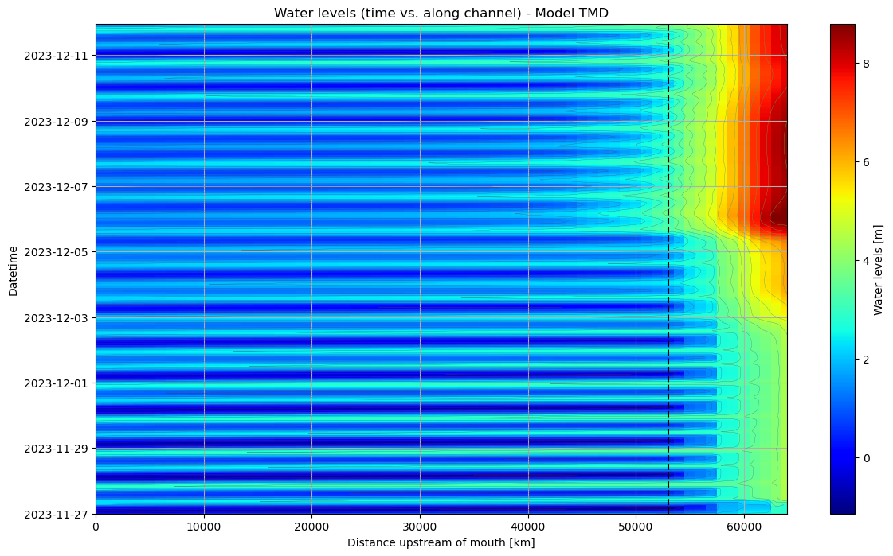

# May 18 - 24, 2025

## Summary:
1) Grays Harbor transition zone 
2) Time series comparisons 
3) Comparisons between nonlinear effect approach (Bao vs. Xiao) 
4) Analytical solution comparison 

## Results:
### 1) Grays Harbor transition zone
- Reran models for Dec. 2023
	- Observed transition zone shifts downstream and widens as discharge increases (Fig. 1)
	- River zone migrates downstream
	- Still struggling to plot water levels relative to a reference level

 
Figure 1: Coastal, transition, and river zones for Grays Harbor.

### 2) Time series comparison
- Along-channel water surface change over time (Fig. 2)
	- Elevation of water levels at Montesano (x=53000) is sustained over time
	- We see that the influence of high river discharge from Wynoochee elevates water levels down to 43000 km

 
Figure 2: Along-channel water surface change over time (dashed line = Montesano).

- Water levels lag behind velocity by ~2 hours (Fig. 3a, 4)
- Direction of flow alternates between ~260 and ~80 as tides change and is sustained flowing offshore as cumulative discharge (Satsop+Porter+Wynoochee) begins to exceed 200 m3/s on Dec. 3, 2023 (Fig. 3b)
- Velocities (x and y) are aligned with each other (Fig. 3c)
- Bed stress increases as downstream velocities increase (Fig. 3d)

 
Figure 3: Montesano time series (water level, x and y velocities, direction, and bed stress).

 
Figure 4: Time lag between velocity and water levels.

### 3) Comparing nonlinear effect method (Bao vs. Xiao)
- Bao's approach: TMD - TD - TM + T
- Xiao's approach removes tides and removes LFS
- Xiao's approach looks to be more reasonable with amplitudes of the nonlinear effect similar to the difference we observe between the tides only run and the TMD run (Fig. 5)

 
Figure 5: Comparisons between different methods for nonlinear effect (Xiao vs. Bao).

- When removing the tide only and discharge only run from the TMD run, we gain a signal very similar to the nonlinear effect derived from Xiao's method, with an offset of 1m (Fig. 6, 7)

 
Figure 6: Comparisons between different methods for nonlinear effect (Xiao vs. Bao).

 
Figure 7: Comparisons between different methods for nonlinear effect (Xiao vs. Bao).

4) Analytical solution comparison 
- Used analytical solution from Bao et al. (2022) to compare with along-channel water surface observed in TD run (Fig. 8)
	- Incorporated convergent width
	- Highly sensitive to bed slope so used a smoothed, steadily increasing depth

 

[bao_analyticalcomparison](../Figures/052225meeting/analyticalmodel_bao.png) 
Figure 8: Comparisons between analytical model and TD run.

## Next steps:
- Plot/calculate momentum balance terms for entire domain
