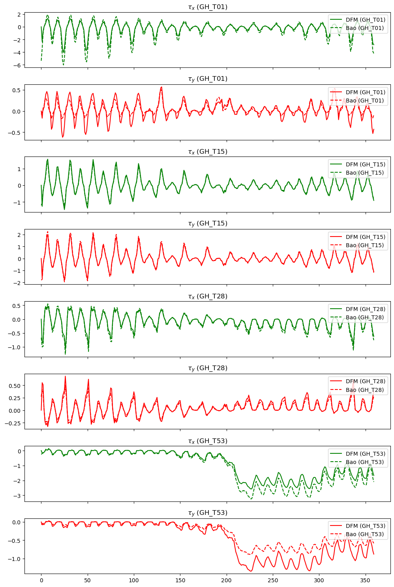
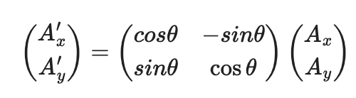
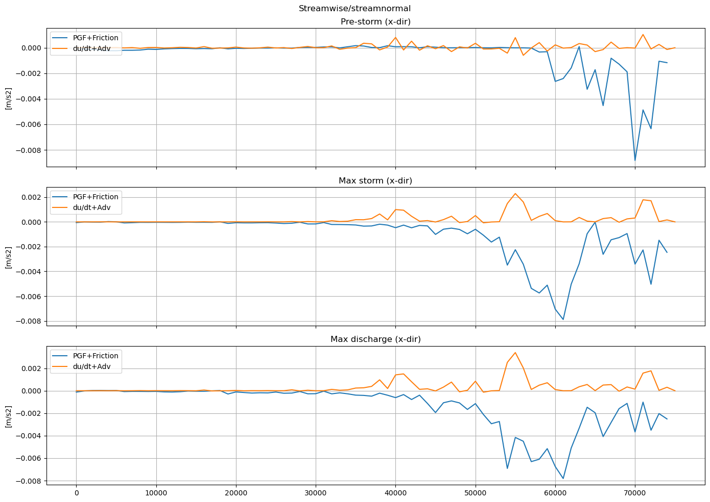
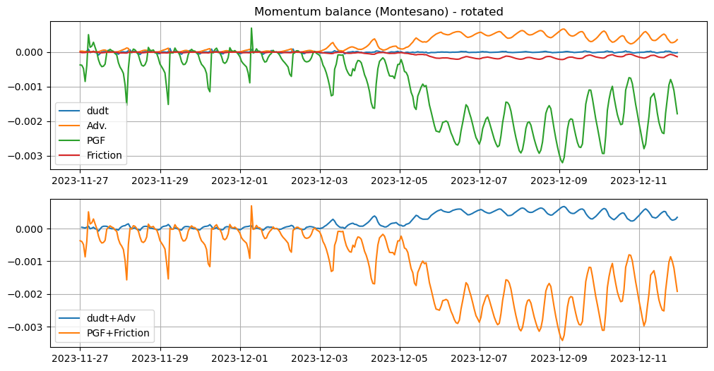

# May 25 - June 07, 2025

## Summary:
1) Momentum balance for Grays Harbor 
2) Momentum balance for Grays Harbor (rotated) 
3) Momentum balance for select locations 

## Results:
### 1) Momentum balance
- Calculate momentum balance for along channel observation points for Grays Harbor/Chehalis River

Bao's momentum balance equation 
 

DFM momentum balance equation 
 
- Fx and Fy represent the unbalance of horizontal Reynolds stresses
- Mx and My represent the contributions due to external sources or sinks of momentum (external forces by hydraulic structures, discharge or withdrawal of water, wave stresses, etc)

- Assumptions:
	- rho = 1013 kg/m3
	- Cd = 3e-03
	- dx = x2-x1
	- dy = y2-y1

 
Figure 1: Momentum balance.

 
Figure 2: Momentum balance (individual terms).

 
Figure 3: Momentum balance (Montesano).

- Compared bottom stress between DFM and Bao et al. (2022)'s tau equation (Fig. 4) 

 

 
Figure 4: Comparing bottom stress between DFM and Bao et al. (2022).

### 2) Momentum balance (rotated)
- Rotate x,y to streamwise and stream normal coordinate system
	- Assume dx = 1000; dy = 0
	- Found direction between two stations and rotated from N

 

 
Figure 5: Angle between stations.

 

- Verification that rotation matrix worked
- GH_T09 is located near the mouth of Grays Harbor, so velocities should be predominantly east-west (Fig. 6)
	- Comparisons between u (east-west flow) and v' (streamwise direction after rotation) show that they both agree

 

- GH_T38 is located at a north-south section of the Chehalis River, so velocities should be predominantly north-south (Fig. 7)
	- Comparisons between v (north-south flow) and v' (streamwise direction after rotation) show that they are opposite, which is to be expected (ebb flow generates positive v, and since rotating coordinate system to positive upstream, v' will be negative as water is flowing out)

 

 
Figure 8: Momentum balance rotated to streamwise.

 
Figure 9: Momentum balance (individual terms) rotated to streamwise.

 
Figure 10: Momentum balance (Montesano) rotated to streamwise.

### 3) Momentum balance for GH_T09 and GH_T51
- Momentum balance for GH_T09 (Fig. 11)
	- Much more balanced
	- Maybe a shift in one of the derivatives?

 
Figure 11: Momentum balance rotated to streamwise for GH_T09.

- Momentum balance for GH_T51 (Fig. 12)
	- Much more dominated by PGF and friction
	- One of the terms should be different sign?

 
Figure 11: Momentum balance rotated to streamwise for GH_T51.

## Next Steps:
- Figure out how to calculate Reynolds stress terms
	- Reynolds stress term (x-momentum): d/dx (ū'^2) (taking the time average of u'^2)
- Calculate d/dx terms (adv, pgf, tau) from neighboring points
- Calculate Cd (friction coefficient) based on velocity/Chezy's for each station