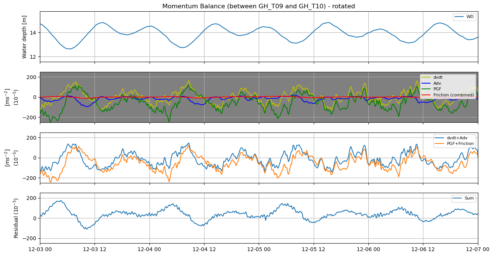

# June 08 - 14, 2025

## Summary:
1) Wind stress calculations 
2) Momentum balance for Grays Harbor 

## Results:
### 1) Wind stress calculations
- Calculations for wind stress component:
	- Drag coefficient 
 
	- Wind speed vs drag coefficient
		- (a) Cd = 6.3e-04 for U=0 m/s
		- (b) Cd = 7.23e-03 for U=100 m/s 
 

	- Surface wind stress (same as bottom stress equation) 
 
 

### 2) Momentum balance for Grays Harbor
- Ran Model TMD with 10m intervals
- Added in wind stress but differences were marginal as stress term is divided by ~10^4

 

- Momentum balance for site between GH_T09 and GH_T10

 

 

## Next steps:
- Calculate viscous stress terms using horizontal viscosity term