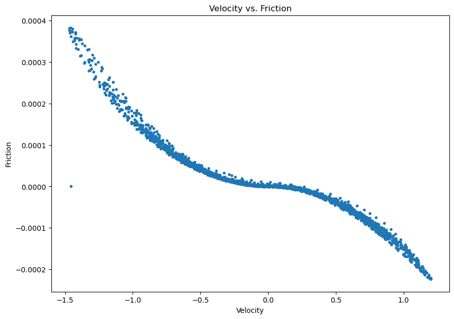

# June 15 - 21, 2025

## Summary:
1) Local momentum balance analysis (GH_T09/GH_T10)
2) Local momentum balance analysis (GH_T51/GH_T52)

## Results:
### 1) GH_T09/GH_T10 analysis
- During falling tide, main balance is between friction and PGF
- During rising tide, all terms are on the same order

 
Figure 1: Momentum balance for location between GH_T09 and GH_T10 (near mouth of Grays Harbor).

#### dvdt
- As tides reach lows (LLW, LHW), dvdt reaches a max (+) velocity (landward flow)
- As tides reach highs (HHW, HLW), dvdt reaches a minimium (-) velocity (seaward flow)
- dvdt lags behind velocity by ~160 minutes (2h40m)
- dvdt reaches 0 at highs and lows of tides (which makes sense) (Fig. 2)
- Velocity lags behind eta by ~160 minutes (2h40m)

 
Figure 2: Eta, dvdt, and velocity for location between GH_T09 and GH_T10. 

#### Advection
- Advection term oscillates around near 0 except for transitions between LHW/LLW and LLW/HHW
- Mostly balances friction term except for the falling tide between LHW and LLW
	- During this time, advection is balanced mostly by PGF
- Water levels lag ~2 hours behind velocity (water levels reach max/min ~2 hours after max/min velocities)
- Velocity and eta ~90º out of phase of each other

#### PGF
- As tides rise, PGF increases
	- deta/dy < 0 (upstream eta > downstream eta)
	- PGF > 0
- As tides fall, PGF decreases
	- deta/dy > 0 (upstream eta < downstream eta)
- Follows/balances dvdt on the rising tides, but diverges on the falling tides

#### Friction
- Increases during falling tide (as velocity approaches max), and peaks just before tides reach a low
- Slope of friction increases as velocity reaches peak (as expected since friction is function of velocity) (Fig. 3)
- Balances advective term at the beginning of the rising tide from LLW to HHW

 
Figure 3: Velocity vs. friction for location between GH_T09 and GH_T10.

### 2) GH_T51/GH_T52 analysis
- PGF and friction terms are of first order during falling tides
- Then become on the same order as other terms during rising tides
- PGF dominates during compound flooding event

 
Figure 4: Momentum balance for location between GH_T51 and GH_T52 (just downstream of Montesano USGS gauge).

Next steps:
- Close momentum budget for upstream location
	- Taking cross section average?
	- For curved sections, need to add new observation points
	- Budget also doesn't seem to close well within the bay
- Find along channel location where pressure and friction terms become first order
	- Could be used to locate transition zone?