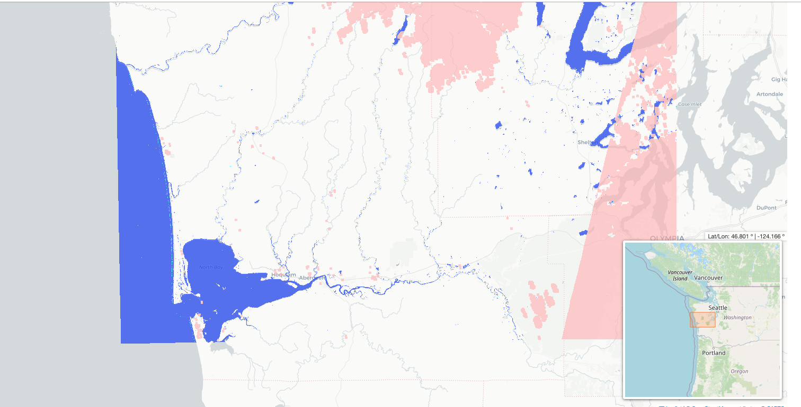
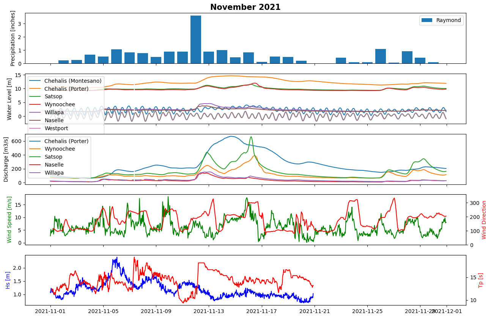

# June 16 - June 22, 2024
test
## Summary:
1) Played with DSWx (water surface extent) product for Twin Harbors
2) Picked atmospheric river event for analysis

## To do:
1) Research DSWx product
2) Find and start analysis of atmospheric river event

## Results:
1) DSWx product
Found GitHub repo for OPERA products and edited notebook to look at available overlapping data for Twin Harbors.

Figure 1: DSWx map. 

2) Atmospheric river event for analysis
Picked the November 2021 atmospheric river event for analysis and began downloading relevant data (water levels, discharge, MET, wave, etc).

Figure 1: November 2021 time series. 

## Issues:

## Next steps:
- Continue investigating DSWx application for Twin Harbors
- Create formatted data files for November 2021 observation data to be used in DFM
