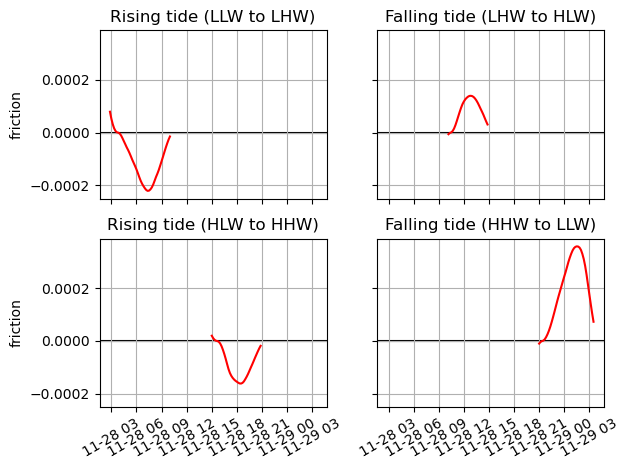
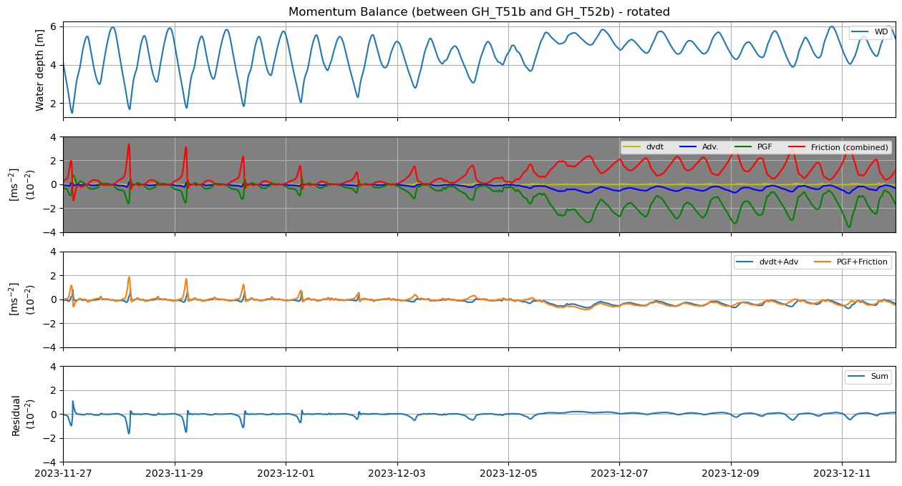

# June 22 - 28, 2025

## Summary:
1) Local momentum balance analysis (GH_T09/GH_T10)
1) Local momentum balance (GH_T51/GH_T52)

## Results:
### 1) GH_T09/GH_T10 analysis
- Picked one tidal cycle (Nov. 28 T02:50 to Nov. 29 T03:30) (Fig. 1)
- Velocity drives SSH change
	- Positive velocity (onshore)
	- Negative velocity (offshore)
	- Velocity lags SSH by ~160 minutes (2h40m)

 
Figure 1: Momentum balance for station between GH_T09/GH_T10 for one tidal cycle.

#### dv/dt (Fig. 2)
- dv/dt = 0: velocity reaches peak (max/min)
- dv/dt > 0: velocity is increasing over time (during rising portion)
- dv/dt < 0: velocity is decreasing over time (after reaching peak velocity)
- LLW to LHW:
	- As dv/dt decreases towards 0, it reaches a max peak onshore velocity during rising tide
	- dv/dt continues to become more negative as velocity begins to switch direction
- LHW to HLW:
	- As dv/dt increases towards 0 velocity approaches peak offshore flow
	- dv/dt continues to become more positive as velocity begins to switch direction and become more onshore flow
- HLW to HHW:
	- As dv/dt decreases toward 0 velocity, it reaches a max peak onshore velocity during this shorter rising tide
	- dv/dt continues to become more negative as velocity begins to switch direction for an offshore flow
- HHW to LLW: 
	- As dv/dt increases toward 0 velocity, it approaches peak offshore flow (much more negative than the previous falling tide)
	- dv/dt continues to become more positive as velocity begins to switch direction for an onshore flow for the next cycle

 
Figure 2: dvdt for different tidal stages.

#### Advection (Fig. 3)
- | vel(GH_09) | > | vel(GH_10) | during peak velocities
	- During flood (rising) tide, velocity decelerates as flow moves onshore 
	- During ebb (falling) tide, velocity accelerates as flow moves offshore
- Peak flow lags behind peak water levels
	- Flow reversal ~2/3 through the tidal stage

 
Figure 3: Velocity for different tidal stages at GH_T09 and GH_T10.

#### PGF (Fig. 4)
- PGF > 0: eta (GH_09) > eta (GH_10)
- PGF < 0: eta (GH_09) < eta (GH_10)
- For majority of rising tides (and tails of falling tides), PGF > 0
	- eta upstream is higher than downstream (water levels tilt up upstream)
- For majority of falling tides (and tails of rising tides), PGF < 0
	- eta upstream is lower than downstream (water levels tilt down downstream)
- PGF has lag response to velocity (bc function of water levels which also lag velocity)

 
Figure 4: PGF for different tidal stages at GH_T09 and GH_T10.

#### Friction (Fig. 5)
- Mirror image of velocity (function of velocity and Chezys)

 
 
Figure 5: Friction for different tidal stages at GH_T09 and GH_T10.

#### Additional notes
- Rising tidal stages:
	- dv/dt = 0 when velocity reaches maximum
- PGF and dvdt becomes first order right after end of each tidal stage
	- Max tilt between stations
- PGF and friction dominate/become first order during HHW to LLW tidal stage
	- Velocity magnitude is much greater than other tidal stages due to larger surface tilt

### 2) GH_T51/GH_T52 momentum balance
- Created 6 cross-channel observation points and calculated momentum budget using different approaches

- Added velx (vdv/dx) and taux components to y-momentum budget

- Calculated cross-sectionally averaged momentum budget (Fig. 6)

Figure 6: Momentum balance using cross sectionally averaged values along GH_T51 and GH_T52 for calculating at GH_T51.5.

- More localized approach calculating momentum balance between GH_T51b, GH_T51.5b, and GH_T52b (Fig. 7)
	- Found calculations for "b" points to yield the smallest residuals
	- For calculating dvdx, used velocities between GH_T51.5c and GH_T51.5a
	- During compound flooding event, large balance between pressure and friction (with advection as secondary)
	- Much better balance but higher residuals due to large imbalance between pressure and friction

Figure 7: Momentum balance between GH_T51b and GH_T52b for calculating at GH_T51.5b.

## Next steps:
- Test same cross section approach with GH_T09 and GH_T10 stations to minimize residuals and verify that additional components are calculated correctly
- Continue analysis of GH_T09/GH_T10 budget