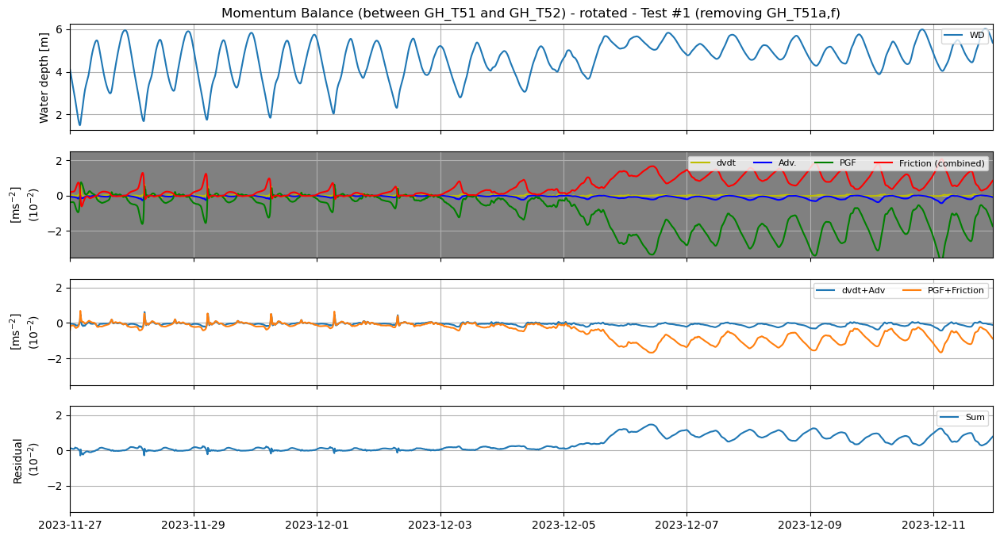

# June 29 - July 05, 2025

## Summary:
1) Local momentum balance (GH_T51/GH_T52)

## Results:
### 1) GH_T51/GH_T52 momentum budget
- Cross sectional stations for GH_T51, GH_T51.5, and GH_T52
- Tried different combinations to close the budget
	- Very sensitive to which stations I choose for calculations!

#### Test 1
- Using cross section average values for GH_T51, GH_T51.5, and GH_T52 (Fig. 1)
- Removing points a and f from GH_T51 helped reduce spikes, but still have large residual during flood (Fig. 3)

Figure 1: Momentum budget for "Test #1" (with GH_T51a/f removed).

#### Test 2
- Using GH_T51.5c as center points (Fig. 
- Not accurate since I'm using a single point value for calculations
- Would be better to use cross-sectionally average for some of the terms (e.g. PGF, bedstress, etc) 
- Still spikes, but residuals are mostly <1

#### Test 3
- Similar to Test 2, but setting d/dx more locally
	- Set d/dx as derivative between GH_T51.5b and GH_T51.5d instead of calculating from GH_T51a to GH_T51.5f (setting local)

#### Test 4
- Centering around GH_T51b instead
- Works the best at balancing during flood event, but still have large spikes prior to flood
	- Driven mostly by higher friction
- Can minimize spikes by using GH_T51.5c for friction calculations, but won't be consistent

#### Test 5
- 

Issues:
- Bottom stress
	- Average of rotated u- and v-direction bottom stress between GH_T51 and GH_T52 not matching with new midsection values
	- Streamwise bottom friction is ~50% larger during flood
	- Streamnormal is much much larger and variable

Fixes:
- Using GH_T52_avg and GH_T51_avg for PGF gives a larger value which causes spikes (Test 5)
	- Using GH_T52b and GH_T51b generates a smaller PGF which decreases the magnitude of the spikes
	- Using GH_T52c and GH_T51c is roughly the same as GH_T52b and GH_T51b
- Using GH_T51a and GH_T51f (which is dry on low tide) increases friction significantly, causing spikes in residuals

To do:
- Continue playing around with combinations of stations to close budget
