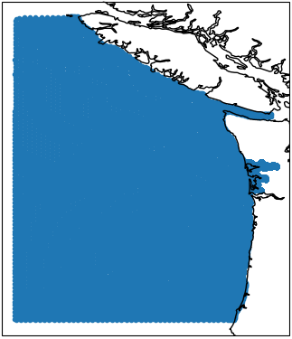
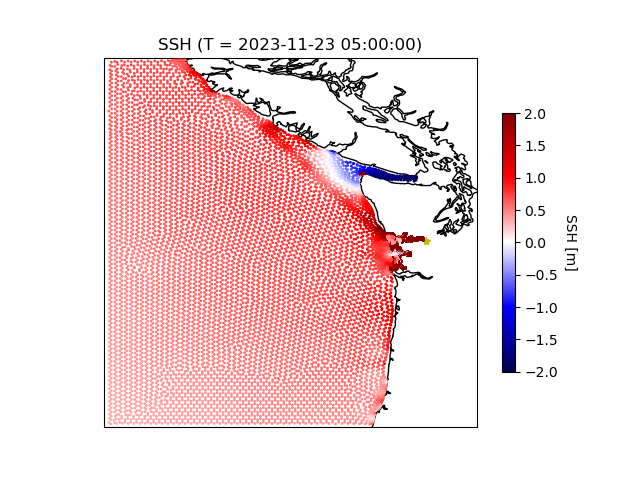
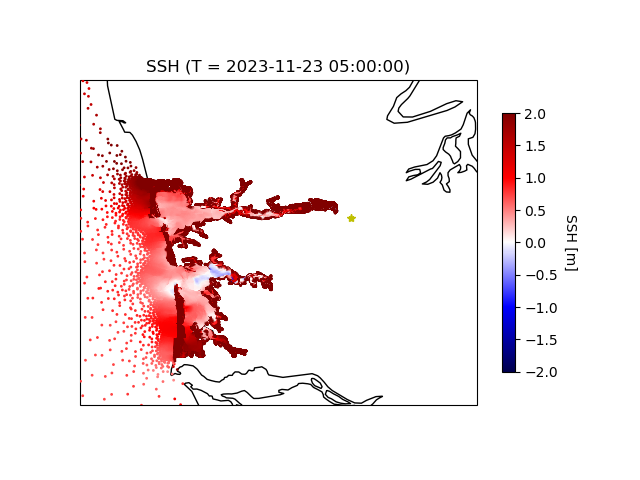
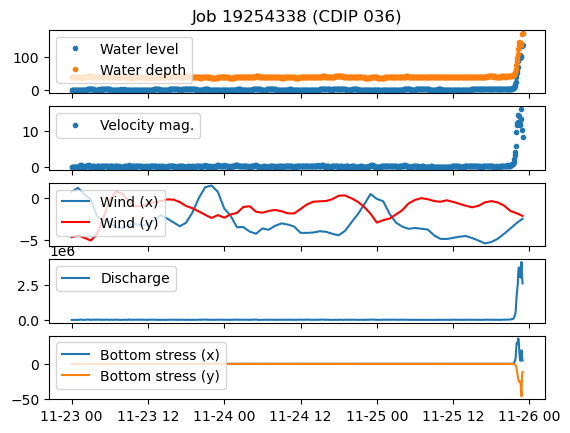
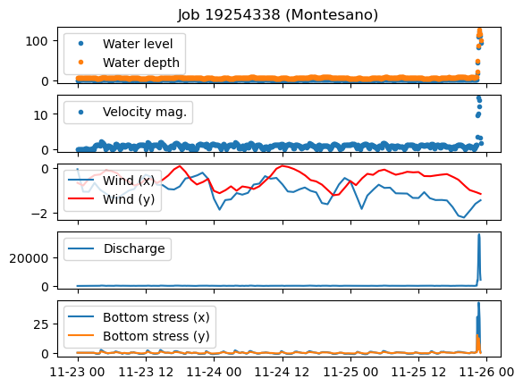
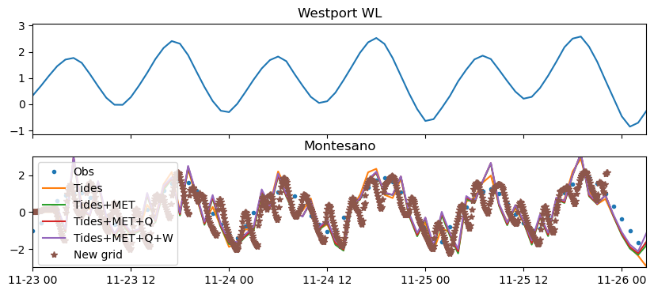

# June 30 - July 13, 2024

## Summary:
1) Ran DFM with new grid 
2) CoPes pilot proposal 

## To do:
1) Run new DFM model with new grid and .mdu file adjustments 
2) 2nd draft of CoPes pilot project proposal 
3) Start code for momentum budget of Twin Harbor estuary along-channel transects 

## Results:
### 1) Run DFM model with new grid
#### Map
- Run only reached Nov. 25 2300 (2 days and 23 hours) from 20 hours of model run time
- Some water level instabilities along Vancouver Island and Strait of Juan De Fuca early on (Figure 1, 2, 3)
	- Columbia River not included?
- Porter discharge point not reached completely?
- Much of channel is flooded

Figure 1: Model grid 

Figure 2: Instabilities (5 hours into model) 

Figure 3: Instabilities zoomed (5 hours into model) 

#### Water levels
- Winds looked normal
- Water levels, water depth, velocity magnitude, bottom stress, discharge magnitude explode:
	- CDIP036 explodes at ~Nov 25, 2110 (Figure 4)
	- TIDE-5-MON (Montesano) explodes at ~Nov 25, 2220 (Figure 5, 6)

Figure 4: CDIP036 time series 

Figure 5: Montesano time series 

Figure 6: Montesano and Westport water levels 

## Issues:
- Water levels explodes with new grid

## Next steps:
- Currently running DFM model with no discharge
- Finish CoPes proposal
- Investigate why water levels explode
- Filter out sections where instabilities occur on map
