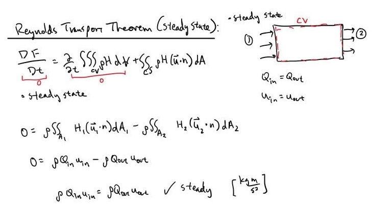
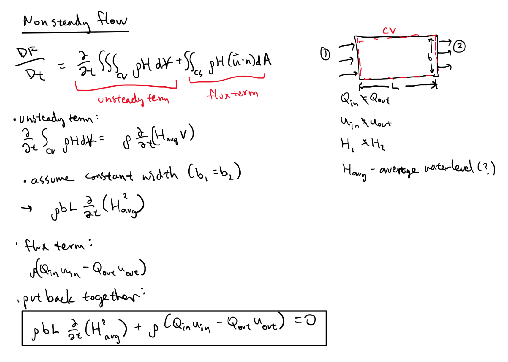

# July 6 - 12, 2025

## Summary:
* Worked on writing out force balance equation for simple river channel section and another one with varying width.

## Results:
### Reynolds Transport theorem (steady flow)
- Assume steady state
- Comes out to be balanced in/out

### Reynolds Transport theorem (unsteady flow)
- Unsteady flow (Q_in, u_in different than Q_out, u_out)
- Keep unsteady term that conserves volume

## Questions:
- Should there be a storage term (rho*Q*u)?
- Would tau be averaged over the entire bed?
	- How to include bottom stress term into equation

## Next steps:
- Looking at equations, I'll most likely need to sit down with someone to work this through...
- Need to adjust equation to include:
	- Bed level
	- Floodplains (maybe)

## Old work (doesn't make sense)
### Simple force balance (rectangular channel)
- Large list of assumptions:
	- Rectangular channel (b = b_1 = b_2)
	- Constant density
	- No bed level change (z_1 = z_2 = 0)
	- Q varies over time
	- Hydrostatic pressure
	- Length of channel is constant

### Force balance (varying width)
- Using new equations to calculate area for bed and cross sections
- Integrate terms over b (width) since depth will vary across channel

