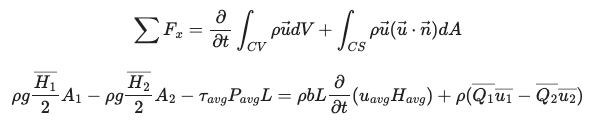
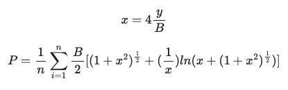
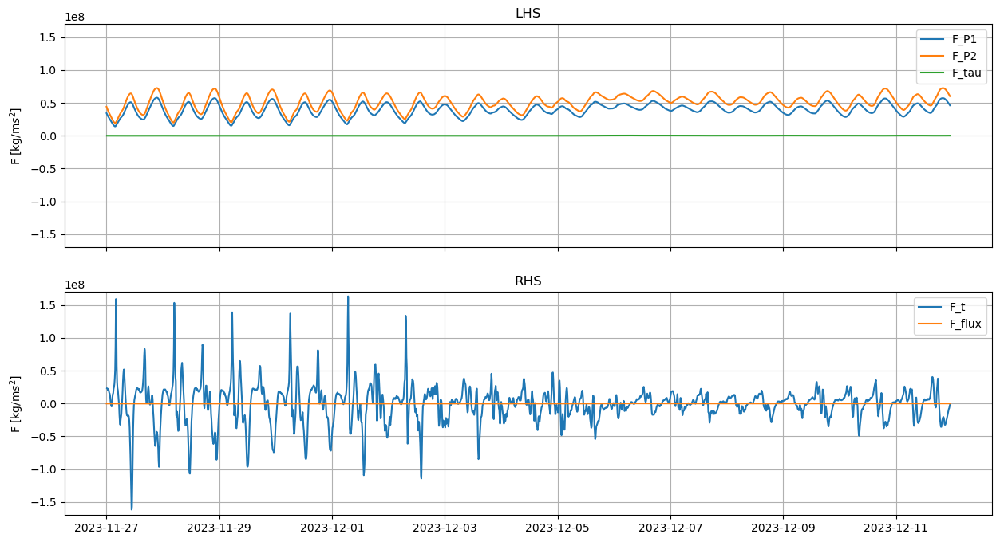
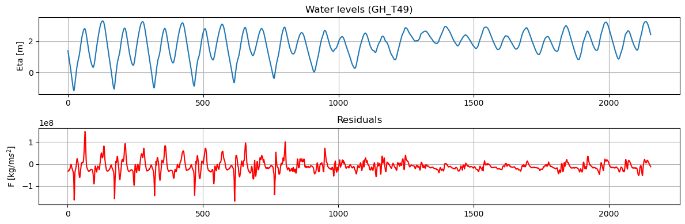
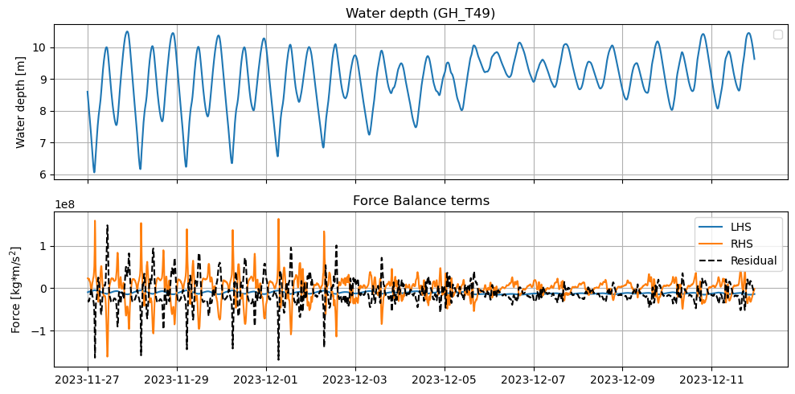

# July 13 - 19, 2025

## Summary:
* Ran model with cross-sections and cross-channel observation points to calculate force balance equation for control volume (between two cross-sections along Chehalis River)
	* Was able to get residuals oscillating around 0, but still of same order of magnitude as individual terms
	* Using P_avg, bed stress term (O(5)) is orders of magnitude smaller than all the other terms (time varying term - O(8); pressure force - (O(7))
	* Time varying term seems to be the largest term
	* Bed stress and flux are on same order of magnitude (O(5))
	* Pressure force and time varying term are roughly same order of magnitude (O(7)-O(8))
	* With residual oscillating around 0 but with spikes, I suspect that it may be sensitive to time varying term (e.g., fluctuating velocities)

## Results:
### Force balance
- Included cross section output for GH_T49/GH_T50 (mostly east-west transect; just downstream of Montesano gauge)
	- Cross sectionally averaged area and discharge (gives cross-sectionally averaged velocity)
- New cross-channel observation points gives individual bed stress and water levels

* Wetted perimeter equation  

* Individual terms plotted (Fig. 1)
	* Relatively balanced between pressure terms
	* Bottom stress and flux are much smaller
	* Time varying term fluctuates

Figure 1: Individual force balance terms (top - LHS; bottom - RHS)

* Residual plotted (Fig. 2)
	* Residuals are much more spiky prior to storm
	* Reflects variability in time varying term

Figure 2: Water levels (top) and force balance residuals (bottom).

* LHS, RHS, and residuals plotted (Fig. 3)
	* Combined terms plotted relative to each other
	* LHS is relatively balanced with negative sum
	* RHS fluctuates, which yields opposing spikes residuals

Figure 3: Water levels (top) and force balance terms (bottom).

## Next steps:
- 

