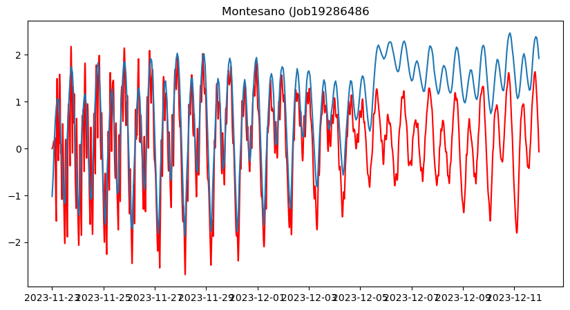
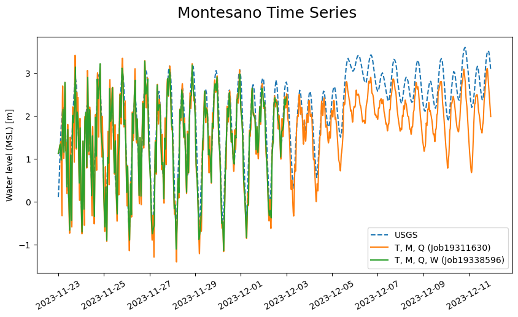

# July 14 - July 20, 2024

## Summary:
1) Finish and submit CoPes proposal
2) Run DFM with new grid (again)
3) Start making analytical model for Twin Harbors

## To do:
1) Submit CoPes proposal
2) Rerun DFM with new grid and fixed northern boundary points
3) Read literature/write down equations for analytical model

## Results:
### 1) DFM model
- Reran DFM model with adjusted northern boundary points and increased processors (108).
	- Original oc_north.pli file included transect from offshore to shoreline. New points designated eastern coordinate to be more offshore and not in high-resolution coastal grid cells.
- Ran with tides and MET and worked fine (~7 hours) (Figure 1)
- Ran with tides, MET, and Q and worked fine (~9 hours) (Figure 2)
- Ran with tides, MET, Q, and waves and running fine (so far) (Figure 2)
	- Run time slower after getting to 12-02-2023; taking 4 hours of run time to model ~4 hours)
	- Initially, model simulated 7 days within 1 day of run time
	- Update: took 4 hours to model 7 hours (checked at ~07/17/24 2300), but still slow
	- Update (07/18/24 ~1130): 11 hours elapsed to model ~19 hours 
- Ran into nNetElemMaxNode error (=5 but expected 3 or 4)
	- Issue fixed, new grid had one point with 5 nodes, but Yingzhong removed for new grid 'final_mesh_net_new.nc'

Figure 1: Montesano water levels (modeled with just tides and MET) - Job19286486

Figure 2: Montesano water level comparisons between two runs (TMD, TMDW) 

### 2) Read literature for analytical model
#### Analytical and numerical analysis of tides and salinities in estuaries; part 1: tidal wave propagation in convergent estuaries (van Rijn, 2011)
- Compared analytical and numerical model for convergent estuary
- For strongly convergent estuary, velocity is governed by surface slope, bottom friction, inertia and the converging width
- Compared solutions against measured data of Western Scheldt Estuary (Netherlands), Hooghly Estuary (India) and Delaware Estuary (USA)
- Convergence dominant in long and deep-converging channels and result in an amplified tidal range (1st term > 2nd term in equation 6)
- Bottom friction generally dominant in shallow converging channels resulting in a damped tidal range (1st term < 2nd term in equation 6)
- Using exponential solution for converging width of estuary
- Nonlinear convective acceleration negligible except for regions close to landward boundary where river or zero tidal flow boundary may be present
- Also linearized friction
- 2 most important terms in momentum equation are pressure term (water surface slope) and friction
Use energy based approach to get amplification or dampening
- As width and depth decrease (shallows), tidal wave height increases
	- As depth decreases, c_o (wave speed) will decrease resulting in shorter wave length and higher wave
- Compound channels are bit more complicated and include main channel and tidal flats
	- Friction coefficient will be larger and wave speed will be smaller in a compound channel (more surface area)
- Compared prismatic channels vs convergent channels
- Assume no convective acceleration and linearize friction term
- Compared analytics solutions with numerical solutions (DELFT1D AND DELFT2D)
- Neglected river discharge in looking at estuaries, assumed bottom is horizontal
- Western Scheldt Estuary:
	- Analytical solution close to measured up to 45km from mouth, but underestimate landward part where reflection plays a role
	- Numerical model shows that reflection is important contribution in landward half of estuary
	- Tidal damping due to bottom friction results in small H_x for water depths <7m
	- Tidal range shows amplification for H_x>1 for water depths >7m
	- Analytical solutions (without reflection) over predicted compared to numerical results without reflection for water depths >10m
	- Analytical results of linearized model and energy based model show that significant amplification occurs in compound channel when depth of the main channel is relatively large
	- Harder for water levels to be amplified in compound channels than solely rectangular channel (compound channel has large tidal damping)
	- Analytical results of energy based model for compound cross-section are in agreement with numerical results for water depths <13m
		- Overpredicted for water depths between 15 and 30m
	- Effect of tidal flats on amplification of tidal range is small for this estuary, so can assume rectangular cross section
- Hooghly Estuary
	- Computed tidal ranges within 15% of observed data for ks value of 0.005m
	- Computed values were pretty accurate using ks values for silt-mud bottom
- Delaware Estuary:
	- Best results were for ks=0.01-0.02m
	- Discharge calculated were close to measured
	- Computed HW at Trenton was ~6.5H later than entrance (observed 8H)
- When including reflection in analytical models, leads to strong overestimation of tidal range in landward half of the channel
- M2 and M4 dominate nonlinear processes in estuaries
Wave speak and velocities were symmetric in this case due to neglecting or linearizing nonlinear terms (convective acceleration, friction)
- River flow and tidal flats can cause nonlinearity, which this solution neglects

#### Compound flooding in convergent estuaries: insights from an analytical model (Familkhalili et al., 2022)
- Increasing h:
    - Allows surge and wave to propagate further into estuary
    - Influence of Q decreases
    - Amplification of surge in some cases
    - Alter flood risk spatially along estuary
    - Reduces impact of Q on peak water level but increases the effects of storm tide
    - Changes the crossover point between storm tide vs fluvial-dominated flooding landward
- Increasing convergence length scale:
    - Increases damping of surge waves

## Issues:
- DFM model still slowing down when getting to December
	- Wonder if we'll see that computational decrease if starting the run on December 01?

## Next steps:
- Let DFM model with wave component finish and see if it simulates compound flooding (can also look at Willapa or Porter location as well)
	- Look at log file to see if iterations is longer when hitting December
- Add in relevant stations in NOAA_WL_obs.xyn file
- Continue lit review and making momentum budget

