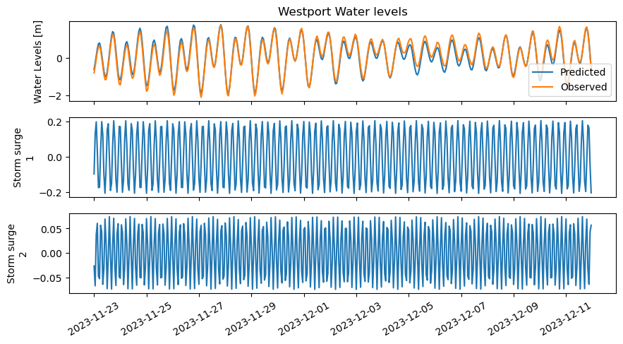

# July 21 - 27, 2024

## Summary:
1) Run DFM with new grid (again)
2) Fieldwork with Kendall and Andrea's team in Willapa Bay
3) Decompose storm surge signal

## To do:
1) Rerun DFM model bc previous run didn't complete
2) Decompose storm signal into 2 waves

## Results
### 1) DFM model
- On 07/15/24, accidentally stopped the model while using command to extend time
	- Job19338596
	- Ran for 3 days and 6 hours, produced 11 days and 8 hours of data
- On 07/18 and 07/19/24, ran the model but failed after disk quota exceeded error
- On 07/23/24, running again with turning off writing a bunch of output parameters to maybe increase speed of model

### 2) Decompose Westport storm signal into 2 waves
- Decomposed and found 2 peaks at 1.26 hours and 5.05 hours (Fig. 1)
- Created 2 waves based on amplitude and dominant frequencies and designated as storm surge 1 and 2 (Fig. 2)
- Residuals for recombined water level signal at Westport shows significant variability still compared to just removing the original tidal signal, meaning that there is still much unresolved frequencies not accounted for (Fig. 3)

Figure 1: Power spectra of Westport water level for November 23 - December 12, 2023. 

Figure 2: Storm surge 1 and 2 signals for time period. 

Figure 3: (a) Recombined waves and observed water level signal, (b) Observed and predicted (tides), (c) Residual for "Observed - combined" and "Observed - predicted".

## Issues
- HYAK keep getting disk quota exceeded error

## Next steps:
- Finish running DFM model
- Separate and write out individual terms in momentum budget from Van Rijn (2011) and Familkhalili's (2020, 2022) papers with relevant equations/derivations for calculating a peudo-longitudinal water level profile for Chehalis River
- Look into creating restartfile for DFM
- Look at water level signals at offshore stations and decompose
- Compare decomposed water level signals in Westport and offshore stations to other literature to compare frequencies 
- Look into offset between Higgins Island and Montesano to accurately correct for NAVD88/MSL conversion
