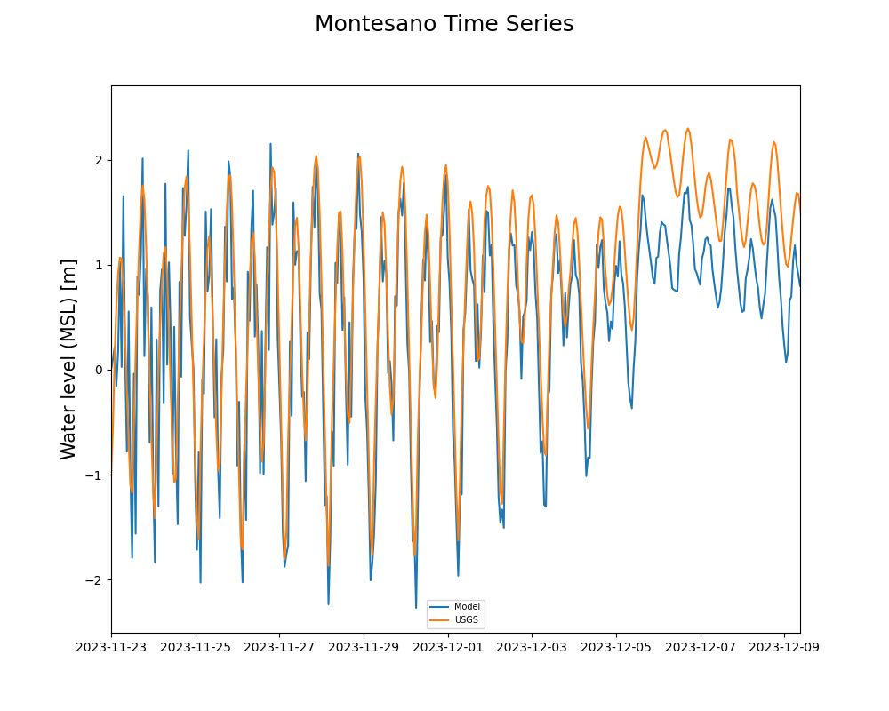
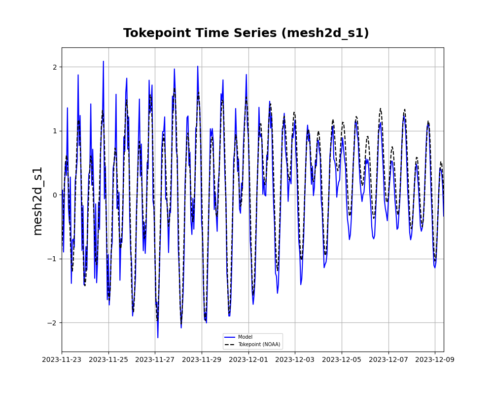
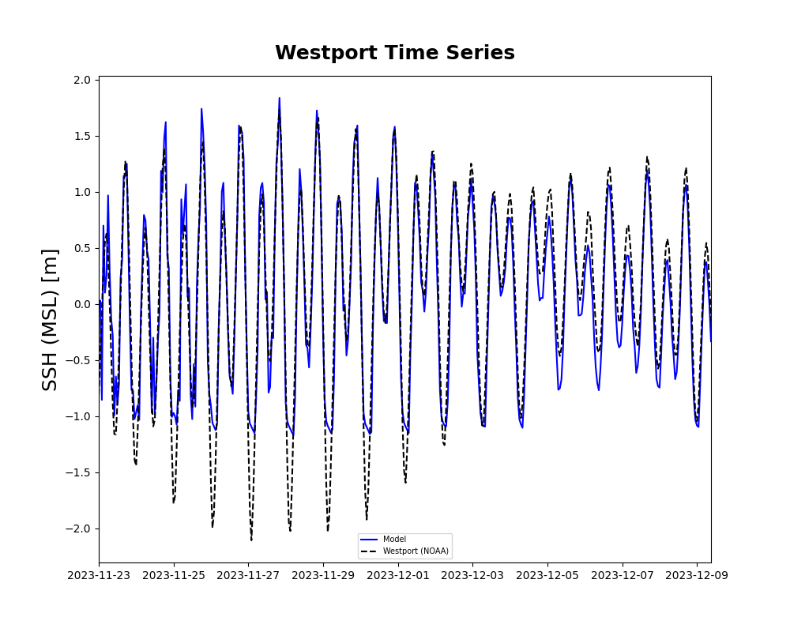
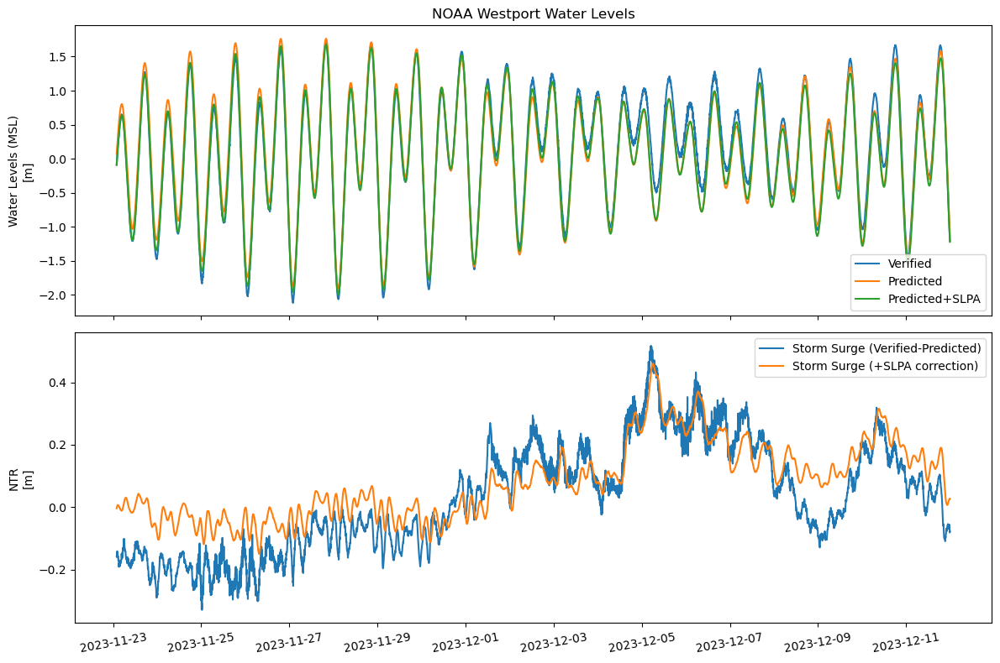
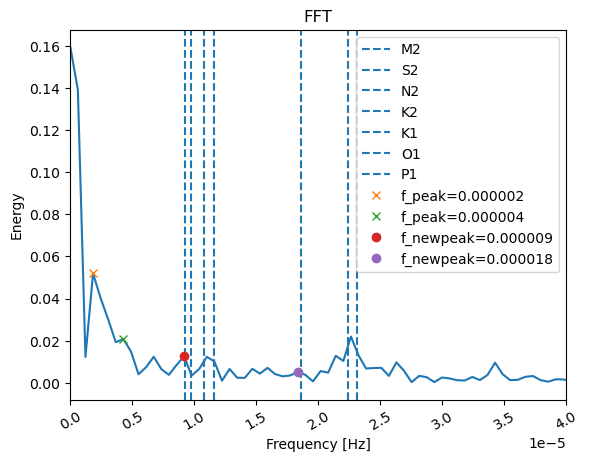

# July 28 - August 03, 2024

## Summary:
1) Run DFM with new grid (again)
2) Decompose Westport water level
3) DFM restart file

## To do:
1) Complete run for DFM with new grid
2) Decompose Westport water levels and draft up analysis
3) Research into DFM restart file for model run

## Results
### 1) DFM model
- Job19687905 began run on 07/23/24, and late 07/31/24, model has run up to 12-09-23 09:00:00 (taken 8 days and 7 hours so far)
	- 267GB so far
- Modeled output at Montesano still underestimate water levels during storm surge period (Fig. 1)
- Tokepoint and Westport are relatively well modeled though (Fig. 2, 3)
	- Truncation in Westport is due to NOAA_WL.xyn coordinate (need to change to offshore coordinate to match up)

Figure 1: Water level comparison at Montesano. 

Figure 2: Water level comparison at Tokepoint. 

Figure 3: Water level comparison at Westport. 

### 2) Decompose Westport water levels
- https://docs.google.com/document/d/1H_t6GQVyG6VNaXZm33C56PRieUtmSzSBsrdhyDpZ2S4/edit
- Tidal frequencies plotted on Storm Surge frequency distribution (+SLPA correction) (Fig. 5)

Figure 4: Non-corrected (blue) and corrected (orange) NTR. 

 
Figure 5: Frequency distribution for correctd NTR with major harmonic constituent bands. 

### 3) DFM restart file
- Using output from Job18090231 to test RestartFile configuration (TwinHarbors_test13)
	- Run only had tides for November 8 - 27
	- Testing restart from November 20 (1641600)
	- Files contained in TwinHarbors_test16
- Received error message when trying to run with FlowFM_merged_map.nc file
	>> ** ERROR  : The specified restart file is of UGRID format, which is not supported.
	- Perhaps due to MapFormat = 4 (4: netCDF UGRID), instead of 1: netCDF
	- Will need to run TwinHarbors_test13 again and turn on Rst file output and set RstInterval
 - Reran TwinHarbors_test13 (Job19762068) and completed
	- Merged *_rst.nc files into FlowFM_merged_20231112_000000_rst.nc
 - Running TwinHarbors_test16 with new FlowFM_merged_20231112_000000_rst.nc file
	- RestartDateTime = 20231112

 - Restart File instructions:
	- https://docs.google.com/document/d/1_i41_wRUssK4Dv2hYablegglfzBS7KS6G9qcSir26lw/edit

## Issues:
- Current configuration of DFM still doesn't resolve elevated water levels from storm surge and river discharge

## Next steps
- Decompose Westport water levels
	- Filter out frequency bands from tides
- Create a rough analytical model (implicit) of Grays Harbor based on Van Rijn (2011)
- Test restart file configuration on TwinHarbors_test16 to see if output afterwards is any different than original run
	- If not, then it would have worked
 - Change coordinates in NOAA_WL.xyn file (Westport, Tokepoint, and any other relevant points)
