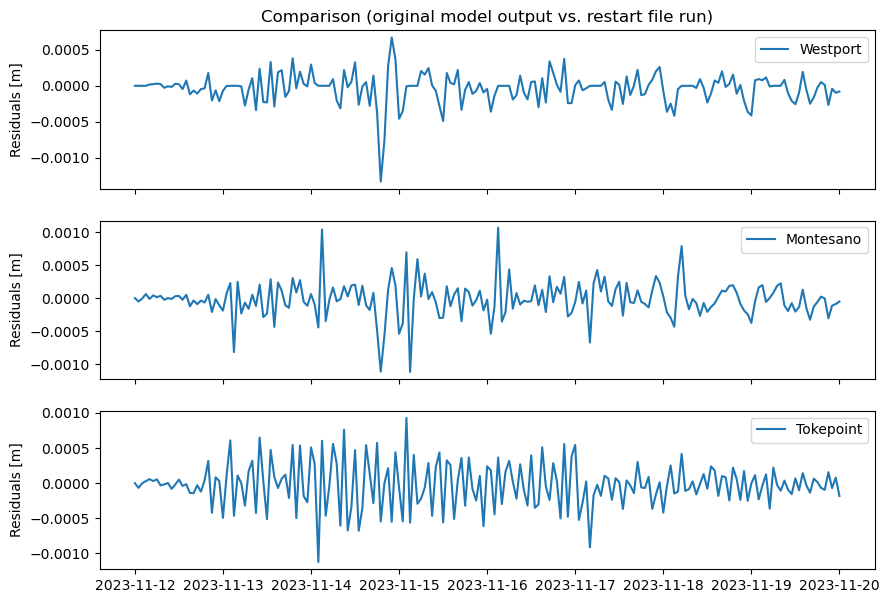

# August 04 - August 10, 2024

## Summary:
1) DFM RestartFile test
2) Investigate extent of storm surge in Grays Harbor
3) SLPA for water level time series (add SLPA to Predicted; match SLPA from model and actual to see if correction is accurate)
4) Code analytical model

## Results
### 1) DFM RestartFile test
Ran DFM for November 08-20 to get original output. Then ran RestartFile configurations to test model running from November 08-20. Maximum 1.33mm (Westport), 1.11mm (Montesano), and 1.12mm (Tokepoint) difference in water levels.

Figure 1: Water level comparisons between original model run and restart file model run. 

Figure 2: Residuals between original model run and restart file model run. 

### 2) Extent of storm surge in Grays Harbor
- Compared transect (dx=10km) from mouth to 60km upstream and began seeing elevated water levels ~43km upstream (7km downstream of Montesano) (Fig. 3,4)

Figure 3: Grays Harbor transect and location of points. 

Figure 4: Water levels along Grays Harbor transect. 

### 3) SLPA correction for water level time series
- Atmospheric pressure field varies along transect based on model output (which should be interpolated from LiveOcean (Fig. 5). 
- This shows that a generic sea level pressure correction using measured pressure at Westport might not suffice, as pressure differences upstream can be up to 15 hPa (~15cm correction) (Fig. 6).
- Correcting the predicted tides with SLPA seems to match observed water levels a bit better (Fig. 7). 

Figure 5: Pressure at each Grays Harbor transect points compared with observed SLP at the Westport station. 

Figure 6: SLP differences between the Westport station and each transect point. 

Figure 7: Comparison at Westport tide gauge of 'Predicted' water levels and 'Predicted+SLPA correction'. 