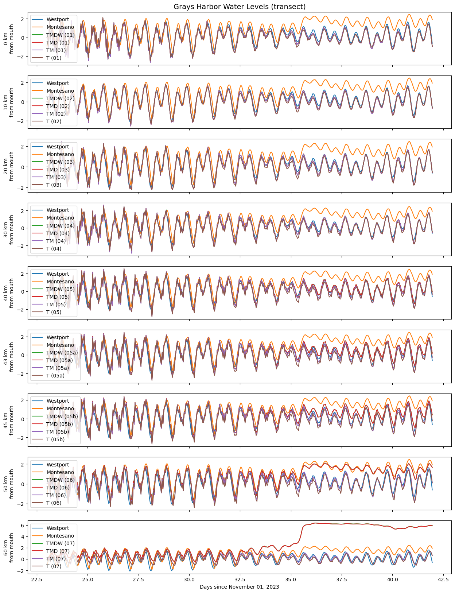

# August 11 - August 17, 2024

## Summary:
1) Run DFM model for tides, tides+MET, tides+MET+discharge 
2) Plot map with wetting/drying thresholdbr>
3) Work on analytical modelbr>

## To do:
1) Run DFM models to get different scenarios (tides, tides+MET, tides+MET+discharge, tides+MET+discharge+waves)br>
2) Re-plot DFM output map with thresholds for floodingbr>
3) Work on analytical model for Grays Harborbr>

## Results:
### 1) DFM model runs
- Ran DFM model with tides - Model T(Job19870441) (Fig. 1)
- Ran DFM model with tides+MET - Model TM (Job19878243) (Fig. 1)
- Ran DFM model with tides+MET+discharge - Model TMD (Job19883575) (Fig. 1)
- Ran DFM model with tides+MET+discharge+waves - Model TMDW (Job19687905) (Fig. 1)

 
Figure 1: Water levels along Grays Harbor transect for all 4 models. 

- Relative to the base model run (Model T), Model TM (tides+MET) showed differences of at least 0.5m along the transects, with this value increasing as you move upstream (Fig. 2)
- Comparing Model TMD and TM, there is little change at the mouth of Grays Harbor (<2cm) up to 20km upstream (Fig. 3)
	- Moving further upstream, MET begins to play a larger influence adding up to 2 meters near Montesano
- Comparing Model TMDW and TMD, water levels were mostly the same (<~5cm) with some phase shifts (spikes) (Fig. 4)

 
Figure 2: Water level differences between model TM and T. 

 
Figure 3: Water level differences between model TMD and TM. 

 
Figure 4: Water level differences between model TMDW and TMD. 

### 2) Re-plot flood map
Re-plot flooding map for Grays Harbor using 0.01m threshold (Fig. 5). 

 
Figure 5: SSH for December flood. 

### 3) Analytical model
- Fit line to Chehalis River width convergence (Fig. 6) 
- Solved initial water level for transect (Fig. 7) 

 
Figure 6: Fitted line for Chehalis River width convergence. 

 
Figure 7: Eta for transect at time=0. 

## Next steps:
- Figure out how to create restart files from *merged_map.nc files for specific time
- Figure out how to plot triangular mesh grid on Python efficiently
- Continue analytical model