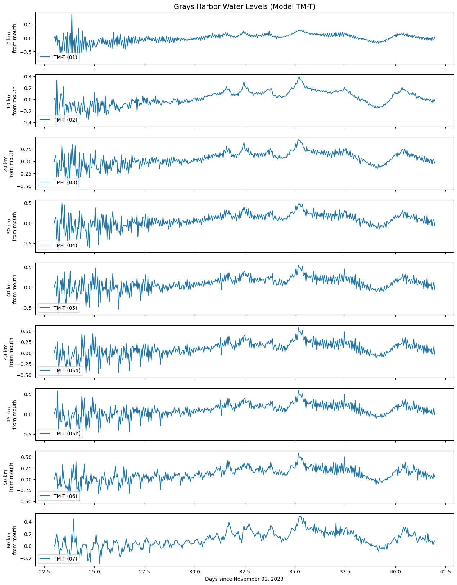
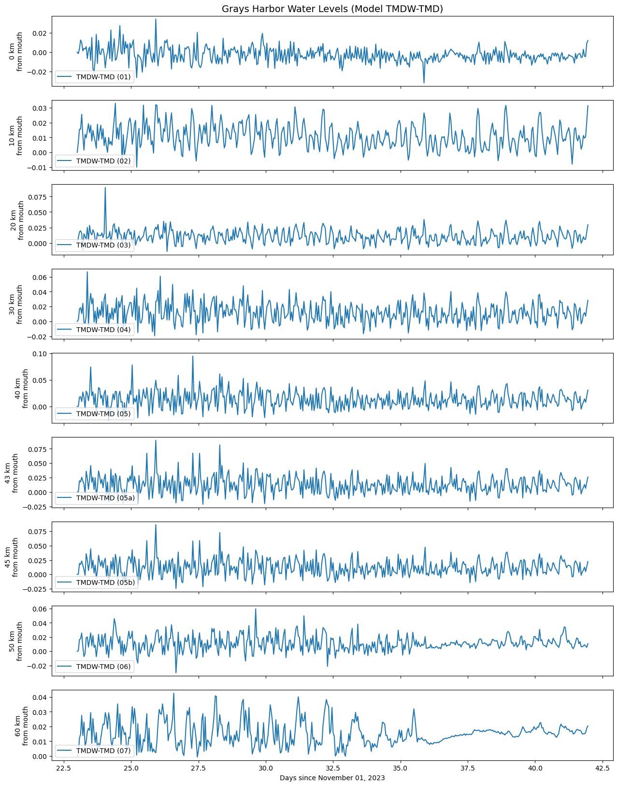

# August 11 - August 17, 2024

## Summary:
1) Run DFM model for tides, tides+MET, tides+MET+discharge
2) Plot map with wetting/drying threshold
3) Decompose Westport NTRs
4) Work on analytical model

## To do:
1) Run DFM models to get different scenarios (tides, tides+MET, tides+MET+discharge, tides+MET+discharge+waves)
2) Re-plot DFM output map with thresholds for flooding
3) Work on analytical model for Grays Harbor

## Results:
### 1) DFM model runs
*Model T - tides; Model TM - tides and MET (wind, pressure); Model TMD - tides, MET, discharge; Model TMDW - tides, MET, discharge, waves

- Ran DFM model with tides (Job19870441) (Fig. 1)
- Ran DFM model with tides+MET (Job19878243) (Fig. 1)
- Ran DFM model with tides+MET+discharge (Job19883575) (Fig. 1)
- Ran DFM model with tides+MET+discharge+waves (Job19687905) (Fig. 1)

 
Figure 1: Water levels along Grays Harbor transect for all 4 models. 

- Models T and TM had mostly same water levels (<5 cm difference for all transect sites) (Fig. 2)
- Models TMD and TMDW had mostly same water levels (<9cm) (Fig. 3)

 
Figure 2: Water level differences between model TM and T. 

 
Figure 3: Water level differences between model TMDW and TMD. 

### 2) Re-plot flood map
Re-plot flooding map for Grays Harbor using 0.01m threshold (Fig. 4). 

 
Figure 4: SSH for December flood. 

## Issues:
- 

## Next steps:
- 
