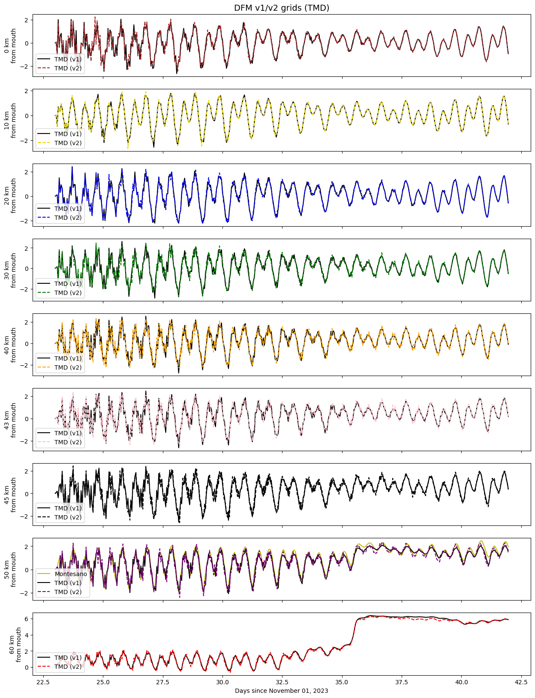
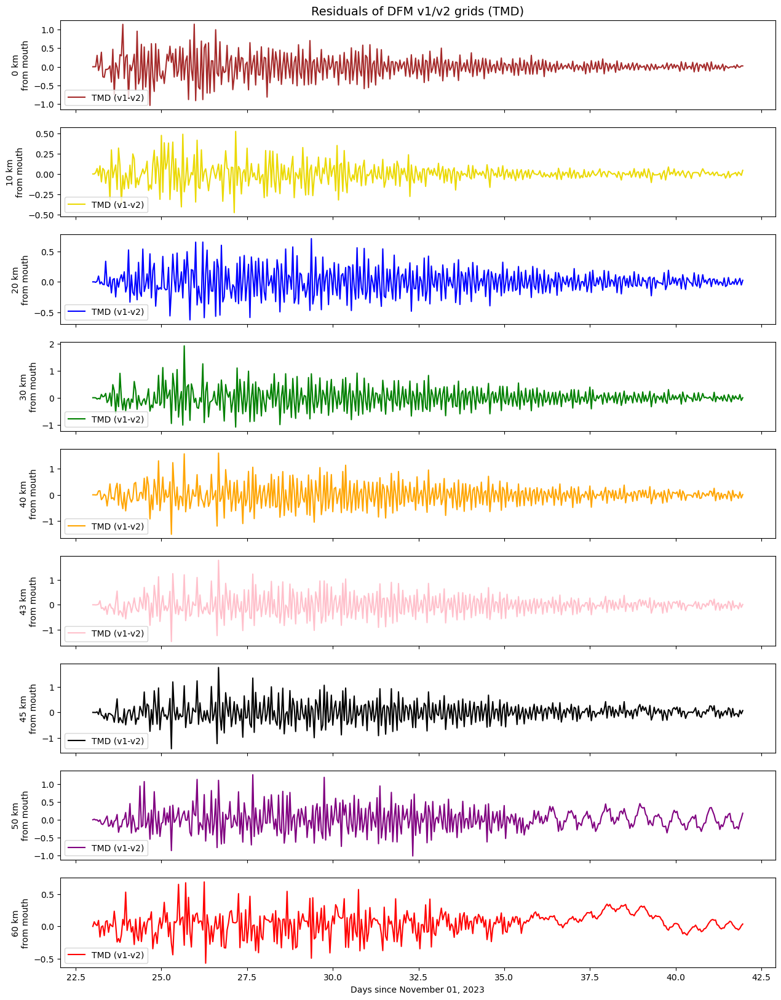
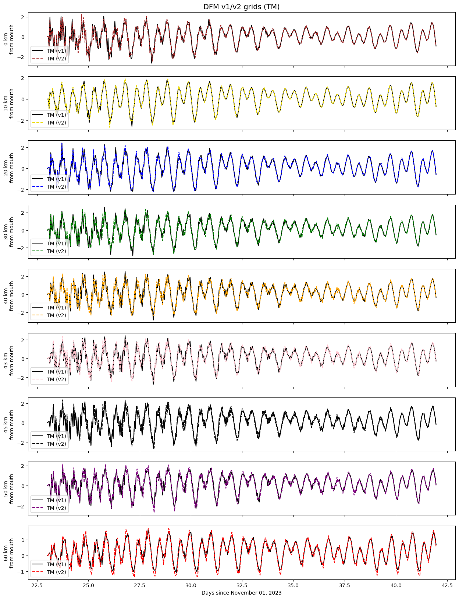
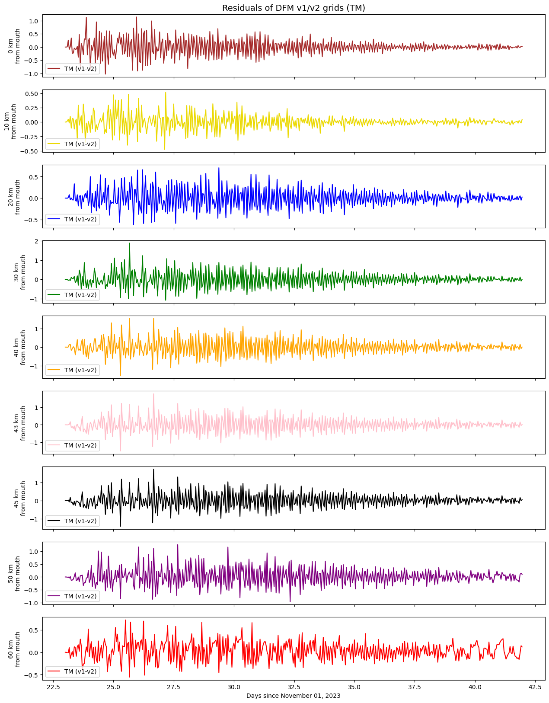
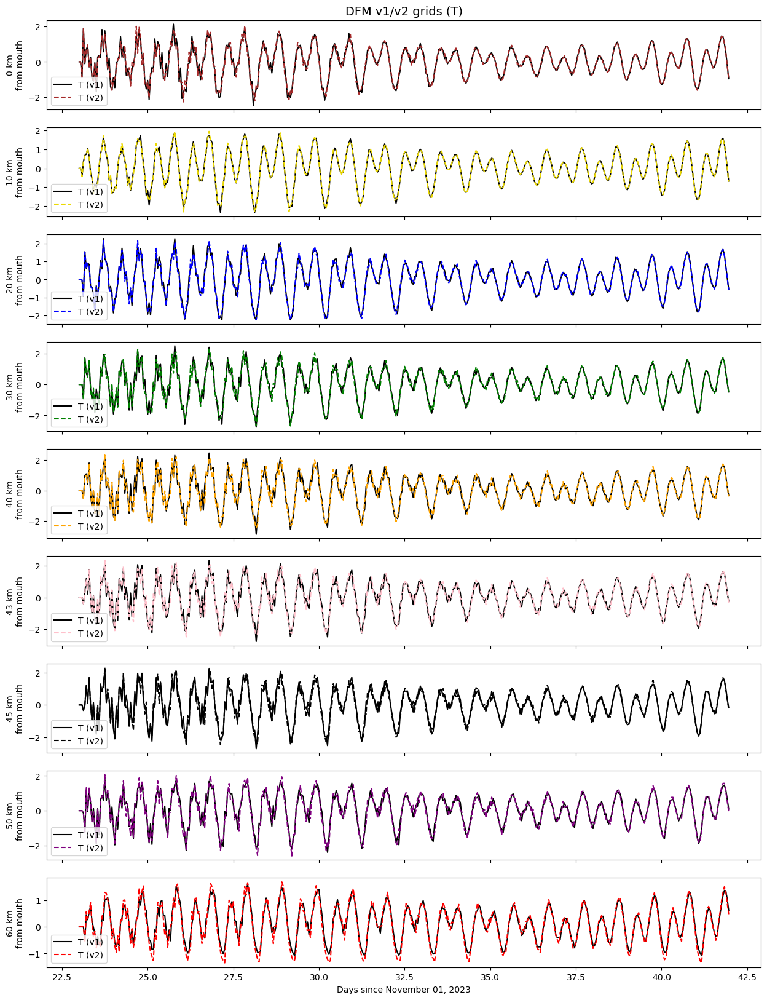
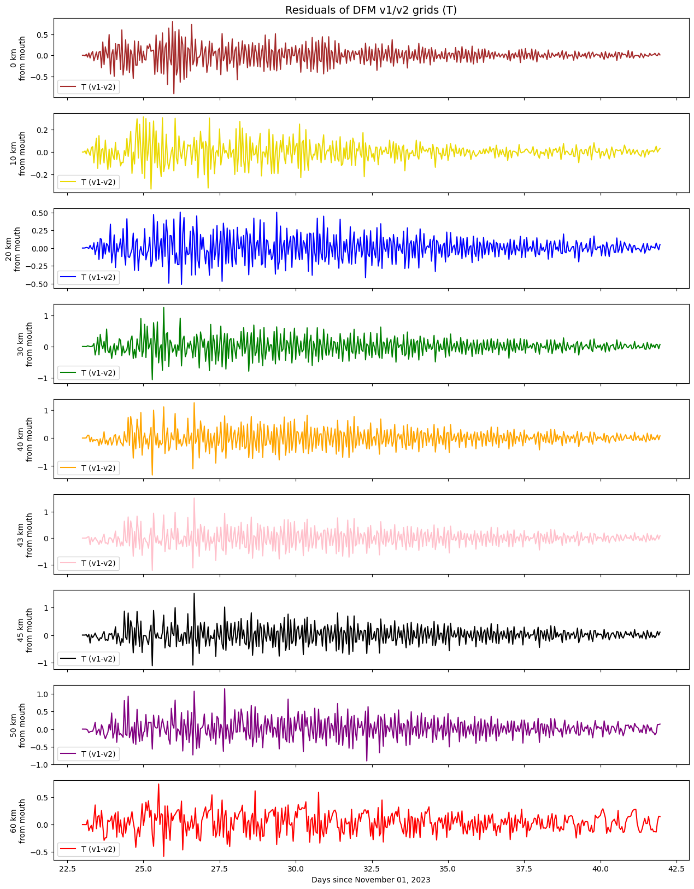

# August 18 - August 24, 2024

## Summary:
1) Run DFM model for tides, tides+MET, tides+MET+discharge 
3) Narrowed down storms to Dec 2023 and Jan 2022

## To do:
1) Run DFM models to get different scenarios (tides, tides+MET, tides+MET+discharge, tides+MET+discharge+waves) for new grid with sloughs 
2) Investigate storms of interest 

## Results:
### 1) Compare DFM model output with different grids
- Compared DFM output between v1 (original dredging version) and v2 (dredged version with sloughs)
- Differences in distance for each location (within 1 grid cell size)
	- Point 1: 87.69900643064652
	- Point 2: 7.166676531552461
	- Point 3: 4.709548583912149
	- Point 4: 9.47766284664902
	- Point 5: 10.552623780090011
	- Point 5a: 5.098086027345868
	- Point 5b: 8.987250290155957
	- Point 6: 2.1461236015300855
	- Point 7: 5.444133232066549
- Based on water level time series of transects, the new grid performed pretty similar (Fig. 1-6)
- Comparing water levels modeled at Montesano, v1 'performed' better at modeling the observations (neglible)
	- RMSE (entire time series): v1 - 0.39842671589498213; v2 - 0.42117097365765377
	- RMSE (starting Dec 1): v1 - 0.2702538048285002; v2 - 0.299820095772469

 
Figure 1: Water levels for model v1 and v2 (TMD). 

 
Figure 2: Water levels differences between model v1 and v2 (TMD). 

 
Figure 3: Water levels for model v1 and v2 (TM). 

 
Figure 4: Water levels differences between model v1 and v2 (TM). 

 
Figure 5: Water levels for model v1 and v2 (T). 

 
Figure 6: Water levels differences between model v1 and v2 (T). 

### 2) Investigate storms of interest
- Found January 2022 storm
- https://docs.google.com/document/d/1wrkGv_q07HguVheaNbDvD7WoNb23vT04uz8LCbbjmKc/edit

## Issues:

## Next steps:
