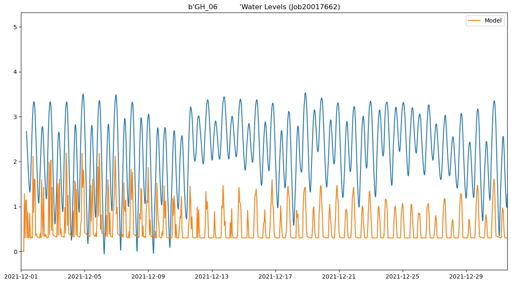
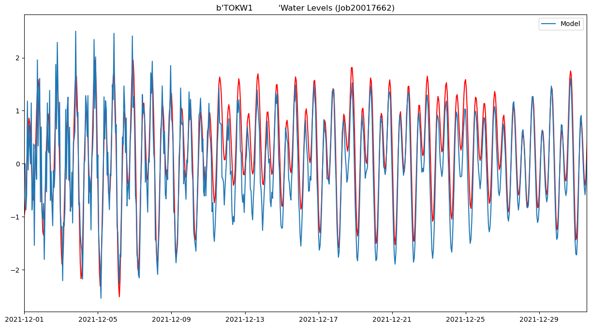
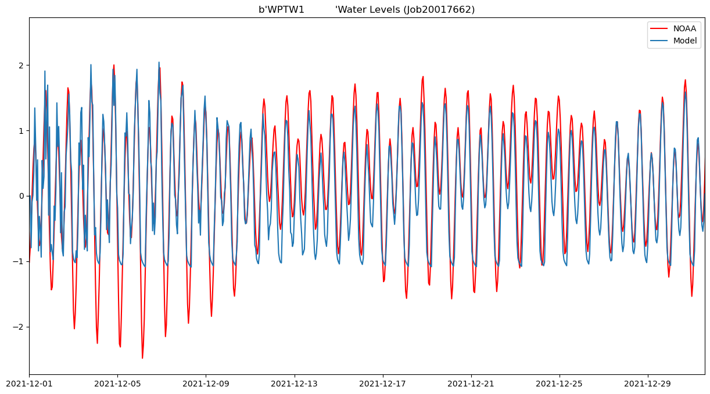
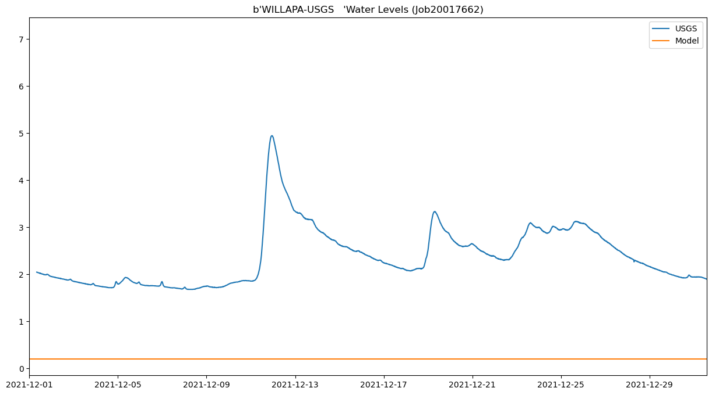
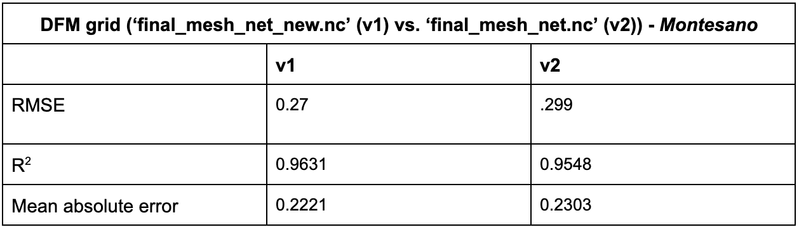
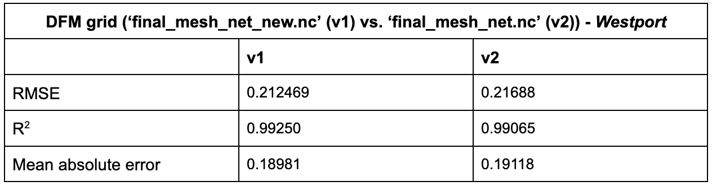
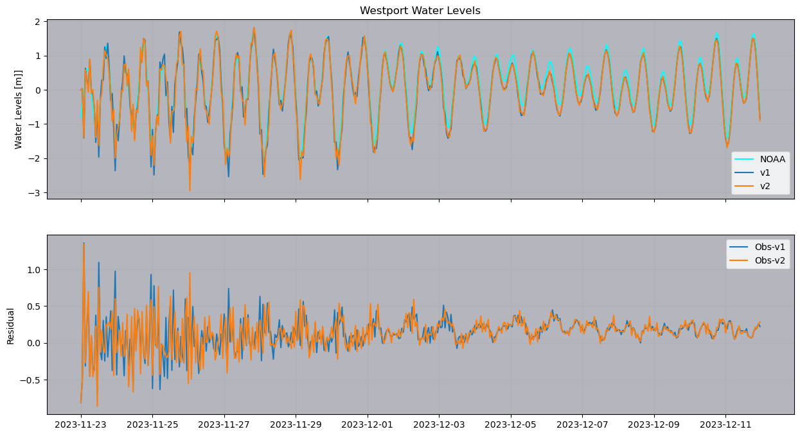
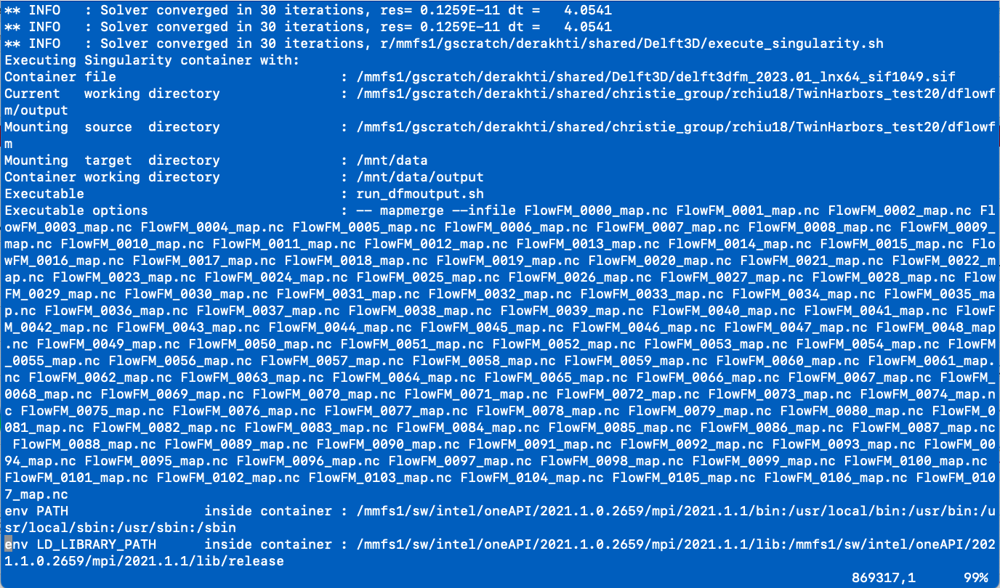

# August 25 - August 31, 2024

## Summary:
1) Downloaded data for Dec21/Jan22 storm period
2) Ran DFM model for tides for December 2021 - Jan 2022 storm (4 runs, all tides)
3) Stat comparisons for v1 and v2 grids
4) Rewrote water level plotting scripts on HYAK

## Results
### 1) Downloaded data for Dec21/Jan22 storm period
- Downloaded discharge (Porter, Wynoochee, Satsop, Nacelle, and Willapa) and created *.bc files
- Downloaded wind and pressure fields from LiveOcean and created interpolated forcing files (.amp, .amu, .amv)

### 2) Ran DFM model for tides
- Run #1: cancelled after ~15 hours because it was taking longer than usual
	- Only ran up to December 31, 2021
- Run #2: completed after ~10 hours of run unexpectedly without resolving the entire duration
	- Ended on December 30, 2021 abruptly (slurm.out file shows iterations unexpectedly stops and begins merge script
	- Output really similar to run #1
- Run #3: looks like it's working better
	- Shifted the start time by 7 days
	- Ran only until January 8, 2022 (which may have to do with the duration of the model run prescribed)
	- Issue should be with timing out after 30 days because merge script doesn't work
- Run #4: TBD
	- Changed start date to December 25, 2021 and kept same end time on January 20, 2022
	- This will test if it completes and able to merge completely

 
Figure 1: Montesano water levels for December 2021 run. 

 
Figure 2: Tokepoint water levels for December 2021 run. 

 
Figure 3: Westport water levels for December 2021 run. 

 
Figure 4: Willapa water levels for December 2021 run. 

### 3) Stats comparing grid v1 and v2
- Grid v1 still seems to perform better at Montesano (Table 1)
- Grid v1 still seems to perform (marginally) better at Westport (Table 2; Fig. 5) 

 
Table 1: Grid v1 and v2 comparisons for Montesano. 

 
Table 2: Grid v1 and v2 comparisons for Westport. 

 
Figure 5: Water level comparisons between v1 and v2 models. 

### 4) Rewrote water level plotting scripts on HYAK
- Rewrote scripts to pull data via USGS and NOAA API

## Issues:
- Run #1 for Dec/Jan 2022 storm took very long (15 hours of run time for 31 days of model)
	- Output at some locations did not look good (Willapa was constant)
- Run #2 for Dec/Jan 2022 storm was quicker (10 hours of run time for 30 days of model)
	- HOWEVER, the slurm.out file showed it randomly exited during iterations and began running the merge file (Fig. 6)
	- Merge script did not work on *_map.nc files
	- Comparisons of results at main stations are <3mm except for Montesano (<1cm)
- Run #3 for Dec/Jan 2022 storm was quicker (hours of run time for days of model)
	- Changed start time to begin on Dec 08, 2021 instead
	- Ran fine but still exited unexpectedly after 31 days
	- Merge script did not work either
- Run #4 for Dec/Jan 2022 storm starting from December 25 to see if it will run its entirety

 
Figure 6: Slurm output showing iterations abruptly stopping. 

# Next steps:
- Figure out why the model is timing out after 30/31 days
- Getting map plotting script working on HYAK
- Run tides+MET and tides+MET+discharge for Jan2022 storms
