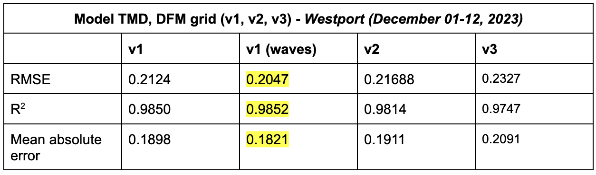

# September 01 - 07, 2024

## Summary:
1) DFM model with v1 grid and tides, MET, discharge, and waves did the best at modeling December 2023 storm. 

## To do:
1) Run DFM model for T (tides), TM (tides+MET), and TMD (tides+MET+discharge) for v3 grid and compare results with v1 and v2. 

## Results
### 1) DFM models
- Ran models T, TM, and TMD with the new v3 grid that includes updated roughness
- v1 grid has performed the best when comparing stats with v2 and v3 grids at Montesano, Westport, and Tokepoint (Table 1, 2, 3)
	- v1 with waves performed the best!
- Models TMD and TMDW performed significantly better than models T and TM (Figures 1, 2, 3)

 
Table 1: Comparisons between grids for Montesano. 

 
Table 2: Comparisons between grids for Westport. 

 
Table 3: Comparisons between grids for Tokepoint. 

 
Figure 1: Time series of model with tides (v1, v2, v3). 

 
Figure 2: Time series of model with tides and MET (v2, v3). 

 
Figure 3: Time series of model with tides, MET, and discharge (v1, v1 (waves), v2, v3). 

## Issues:
- Grid v3 is not doing as well as the other versions

## Next steps:
- Make zoomed in plots of along Chehalis River
- Continue analytical model
