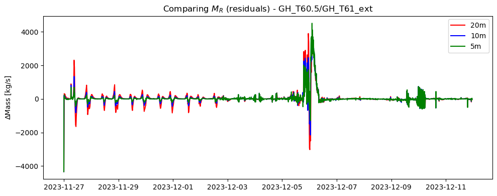
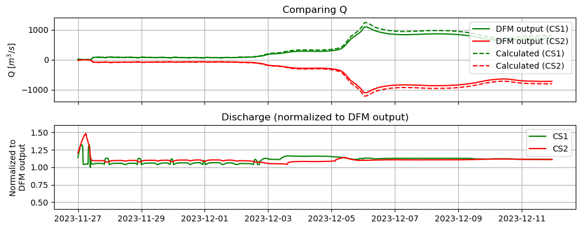
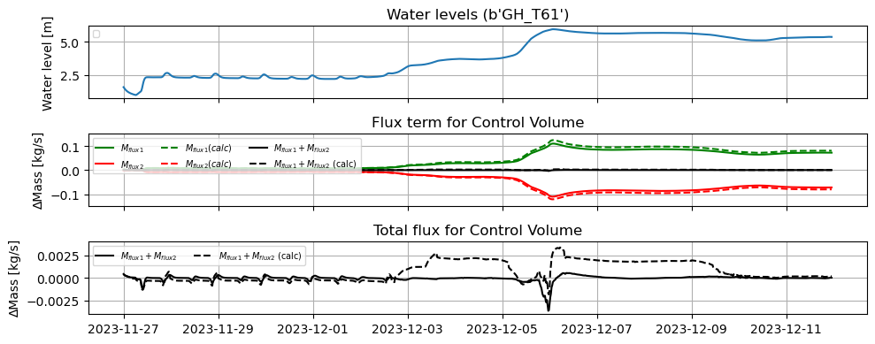
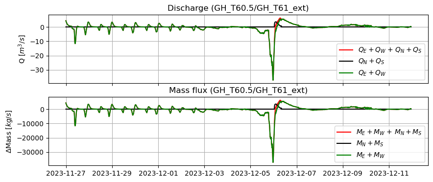
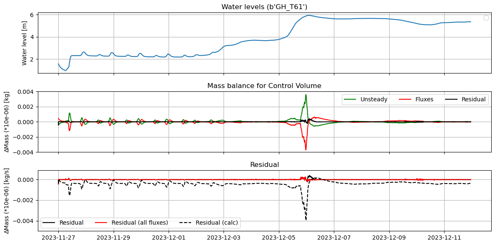

# September 07 - 13, 2025

## Summary+takeaways:
1) Compared mass balance terms with different time model time intervals (5min, 10min, 20min) 
	* Increasing the temporal resolution introduces tiny fluctuations, but reduces the residual in the mass balance 
2) Compared cross-sectional discharge/velocity with interpolated discharge/velocity 
	* Interpolated discharge/velocities are overestimated compared to the DFM output 
	* This translates to the mass flux calculations, which lead to large residuals in the total balance 
	* This can then translate to momentum flux calculations in force balance approach and lead to interpolation errors
3) Include northern/southern boundaries in mass balance  
	* This only reduces the residual on December 6, but a spike is still observed prior

* Mass balance document:
	* https://docs.google.com/document/d/1Eg0rbluJZ7KoBvSvie-XAdYaMI1DoPUDk0VO89neMEI/edit?pli=1&tab=t.564jkczf4cqj

## Results:
### 1) Comparing different time intervals (5min, 10min, 20min)
* Calculations are more spiky but residuals are flatter with increased temporal resolution

Figure 1: Residuals plotted for 5min, 10min, and 20min interval runs.

### 2) Comparing DFM discharge/velocity against interpolated discharge/velocity
* Discharge is overestimated when calculating using the interpolated grid/cells

Figure 2: Comparing DFM discharge output with interpolated discharge (20min).

* This difference is reflected in the mass flux calculations

Figure 3: Comparing mass flux between DFM output and interpolated method (20min).

### 3) Include northern/southern boundaries in mass balance
* Adding in N/S fluxes for extended CV doesn't change much since N/S fluxes were ~2.5 orders of magnitude smaller than E/W fluxes

Figure 4: Comparing mass flux for E/W boundaries, N/S boundaries, and N/S/E/W boundaries.

* After adding all fluxes, residual is reduced mostly during December 6
* Note, residuals are at least an order of magnitude smaller than the storage and flux terms

Figure 5: Residuals are reduced around December 6 when considering fluxes from all 4 boundaries. 

## Next steps:
* Compare differences in residuals in 5m and 20m model runs
* Calculate mass balance for original CV (mostly channel)
	* The northern boundary definitely has water flowing northward during the flood period, but is it more balanced than the expanded CV?
* Plot triangular mesh with cross-section cells used to match interpolated cells
	* DFM cross-section outputs interpolate over triangular cells, which is not exactly in straight line
	* Compare these cells it interpolates over with the CV edge for momentum/mass balance calculations to see if they align
