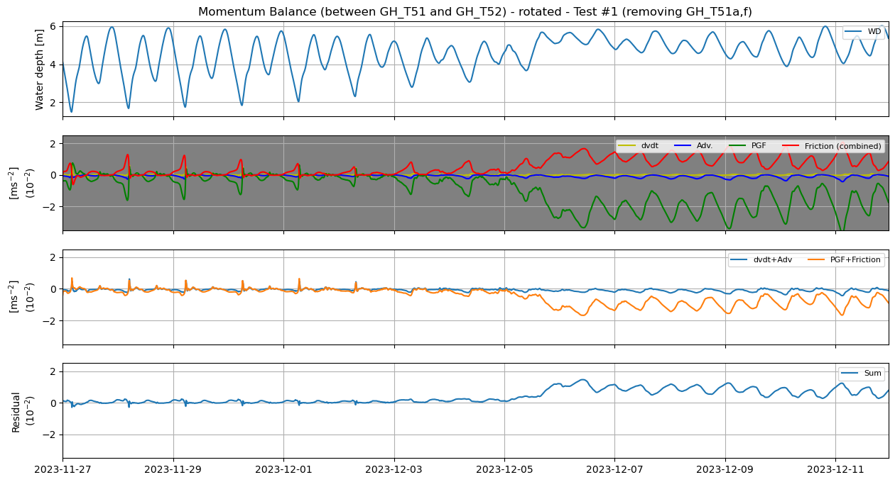

# September 07 - 13, 2025

## Summary+takeaways:
1) Compared mass balance terms with different time model time intervals (5min, 10min, 20min)
	* Increasing the temporal resolution introduces tiny fluctuations, but reduces the residual in the mass balance
2) Compared cross-sectional discharge/velocity with interpolated discharge/velocity
	* Interpolated discharge/velocities overestimate DFM output
	* This translates to mass flux calculations, which lead to large residuals in the total balance
3) Include northern/southern boundary in mass balance 
	* Does this close mass balance for control volume?
* How other people interpolate/calculate momentum balance for DFM/unstructured grids?

## Results:
### 1) Comparing different time intervals (5min, 10min, 20min)
* Calculations are more spiky but residuals are flatter with increased temporal resolution

Figure 1: Residuals plotted for 5min, 10min, and 20min interval runs.

### 2) Comparing DFM discharge/velocity against interpolated discharge/velocity
* Discharge is overestimated when calculating using the interpolated grid/cells

Figure 2: Comparing DFM discharge output with interpolated discharge (20min).

* This difference is reflected in the mass flux calculations

Figure 3: Comparing mass flux between DFM output and interpolated method (20min).

### 3) Include northern/southern boundary in mass balance
* Adding in N/S fluxes for extended CV doesn't change much since N/S fluxes were ~2.5 orders of magnitude smaller than E/W fluxes

Figure 4: Comparing mass flux for E/W boundaries, N/S boundaries, and N/S/E/W boundaries.

* After adding all fluxes, residual is reduced mostly during December 6
massbalance_combined_allfluxes_10m

## Next steps:

Figure 1: Momentum budget for "Test #1" (with GH_T51a/f removed).
