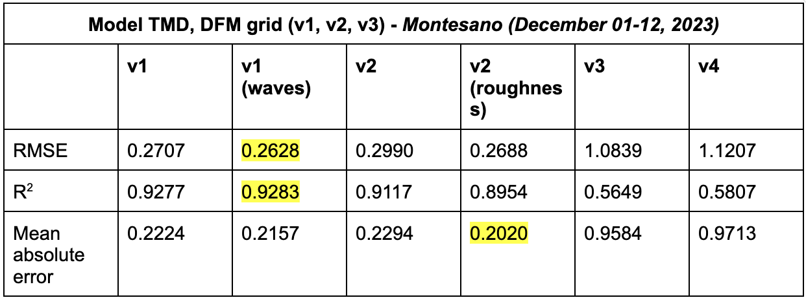
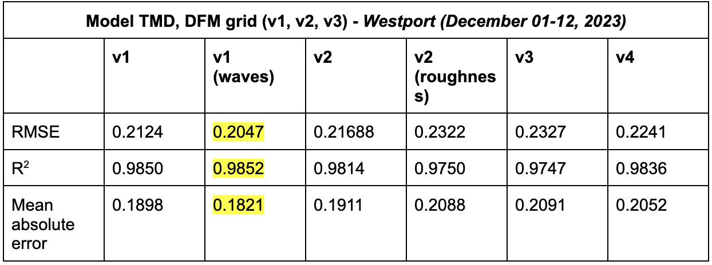
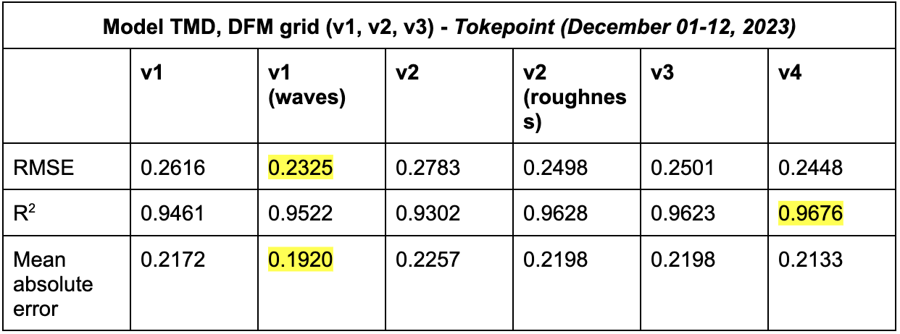
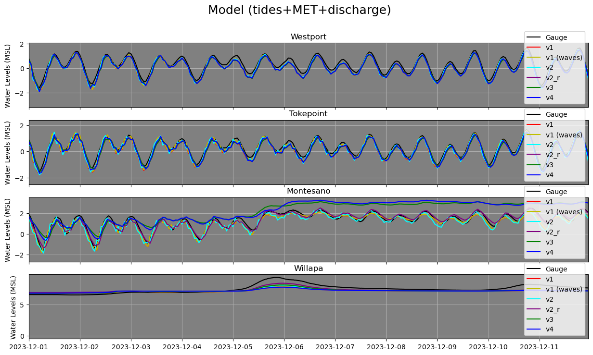
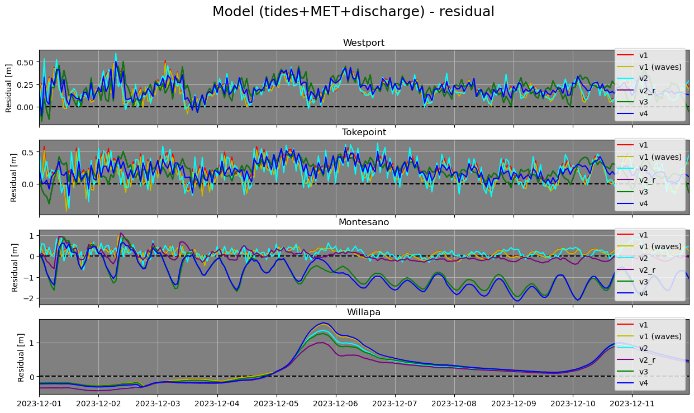

# September 08 - 14, 2024

## Summary: 
1) Ran DFM model with v4 grid (default roughness) but still did not do well 
2) Ran DFM model with v2 grid (roughness file) and does better than original v2 grid at Montesano and Tokepoint, but worse at Westport 
3) Wrote code for inundation maps  

## To do:
1) Run DFM model with v4 grid (default roughness) 
2) Run DFM model with v2 grid (new roughness file) 
3) Finish code for inundation maps in MATLAB 

## Results:
### 1) DFM model comparisons
- Ran model TMD with v4 grid and performed worse at Montesano, and slightly better at Westport and Tokepoint (Tables 1,2,3)
- Water level signal for v4 grid is still muted and overestimates during compound flooding event at Montesano (Figures 1,2)
- Ran model TMD with v2 grid with roughness file and performed slightly better at Montesano for MAE (Table 1,2,3)
	- Could do much better if included waves?

 
Table 1: Statistics between grids for Montesano. 

 
Table 2: Statistics between grids for Westport. 

 
Table 3: Statistics between grids for Tokepoint. 

 
Figure 1: Comparisons between grids for Westport, Tokepoint, Montesano, and Willapa. 

 
Figure 2: Residuals between grids and USGS/NOAA observed data. 

### 2) Inundation maps
- Model TMD (v4 grid) inundation map (Video 1)

 
Video 1: Inundation map with Montesano water levels and Porter discharge rates. 

## Next steps:
- Improve inundation map graphics
- Run model with v2 grid and waves?
