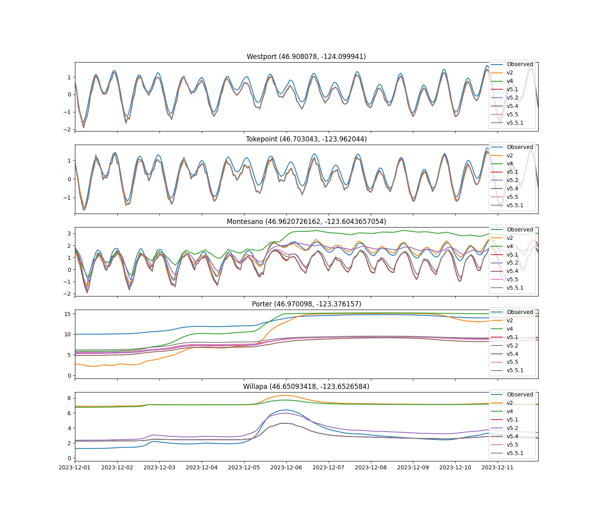

# September 15 - 21, 2024

## Summary:
1) Ran DFM model with multiple v5 grid versions (v5.1, v5.2, v5.4, v5.5, v5.5.1)

## To do:
1) Run model for v5 grids
2) Look at water level transect

## Results:
### Water Level Comparisons
- Westport (Fig. 1a):
	- All model versions underestimated water levels at Westport, but were consistent (may be function of being offshore of NOAA station coordinate)
- Tokepoint (Fig. 1b):
	- All model versions did decently well, but v2 did the best
	- During peak discharge/storm period, all grids underestimated water levels
	- Offset may be a function of being offshore of NOAA station coordinate
- Montesano (Fig. 1c):
	- Prior to storm, all versions underestimate Montesano water levels
	- v2 performed the best in simulating Montesano water levels
	- v3 and v4 became muted and exceeded Montesano water levels during peak discharge
	- v5.1 and 5.4 resembled each other's signals and barely showed any elevation
	- v5.2 showed elevation but was muted just like v4
		- However, it did not exceed peak water levels like v4 did
	- v5.5 and v5.5.1 followed each other closely, with slightly more elevated water levels than v5.1 and v5.4, but still fail to simulate elevated water levels during storm period

 
Figure 1: Water level comparisons between grid versions. 

### Chehalis River transect
- Created transect from Grays Harbor mouth to upstream of Montesano (10km increments) and plotted interpolated water levels throughout time series (Figs. 2-7).
- We see the elevated water level distribution fluctuate, but steadily increase throughout the end of the time series due to increasing discharge/runoff upstream (Porter) for all grid versions
- v2 resembles the elevated water levels at Montesano, so I am using this as a reference for other grid versions (Fig. 2)
	- Tidal signals control the range of along-channel water levels (negative during lower low tides, and positive during the rest of the tides)
	- When the storm arrives, elevated water levels extend downstream, showing higher water levels distributed throughout the slough 

 
Figure 2: Model TMD (v2) transect plot. 

- v3 shows a similar trend (but smoother), but elevated water level distribution doesn't extend as far downstream as v2 (Fig. 3)

 
Figure 3: Model TMD (v3) transect plot. 

- v4 shows a very similar pattern as v3, but elevated water level distributions extend further downstream than v3 (Fig. 4)

 
Figure 4: Model TMD (v4) transect plot. 

- v5.2 elevated water level distribution is much smoothed out (dampened signal), and it takes a while before that migrates downstream (Fig. 5)

 
Figure 5: Model TMD (v5.2) transect plot. 

- v5.4 does not show much signs of immediate elevated water level response (Fig. 6)

 
Figure 6: Model TMD (v5.4) transect plot. 

- v5.5.1 shows same lagged elevated water level response as v5.4 (Fig. 7)

 
Figure 7: Model TMD (v5.5.1) transect plot. 

## Issues:
- Upstream points may be flooded, not representative of thalweg (need to figure out consistent way to trace)

## Next steps:
- Calculate other metrics (i.e. BTPG, cross-channel avg. velocity, transition point) for DFM model
- Work on way to trace thalweg of channel (or have a set of consistent coordinates for channel)
- Run new grid version? 
	- Best results are with v2 (15m to 10m) and v5.2 (10m to 2m w/shift transition)

