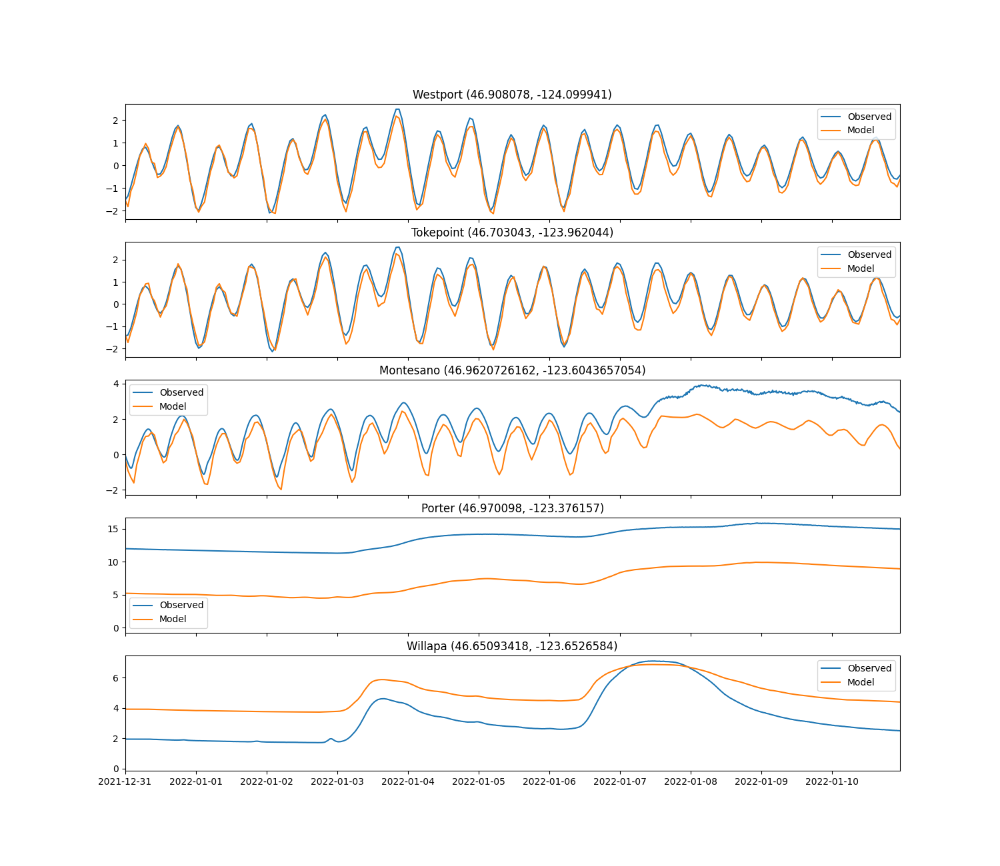
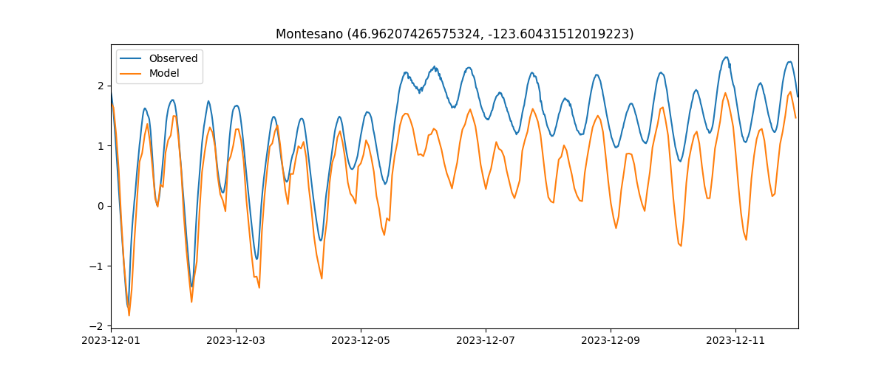
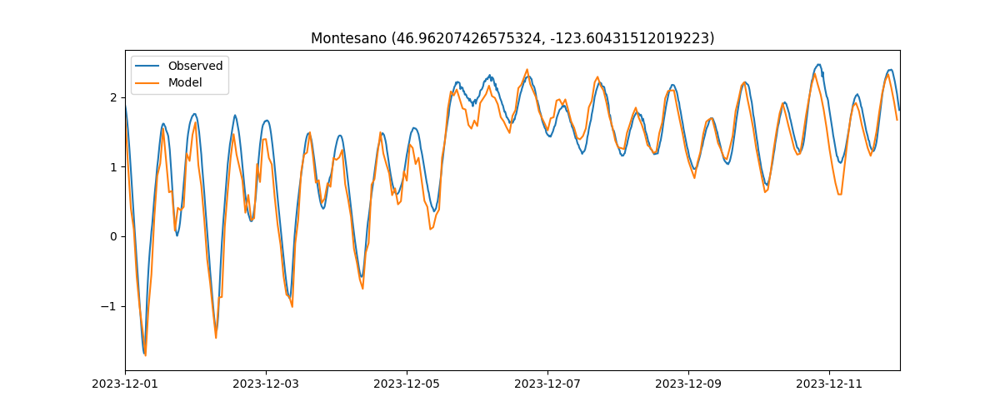

# September 22 - 28, 2024

## Summary:
1) Run Jan 2022 storm using DFM model grid v2
2) Ran DFM model grid v2 with weir (sample_fwx.pliz)

## To do:
1) Run Jan 2022 storm using grid v2
2) Test grids with WeirFile (sample_fxw.pliz)

## Results:
### 1) Jan 2022 storm
- Model completed
- Able to model Tokepoint and Westport accurately
- Able to model tidal fluctuations at Montesano but struggled to simulate the elevated signal on January 07, 2022 (Fig. 1)
- Oddly enough, adding in the fixed weir file (sample_fxw.pliz) let us simulate the water level much better at Montesano (Fig. 2)

 
Figure 1: Water level comparisons for grid v2 (TMD) for January 2022 storm. 

 
Figure 2: Water level comparisons for grid v2 (TMD) for January 2022 storm including the fixed weir. 

### 2) Test grids with fixed weir
- Looked back and realized the December 2023 storms v1, v2, v3, and v4 runs had fixed weir
	- Found by rerunning v2 and seeing output was not reproducible, but worked well after adding back in the fixed weir (Fig. 3, 4)
- Added fixed weir to Jan 2022 storm and it seems to make Montesano water levels more accurate
- Older GIF created had fixed weir (Job19936754_v2) (Fig. 5)
	- Created new GIF of v2 grid WITHOUT fixed weir and does not show as much flooding near Montesano (Fig. 6)
	- Chehalis River Surge Plain drains completely during tidal cycles, unlike previous GIF (v2)

 
Figure 3: Montesano water level for grid v2 (TMD) in December 2023 NOT including fixed weir. 

 
Figure 4: Montesano water level for grid v2 (TMD) in December 2023 INCLUDING fixed weir. 

 
Figure 5: Previous v2 grid run WITH fixed weir. 

 
Figure 6: New v2 grid run WITHOUT fixed weir. 

*WITH fixed weir
- DOES simulate sustained elevated water level signal at Montesano really well (for both January 2022 and December 2023)
- Chehalis River Surge Plain AND Montesano is flooded for multiple tidal cycles during rising discharge rates and elevated water levels

*WITHOUT fixed weir
- Does NOT simulate sustained elevated water level signal at Montesano
- Complete flushing of the Chehalis River Surge Plain
- Montesano floods momentarily but drains on next tidal cycle

## Issues:
- Figure out what to do with fixed weir and whether it affects system

## To do:
- Decide whether it makes sense to have weir included to improve Montesano water level signal

 
