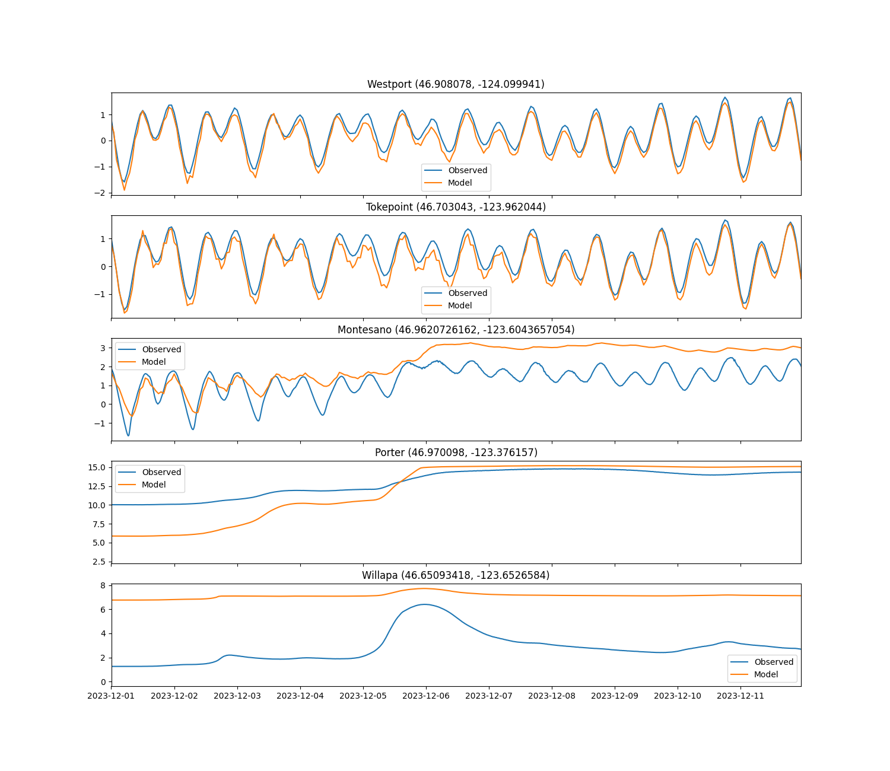
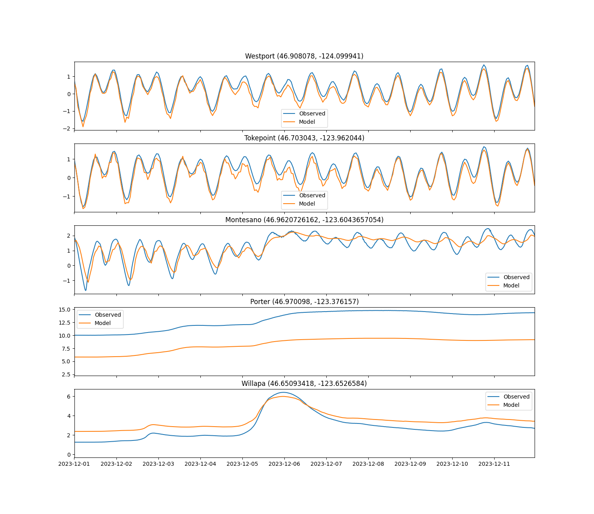
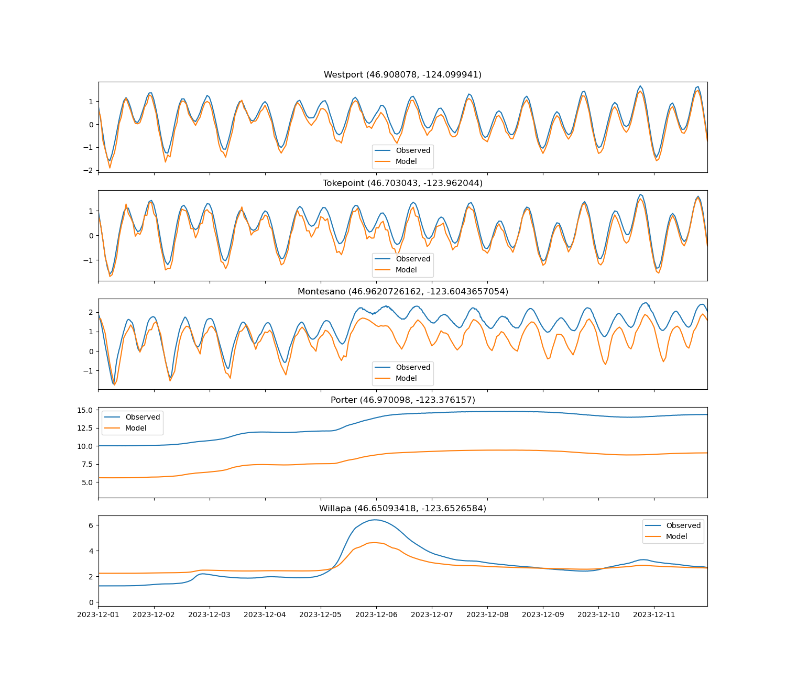
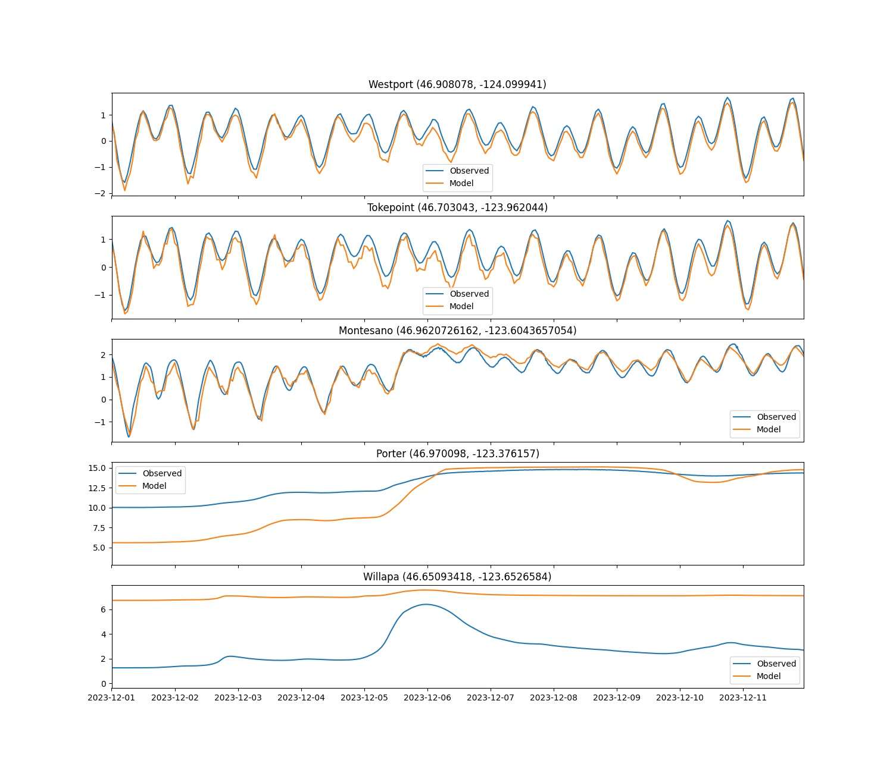
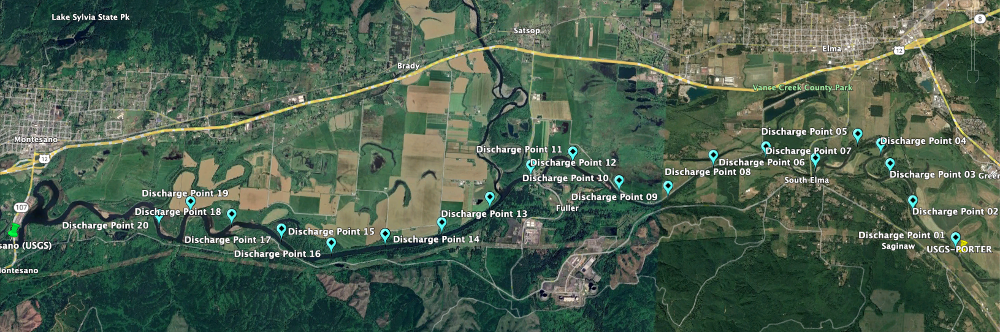
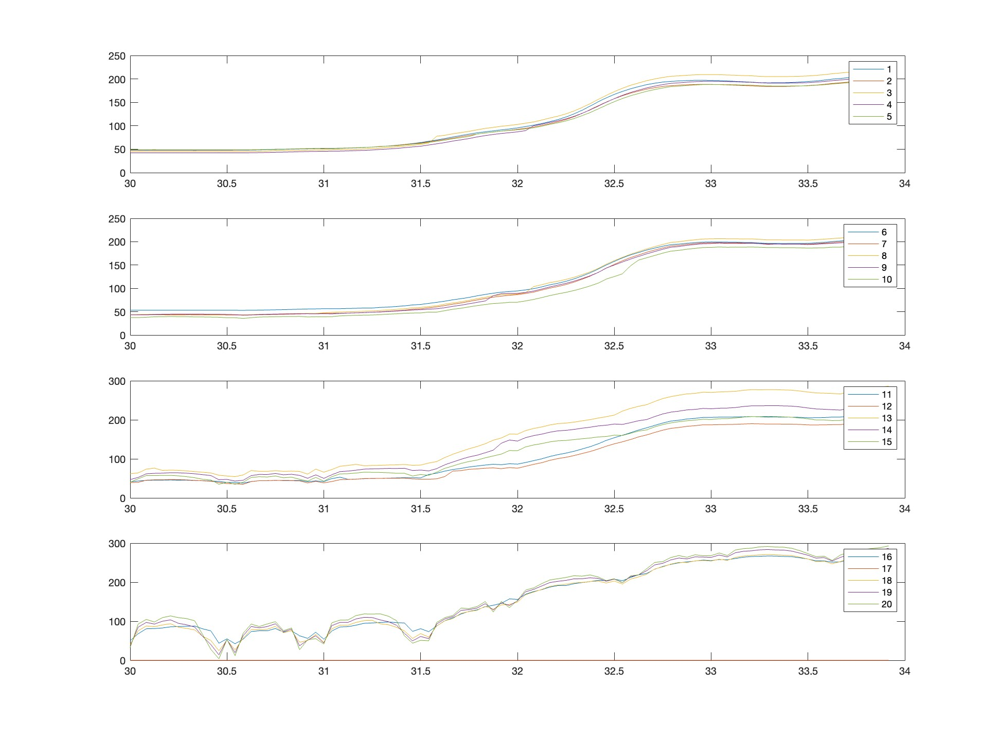
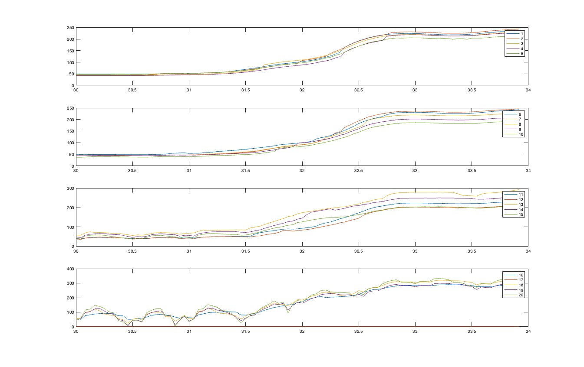

# September 29 - October 05, 2024

## Summary:
1) DFM model (v4) with no weir simulated magnitude of elevated water levels, but had a damped signal 
2) DFM model (v5.5) with weir simulated magnitude of elevated water levels better, but still had damped signal for initial period of storm (better than v4 no weir)
3) Tidal influence seems to stop around Satrap River discharge point
4) Results of model runs WITHOUT the fixed weir seem more realistic upstream, as flooding in the tidal surge plain and agricultural fields are flushed by tidal cycles  

## To do:
1) Run DFM model (v4) with NO weir
2) Run DFM model (v5.5) WITH weir 
3) Check along channel discharge for leaks (with weir runs)

## Results:
### 1) DFM model (v4) no weir
- Simulated water levels at Montesano are much better (no overestimated signal like the run with the fixed weir)
- Comparisons between the v4 grid WITH the fixed weir (Fig. 1) and WITHOUT the fixed weir (Fig. 2)
- Water levels lowered due to water spilling over to the floodplain instead of confined within the channel previously due to the fixed weir
- Water levels are still significantly damped
- Water levels at Porter is offset by a constant ~4.5m for run WITHOUT weir
	- Agrees with our correction of ~5m difference between the elevation at USGS Porter station and our model's Porter station

 
Figure 1: Water level comparisons for grid v4 (TMD) for December 2023 storm WITH the fixed weir. 

 
Figure 2: Water level comparisons for grid v4 (TMD) for December 2023 storm WITHOUT the fixed weir. 

### 2) DFM model (v5.5) with weir
- Downstream: 12m
- Upstream: 2m
- Simulated water levels do better than v5.1 and v5.4 (upstream 15m, downstream 2m)
- HOWEVER, it will be difficult to justify the addition of the fixed weir in our model
- Comparisons between the v5.5 grid WITH the fixed weir (Fig. 3) and WITHOUT the fixed weir (Fig. 4)
- Again, water levels between USGS gauge at Porter and our measured Porter discharge work well with a constant using the model WITHOUT the fixed weir

 
Figure 3: Water level comparisons for grid v5.5 (TMD) for December 2023 storm WITHOUT the fixed weir. 

 
Figure 4: Water level comparisons for grid v5.5 (TMD) for December 2023 storm WITH the fixed weir. 

### 3) Channel discharge
- Originally wanted to look at discharge along channel upstream of Montesano to look for leaks in the fixed weir model runs (Fig. 5)
- Animation of model run (v4) with (Fig. 6) and without fixed weir (Fig. 8) looking at upstream channel
- Discharge at 20 different cross sections (~1km apart) is plotted for runs with weir (Fig. 7) and without the weir (Fig. 9) for model run with v4 grid
- Tidal influence seems to reach up to cross-section around 12 and 13 (outlet of Satsop River)
	- Transect 17 is dry (channel/flooded regions do not match Google maps)

 
Figure 5: Map of discharge transects upstream of Montesano. 

 
Figure 6: Animation of upstream of Montesano for model run (v4) WITH the fixed weir. 

 
Figure 7: Discharge of 20 transects for model run (v4) WITH the fixed weir. 

 
Figure 8: Animation of upstream of Montesano for model run (v4) WITHOUT the fixed weir. 

 
Figure 9: Discharge of 20 transects for model run (v4) WITHOUT the fixed weir. 

## Next steps:
- Find thalweg along channel to give correct:
	- Discharge
	- SSH
	- Water depth
- Run newer grid:
	- Increasing bed height at Montesano to elevate v5.5 water levels?
	- Opposite: increase depth at Montesano and have transition slope further upstream to decrease dampening of tides in v4 grid?
