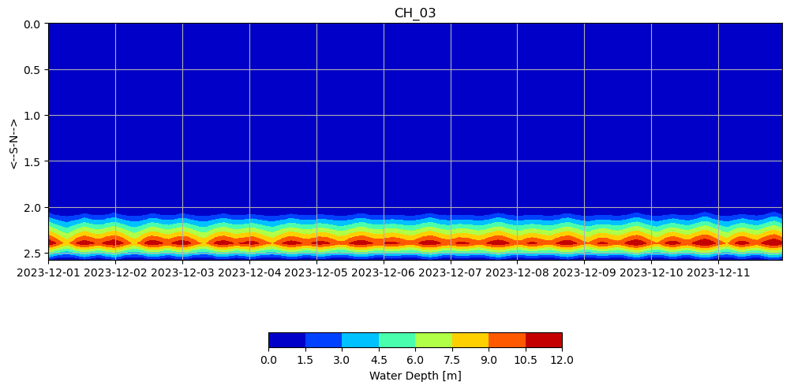
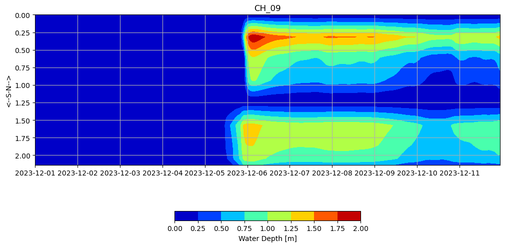

# October 06 - 12, 2024

## Summary:
1) Generated cross sections along Chehalis River based on max inundation observed for the December 2023 storm 
2) Plotted cross sectional area, discharge, and water levels  

## To do:
1) Run model (TMD) with v4 grid including new observation and discharge points 
2) Cross-section profiles 
3) Team 2 meeting presentation ideas 

## Results:
### 1) Cross sections for Chehalis River 
- Ran model TMD w/v4 grid (no weir)
- Chose transect points (13) based on max inundation (spaced ~4km apart) (Fig. 1)

 
Figure 1: Map of max inundation (Dec. 07, 2023 T06:00) with cross sectional transects (13).

### 2) Plotted cross sectional area, discharge, and water levels 
- Generated cross section file (CrsFile) for model to generate cross sectional area and discharge
- Plotted cross sectional area for each transect (Fig. 2)
- Plotted discharge for each transect (Fig. 3)
- Plotted cumulative discharge for each transect (Fig. 4)
- Plotted cross channel water depth profile for each transect (Fig. 5-17)
	- Transects 4 and 5 are supposed to be in tidal surge plain but much of it seems very dry/shallow (which could make sense, plots make it difficult to see shallow depths)
	- Transect 7 (just downstream of Montesano) gets pretty deep in channel during large discharge)
	- Transect 8 is the last point where we can see "some" tidal influence
	- Transects 9 and 11 show dry until December 5, which is seen in animation
	- Transect 9 shows two water channels (north channel could be caused by lakes/pools/streams that are seen in Google maps (but relatively shallow (<2m)
	- Transect 10 show very deep channel (up to 10m), which could explain where the discharge from Satsop pools up
	- Transect 11 shows two water channels, similar to 9 where north channel has existing pools and streams
	- Discharge at Porter cross section shows values agree with USGS gauge

 
Figure 2: Cross sectional area for all transects (13).

 
Figure 3: Discharge for all transects (13).

 
Figure 4: Cumulative discharge for all transects (13).

 
Figure 5: Cross channel water depth profile (Transect 1).

 
Figure 6: Cross channel water depth profile (Transect 2).

 
Figure 7: Cross channel water depth profile (Transect 3).

 
Figure 8: Cross channel water depth profile (Transect 4).

 
Figure 9: Cross channel water depth profile (Transect 5).

 
Figure 10: Cross channel water depth profile (Transect 6).

 
Figure 11: Cross channel water depth profile (Transect 7).

 
Figure 12: Cross channel water depth profile (Transect 8).

 
Figure 13: Cross channel water depth profile (Transect 9).

 
Figure 14: Cross channel water depth profile (Transect 10).

 
Figure 15: Cross channel water depth profile (Transect 11).

 
Figure 16: Cross channel water depth profile (Transect 12).

 
Figure 17: Cross channel water depth profile (Transect 13).

### Team 2 meeting presentation
- Background + motivation
- Model grid/development
- Flood map/animation
- Discussion on what planners, scientists, communities can use the output for?
	- % inundated relative to MHW
	- shapefiles

## Issues:
- Transects at certain points (9, 11) are dry until storm arrival (Dec. 05)

## To do:
- Run model with different grid version and compare cross channel profiles, discharge, and along-channel profile
- Put cross sections along Wynoochee and Satsop
- Improve cross-sectional water depth plots (make x_dist real, improve resolution of colorbar to see shallower depths)
- Start presentation for Team 2 meeting
- Brainstorm more ideas for Winter Storms Forum